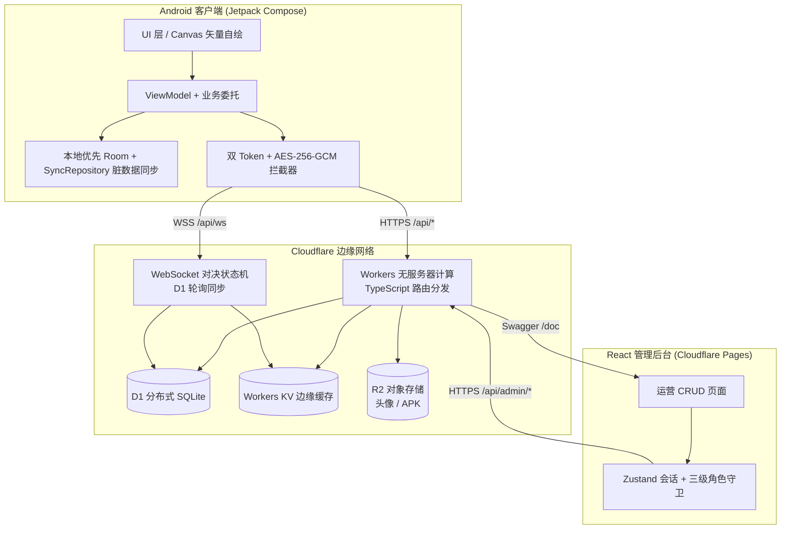
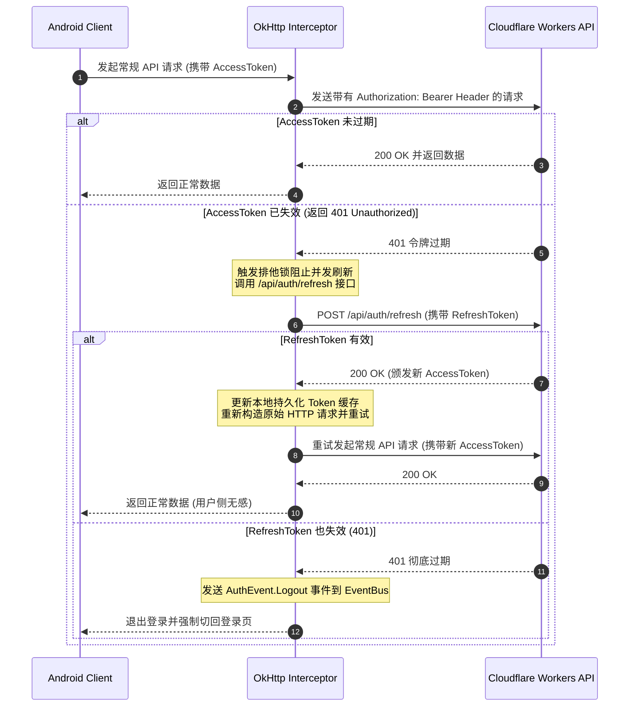

# 秘境消消乐

本系统是一个采用“中式民俗/秘境传说”视觉题材的层叠式三消益智游戏（类似于“羊了个羊”核心玩法）。项目整体采用前后端分离的“端云协同”架构开发：Android 客户端基于 Jetpack Compose + 现代 Android 架构设计，后端服务托管于 Cloudflare Workers 无服务器计算平台，结合 D1 分布式 SQLite 数据库进行云端存储。

---

## 🌟 项目亮点与核心功能

1. **端云协同的关关生成机制**：
   - 关卡布局数据基于特定种子在后端（Cloudflare Workers）进行确定性且必定有解（Solvable）的算法生成，包含 X/Y 轴半格对齐和多层 Z 轴层叠。
   - 网络异常时，Android 客户端会自动无缝降级为**本地离线模式**（Local-First），通过相同的 LCG 随机数生成算法在本地生成关卡，保证极致的游玩连贯性。

2. **丰富的关卡机制**：
   - **普通牌**：标准的可点击消除的图案牌。
   - **封印牌 (Sealed)**：表面贴有金黄色“封印符纸”的卡牌，其层叠封印符的透明度为 0.65，使玩家能够看清底部的图案，只有在周边卡牌被消除、触发解封时方可点击。
   - **神秘牌 (Blind)**：背面显示为“神秘问号”状态的暗牌，只有被揭开（最上层无遮挡）时才能显示真容。

3. **趣味道具与背包系统**：
   - 支持移出置物架（Move Out）、撤销（Undo）、洗牌（Shuffle）、提示（Hint）、炸弹（Bomb）、小丑牌（Joker）、双倍积分（Double Points）等多种法宝道具。
   - 道具可在积分商城中进行购买与兑换，数据支持云端同步和 Room 本地离线脏数据同步机制。

4. **全球实时排行榜**：
   - 关卡结算后，客户端通过带有加盐校验签名的防作弊算法，安全地将通关用时和得分上传至云端数据库，生成实时的日榜与总榜。

5. **社交与日常功能**：
   - 支持手机号验证码注册/登录、用户中心、每日签到（连签奖励）、每日任务、公告系统。

6. **多主题皮肤自绘系统**：
   - 包含经典国风、水墨江山、赛博霓虹三种独特界面主题。根据首选项自动切换，卡牌底色及 12 种游戏图案全部在 Compose Canvas 中通过图形学计算重绘（水墨黑灰写意色、霓虹特制电子荧光色）。

7. **法宝高清 Canvas 矢量自绘动画**：
   - 局内/备战 8 种道具卡（阴阳乾坤鱼、缩地祥云、天命星盘、还魂金丹、太极天眼镜、震天炸弹、炫彩八卦罗盘、双叠铜钱）及 3 种皮肤卡片全部废弃静态 Placeholder，改为纯 Canvas 像素级矢量自绘，搭载自转、漂浮、呼吸闪烁动效。

8. **智能发布流水线与一键对齐系统**：
   - 包含一键发布脚本 `release.js`，自动实现版本升级、向 D1 数据库写入记录并向 main 分支提交推送；GitHub Actions 自动解析 versionName 并与发布 Tag 对齐，彻底规避版本冲突死循环。

9. **多人实时对决与法术诅咒系统**：
   - **连击对决伤害**：支持多人 WebSocket 实时竞技，依据缓动公式 $Attack = Base \times (1 + \ln(Combo))$ 将消除连击转换为对手伤害，防范高频刷连击造成瞬杀，保证对战平衡。
   - **三大法术诅咒**：消除卡牌累积能量，可向对手释放实时法术诅咒。包含“迷雾咒”（遮挡法阵，探照清除）、“锁槽咒”（槽降为 6 格，满槽直接判负）和“封印咒”（给对方所有当前暴露牌施加封印）。
   - **重连退避与优雅挂起**：配备 15 秒断线挂起等待与指数退避重连机制，自动判定胜负，保障弱网体验。

10. **全盘汉化与地毯式详细中文注释补全**：
    - 项目中的 116 个源文件（包括后端核心 API 处理层 handlers、LCG 确定性求解生成算法，以及客户端公共库 `:core`、三消动画与渲染引擎 `:feature_game`、外围 UI 交互模块等）均已进行了地毯式的详细中文注释补全与重构润色，彻底消除多语言注释混杂问题，可读性与二开友好度极大提高。

---

## 🛠️ 核心框架技术与实现方式

### 📱 Android 客户端 (Android Client)

* **声明式 UI 渲染 (Jetpack Compose)**：
  - 全面摒弃传统 XML 布局，采用 Compose 声明式渲染整个游戏画境。局内卡牌叠放通过 `Box` 容器中动态测算每个卡牌的 `Modifier.offset` 来决定。结合 `graphicsLayer` 轻松实现压感弹性微缩放动效。
* **依赖注入 (Hilt / Dagger)**：
  - 采用 Hilt 构建全局依赖注入拓扑图。在 `:core` 模块中通过 `@InstallIn(SingletonComponent::class)` 注入全局单例（如 Room 数据库实例、网络 Retrofit 服务等），在 `:feature_*` 各业务模块中通过 `@ViewModelInject` 或 `@AndroidEntryPoint` 快捷获取。
* **数据流管理与异步架构 (Coroutines & Flow)**：
  - 基于 Kotlin 协程进行非阻塞式异步运算。ViewModel 与 View 之间通过 `StateFlow` 双向绑定状态，通过 `SharedFlow` 订阅一次性侧效应（如播放音效、振动反馈、Toaster 提示等），避免多线程竞争和内存泄漏。
* **离线本地优先存储 (Room ORM)**：
  - 本地采用 SQLite (Room) 缓存数据。为了实现 Local-First 的顺畅体验，用户购买道具、刷新进度时先写 Room 本地库，并将数据标记为“脏数据” (`isDirty = true`)，再通过后台协程同步器 `SyncRepository` 在网络恢复时自动排队向云端同步。
* **解耦多模块路由 (TheRouter)**：
  - 选用阿里开源的现代 Compose 路由框架 `TheRouter`，各个模块之间通过注册 URI（如 `/game/play`，`/menu/main`）实现页面间完全解耦跳转。
* **网络请求与日志拦截 (Retrofit 2 & OkHttp 3 & LogUtils)**：
   - 采用行业标准的 `Retrofit 2` 作为网络访问接口层，结合 `Kotlinx.serialization` 进行类型安全的 JSON 数据解析。
   - 底层使用 `OkHttp 3` 客户端进行连接管理、超时配置。同时配置了四大拦截器：语言国际化拦截器、Bearer Token 身份认证拦截器、带锁防并发的双 Token 静默刷新拦截器、以及弱网自动指数退避重试拦截器。
   - **网络与系统日志分析**：集成流行日志库 `pengwei1024/LogUtils` (`com.apkfuns.logutils:library`)，配合 `HttpLoggingInterceptor` 拦截网络请求，整包聚聚合以无 Tag（利用其自动调用类名堆栈追踪定位机制）的方式输出结构化调试日志，极大地方便了端云联合调试。
* **Canvas 纯矢量高清自绘与微交互动画**：
  - 局内卡牌渲染与 8 种道具卡全部基于 Compose Canvas 矢量图形学绘制，彻底摆脱传统位图占用，并结合 `InfiniteTransition` 实现自转、漂浮、呼吸闪烁动效。
* **自定义 Q弹 Spring 物理动效 (Compose Transition)**：
  - 自定义封装 PrepareGameDialog 弹窗，利用 `animateFloatAsState` 实现具有物理惯性的弹性入场（Q弹）与淡入淡出动画，显著提升操作质感。

### ☁️ 后端服务 (Backend Service)

* **Serverless 边缘轻量计算 (Cloudflare Workers & TypeScript)**：
  - 采用无服务器计算架构，无冷启动延迟。业务路由基于 TypeScript 构建，在全球数十个边缘节点就近响应客户端请求。
  - 路由分发采用自研入口 `src/index.ts`：按 `path.startsWith` 精准分发到各 `handlers/*` 模块；同时内置一个 `OpenAPIHono` 实例仅挂载 Swagger 文档端点 `/doc`，便于查看开放 API。
* **边缘分布式 SQLite (Cloudflare D1)**：
  - 后端直接绑定 D1 分布式 SQLite 数据库（binding 名 `DB`），实现轻量高速的 SQL 查询。用户配置、关卡模板、实时排行榜、签到流水账等数据均在 D1 中原子落盘。
* **KV 边缘缓存加速 (Cloudflare Workers KV)**：
  - 公告、排行榜、关卡布局、商城道具、系统配置等读高频数据全部通过 KV（binding 名 `SHEEPS_CACHE`）进行边缘持久化缓存（300s-24h TTL），大幅降低 D1 读取负载和 API 响应延迟。
* **R2 对象存储 + 自定义域名 CDN (Cloudflare R2)**：
  - APK 安装包托管于 R2（bucket 名 `sheeps-apk`）经自定义域名 `apk.xqh.cc.cd` 全球 CDN 边缘分发，告别 GitHub Releases 国内下载缓慢问题；用户头像同样写入 R2（binding 名 `AVATAR_BUCKET`，公开域名 `file.xqh.cc.cd`）。
* **JWT 密钥 Cache + D1 查询合并优化**：
  - WebCrypto `importKey` 从每次调用改为 Worker 实例级单例缓存，省 30-40% CPU；
  - 登录接口 3 次独立 D1 batch 合并为 1 次读 + 最多 1 次写。
* **AES-256-GCM 端云链路加密**：
  - 客户端对写请求体使用 AES-256-GCM 加密（字段 `encrypted`），服务端 `middleware.ts` 自动解密、并对加密请求的原样响应体回加密；明文 JSON 兼容老客户端。密钥由 Worker Secrets（`AES_KEY_HEX`）注入，开发环境有 fallback 常量。

### 🖥️ 管理后台 (Admin Console)

* **现代前端架构 (React + Vite + TypeScript)**：
  - 基于 React 18 与 Vite 构建，采用响应式布局，完美适配桌面端和大屏设备。开发和生产构建极速响应。
* **组件库与设计系统 (Material-UI - MUI)**：
  - 使用 `@mui/material` 与 `@mui/icons-material` 构建视觉优雅、质感 premium 的管理界面。所有表格（CrudPage）、对话框（Dialog）、状态开关（Switch）均符合 Material Design 规范，并集成了平滑安全动画。
* **极简状态管理 (Zustand)**：
  - 选用轻量级状态管理库 `Zustand` 处理管理员的登录会话（Token）和操作角色权限。支持持久化同步（localStorage），避免页面刷新导致状态丢失。
* **Axios 请求适配与安全性拦截**：
  - 网络适配器基于 `Axios` 二次封装，集成了请求/响应拦截器。在每次请求中自动附加管理员身份 Bearer Token；响应拦截器检测到 HTTP 401 凭证过期时会自动清空本地 session 并优雅退回登录页面。
* **用户背包资产（道具与皮肤）精细化控制**：
  - 管理员可以通过背包弹窗一键对用户的 8 种游戏局内道具卡数量进行增减，或者使用 `Switch` 开关一键授予/回收用户的 5 种卡牌自绘皮肤。

---

## ⚙️ 全局统一配置规范

为了避免多处散落、硬编码相同全局信息（如服务器接口根地址 `BASE_URL`），项目在 `:core` 模块根包名 `com.example.sheeps.core` 下建立并封装了 **`AppConfig`** 对象：
- **`AppConfig`** ([AppConfig.kt](app/core/src/main/java/com/example/sheeps/core/AppConfig.kt))：作为应用唯一的全局配置入口，所有的环境常量、协议配置以及未来的功能开关都会统一收拢到该对象中。
  - `BASE_URL = "https://api.xqh.cc.cd/"`：后端服务接口的基础请求地址。
  - `WS_URL = "wss://api.xqh.cc.cd/api/ws"`：多人实时对决 WebSocket 地址。
- 移除了原有的 `ApiService.Companion.create` 冗余代码，使整个网络的配置点实现一处声明、全局消费。

---

## 🧰 封装的常用核心工具类说明

在 `:core` 基础库中的 `com.example.sheeps.core.utils` 包下，项目针对通用系统级功能进行了二次封装，提供了极简且防错的接口：

1. **`NetworkMonitor` (实时网络状态监听类)**：
   - **实现机制**：内部利用 Android `ConnectivityManager` 的 `registerNetworkCallback` 机制主动监听系统网络变化。
   - **功能作用**：实时维护一个公开的 `StateFlow<NetworkStatus>`。当网络发生“可用 (onAvailable)”和“丢失 (onLost)”状态转换时自动更新。对外提供极其便利的同步判断接口 `isOnline(): Boolean`，业务 ViewModel 在发起关卡加载前会据此自动判断应从云端 API 获取关卡还是降级到本地 LCG 生成算法。

2. **`AuthEventBus` (全局认证事件总线)**：
   - **实现机制**：基于 `MutableSharedFlow` 封装的单例事件总线，采用 `extraBufferCapacity = 1` 确保即使在协程挂起时事件也不会丢失。
   - **功能作用**：主要用于处理 App 生命周期内的全局鉴权敏感事件（如 `AuthEvent.Logout`）。当网络层拦截器检测到 HTTP 401 凭证过期或服务器提示令牌失效时，会通过 `AuthEventBus.post(AuthEvent.Logout)` 发送事件，主界面监听到后会自动清除 Preference 凭证并一键切回登录页。

3. **`GsonUtil` (JSON 数据高阶序列化工具)**：
   - **实现机制**：基于 Google `Gson` 库进行二次封装，内部维护全局共享的 Gson 实例。
   - **功能作用**：提供统一的 `toJson(src)`、`fromJson(json, classOfT)` 和支持泛型反射 Type 的 `fromJson(json, typeOfT)`。主要用于背包道具复杂 JSON 字符串在 Room 数据库文本字段与 Kotlin 数据类之间的便捷映射。

---

## 📂 项目目录结构

```text
├── app/                        # Android 客户端代码（Gradle 多模块工程）
│   ├── app/                    # 壳 Module (namespace com.example.sheeps)，主程序入口、Application、Release 签名
│   ├── core/                   # 核心基础 Module (com.example.sheeps.core：网络/Room/主题/工具/全局配置)
│   ├── feature_splash/         # 启动模块 (com.example.sheeps.splash)：启动图、初始化校验、路由分发
│   ├── feature_menu/           # 主菜单与商店 Module (com.example.sheeps.menu)：大厅/签到/任务/公告/商城
│   ├── feature_game/           # 游戏局内 Module (com.example.sheeps.game)：单机闯关 + 多人对决渲染与逻辑
│   ├── feature_leaderboard/    # 排行榜独立 Module (com.example.sheeps.leaderboard)
│   ├── gradle/                 # Gradle Wrapper + libs.versions.toml 版本目录
│   ├── build.gradle.kts        # 根构建文件（buildscript classpath、插件别名）
│   ├── settings.gradle.kts     # 模块声明与仓库解析
│   ├── gradle.properties       # Gradle 全局优化（并行/配置缓存/R8）
│   └── sheeps.jks              # Release 签名证书
│
├── admin-console/              # React 管理后台项目
│   ├── src/
│   │   ├── api/                # 后台 API 请求层 (client.ts Axios 封装与鉴权拦截 / admin.ts 接口封装)
│   │   ├── components/         # 公共组件 (CrudPage 通用表格、Layout 导航、feedback 提示、ProtectedRoute 守卫)
│   │   ├── pages/              # 业务页面 (Login/Dashboard/Users/Accounts/AuditLogs/Config/ShopItems/Notices/Tasks/Levels)
│   │   ├── store/              # Zustand 状态管理 (auth 管理员会话)
│   │   ├── App.tsx / main.tsx
│   ├── .env                    # 本地调试配置 (指向 localhost API)
│   ├── .env.production         # 线上生产配置 (指向 api.xqh.cc.cd API)
│   └── package.json
│
├── server/                     # 后端服务代码 (Cloudflare Worker, TypeScript)
│   ├── src/
│   │   ├── index.ts            # Workers 路由入口（分发 + D1 自动迁移 + 加密中间件 + WebSocket 升级）
│   │   ├── types.ts            # Env 绑定类型与 JWT/AdminPayload 类型
│   │   ├── crypto.ts           # JWT(HMAC-SHA256) 签发校验 + PBKDF2 + SHA256 + AES-256-GCM 加解密
│   │   ├── auth-utils.ts       # 密码哈希/校验 (PBKDF2-SHA256)
│   │   ├── helpers.ts          # CORS、玩家鉴权、管理员三级鉴权、KV 配置缓存、国际化
│   │   ├── middleware.ts       # 请求解密 / 响应加密 (AES-256-GCM)
│   │   ├── level.ts            # LCG 确定性可解关卡生成算法
│   │   ├── difficulty.ts       # 100 级难度系数系统
│   │   ├── update.ts           # App 版本更新检测 (D1 + R2 HEAD 探测)
│   │   ├── websocket.ts        # 多人对决 WebSocket 状态机 (基于 D1 game_commands 轮询同步)
│   │   ├── public/                 # 隐私政策/用户协议/收集清单/共享清单 静态 HTML（由 generate-legal-html.js 生成）
│   │   └── handlers/           # 业务路由 (auth/match/user/shop/task/game/system/admin)
│   ├── test/                   # 后端单元测试 (level/difficulty/update/admin_assets)
│   ├── scripts/                # 辅助脚本 (seed-admin.mjs 种子管理员 / generate-legal-html.js 生成法律页)
│   ├── wrangler.jsonc          # Cloudflare Wrangler 配置 (Worker + D1 + KV + R2)
│   ├── schema.sql              # D1 数据库初始化建表脚本
│   └── package.json
│
├── docs/                       # 项目配套文档（详见文末「项目文档索引」）
├── release.js                  # 一键发版脚本（版本升级 + D1/KV 写入 + 推送 main）
├── diagnose_blocking.py        # 关卡遮挡诊断脚本（模拟生成与遮挡判定）
└── .github/workflows/          # GitHub Actions (release.yml 构建 APK 并上传 R2)
```

---

## 🏗️ 系统架构总览

下图展示“Android 客户端 ↔ Cloudflare Workers(后端) ↔ D1/KV/R2 ↔ 管理后台(React)”的端云协同关系：



**端云协同要点**：客户端所有写操作经 AES-256-GCM 加密后直连 Worker；读高频数据（公告/排行榜/商城/配置）优先命中 KV 边缘缓存；关卡布局由 Worker 端 LCG 确定性算法生成并缓存到 KV；多人实时对决通过 WebSocket 接入，由 `websocket.ts` 借助 D1 `game_commands` 表做跨实例消息轮询同步；APK 与用户头像托管于 R2 并经自定义域名 CDN 分发。

---

## 🧩 技术栈总览表

| 端 | 维度 | 选型 |
| :--- | :--- | :--- |
| **Android 客户端** | 语言/构建 | Kotlin 2.2.21 · AGP 9.0.1 · Gradle 版本目录 (libs.versions.toml) · compileSdk 37 / minSdk 24 / targetSdk 36 |
| | UI | Jetpack Compose (BOM 2026.03.01) · Material 3 · Navigation3 · Lottie · BRVAH · SmartRefreshLayout |
| | 架构/异步 | MVI 单向数据流 · Coroutines 1.10.2 · Flow/StateFlow/SharedFlow · WorkManager 2.9.1 |
| | 依赖注入 | Hilt 2.59.2（KSP 代码生成） |
| | 网络/存储 | Retrofit 2.11.0 · OkHttp 4.12.0 · kotlinx-serialization-json 1.7.3 · Room 2.6.1 · MMKV 2.4.0 · Gson 2.10.1 · Coil 2.6.0 |
| | 模块路由/安全 | TheRouter 1.3.2 · androidx.security:crypto · LogUtils (pengwei) |
| **后端 (Cloudflare Workers)** | 语言/运行时 | TypeScript · Workers compatibility_date 2026-06-27 · placement=smart |
| | Web 框架 | Hono 4.12 + @hono/zod-openapi + @hono/swagger-ui（仅 /doc 挂载 OpenAPI） |
| | 存储/缓存 | D1 (SQLite, binding `DB`) · Workers KV (binding `SHEEPS_CACHE`) · R2 (binding `AVATAR_BUCKET`) |
| | 安全 | JWT (HMAC-SHA256) 双 Token · PBKDF2-SHA256 密码哈希 · AES-256-GCM 链路加密 |
| | 工具链 | Wrangler 4.105 · @cloudflare/workers-types |
| **管理后台 (React)** | 框架/构建 | React 18.3 · Vite 5.3 · TypeScript 5.4 · React Router 6.24 |
| | UI/状态 | MUI 5.15 (@mui/material + icons) · Emotion · Zustand 4.5 |
| | 网络 | Axios 1.7（拦截器注入 Bearer / 401 退登） |
| | 部署 | Cloudflare Pages (`miadmin-console`) |

---

## 📦 各模块详细说明

### 1. app/（Android 多模块工程）

Gradle 模块（见 `settings.gradle.kts`）：`:app`、`:core`、`:feature_splash`、`:feature_menu`、`:feature_game`、`:feature_leaderboard`。依赖统一收口在 `gradle/libs.versions.toml` 版本目录。

实际源码包结构（`src/main/java/com/example/sheeps/`）：

```text
core/                         # 核心公共库
  base/                       # Activity/ViewModel/Application 基类
  crypto/                     # 端侧加解密辅助
  di/                         # Hilt 全局依赖注入模块
  game/                       # 游戏核心算法引擎（遮挡/求解）
  multiplayer/                # WebSocket 管理与对战协议
    model/                    # 对战数据模型
  network/                    # Retrofit 接口定义与 OkHttp 拦截器
  preference/                 # MMKV / DataStore 偏好封装
  startup/                    # App Startup 初始化器
  update/                     # 版本更新检测
  utils/                      # NetworkMonitor / AuthEventBus / GsonUtil 等
  AppConfig.kt                # 全局配置入口
data/                         # 数据层
  local/                      # Room 数据库与 DAO
  model/                      # 统一业务数据模型
  network/                    # 网络实体
  repository/                 # 数据仓库与云端同步 (SyncRepository)
theme/                        # 仙侠/国风主题管理
ui/components/                # 通用 Compose 组件
app/worker/                   # 壳 Module 内的 Worker（WorkManager 同步任务）
feature_splash/  → splash/            # 启动图、初始化校验、路由分发
feature_menu/     → menu/              # 大厅/商城/签到/任务/公告（ui/components/dialogs/screens + viewmodel/delegates）
feature_game/     → game/              # 单机闯关 + 多人对决（state/ui/animations/components/dialogs/screens + viewmodel/delegates/helpers）
feature_leaderboard/ → leaderboard/   # 排行榜展示
```

关键约定：
- 壳 `:app` 只负责组装各 `:feature_*` 模块、`Hilt`/`TheRouter` 注解处理器引入、Release 签名与 APK 文件名（`sheeps_<versionName>.apk`）。
- `:core` 以 `api(...)` 方式对外暴露基础能力，业务模块仅 `implementation(project(":core"))` 即可复用。
- 模块间页面跳转全部走 TheRouter URI（如 `/game/play`、`/menu/main`），互不依赖。

### 2. server/（Cloudflare Worker 后端）

入口 `src/index.ts` 在 `fetch` 中完成：注入密钥 → D1 Schema 自动迁移（幂等加列建表）→ CORS/OPTIONS → 静态法律页 → WebSocket 升级 → 解密请求体 → 按 `path` 分发到各 `handlers/*` → 错误国际化 → 加密响应体。

`handlers/` 各文件职责：
- `auth.ts`：验证码/密码登录注册、双 Token 刷新、密码设置/重置。
- `match.ts`：匹配队列（加入/轮询/离开，30s 超时清理，含并发锁竞争防护）。
- `user.ts`：端云数据同步、Profile、积分/兑换流水、改名、头像上传（R2）、头像代理。
- `shop.ts`：积分商城商品列表（多语言 + KV 缓存）、积分兑换（事务原子）。
- `task.ts`：每日任务列表（懒加载初始化 + 签到修复）与奖励领取。
- `game.ts`：关卡布局获取（确定性可解 + KV 缓存）、积分解锁、成绩提交（加盐 SHA256 防作弊）、每日签到、排行榜（分页/日/周/总）、每日弹窗 TOP3。
- `system.ts`：公告列表（多语言 + KV 缓存）、App 版本更新检测。
- `admin.ts`：**三级角色**（`super`/`operator`/`readonly`）鉴权 + 写守卫（`assertCanWrite`）+ 超管守卫（`assertSuper`）+ 全量后台 CRUD + 审计落库（`admin_audit_log` 仅 INSERT，无改/删接口）。

支撑模块：`crypto.ts`（JWT/PBKDF2/SHA256/AES-GCM）、`auth-utils.ts`（密码哈希）、`helpers.ts`（CORS、鉴权、KV 配置缓存、国际化）、`middleware.ts`（链路加解密）、`level.ts`（LCG 关卡生成）、`difficulty.ts`（难度系数）、`update.ts`（版本探测）、`websocket.ts`（对决同步），法律页由 `server/public`（静态法律页）直接服务。

### 3. admin-console/（React 管理后台）

- `src/api/client.ts`：Axios 实例 + 拦截器（自动附加 `Authorization: Bearer`、401 清空 session 退登）。
- `src/api/admin.ts`：封装全部 `/api/admin/*` 接口。
- `src/components/CrudPage.tsx`：通用表格 CRUD 组件（分页、增删改查、确认弹窗）。
- `src/components/ProtectedRoute.tsx`：基于 Zustand 会话的路由守卫（未登录跳 Login）。
- `src/store/auth.ts`：Zustand 管理员会话，持久化到 localStorage（含 `isSuper()/canWrite()` 派生）。
- `src/pages/`：Login、Dashboard（运营统计 `GET /api/admin/stats`）、Users、Accounts（超管）、AuditLogs（超管）、Config、ShopItems、Notices、Tasks、Levels。

权限模型（前端禁用仅为体验，后端 `requireAdmin`/`assertCanWrite`/`assertSuper` 为最终防线）：

| 角色 | 能力 |
| :--- | :--- |
| `super` | 全部读写 + 管理员账户管理 + 审计日志查看 |
| `operator` | 业务数据读写（用户/商品/公告/任务/关卡/配置） |
| `readonly` | 仅查看，写按钮禁用 |

首次部署：使用 `server/scripts/seed-admin.mjs`（环境变量 `ADMIN_PHONE`/`ADMIN_PASSWORD`）幂等创建首个 `super` 账号；生产环境须通过 `wrangler secret put` 注入 `JWT_SECRET`、`AES_KEY_HEX`、`ADMIN_WEB_ORIGIN`。

---

## 🔌 后端 API 接口参考

> 鉴权列说明：**公开**=无需 Token；**用户Token**=请求头 `Authorization: Bearer <accessToken>`；**管理员**=通过 `requireAdmin`；**管理员(可写)**=再经 `assertCanWrite`（readonly→403）；**超级管理员**=再经 `assertSuper`（非 super→403）；**RefreshToken**=提交 refresh token 而非 access token。

### 认证 auth
| 方法 | 路径 | 功能描述 | 鉴权 |
| :--- | :--- | :--- | :--- |
| POST | `/api/auth/send-code` | 发送短信验证码（写入 `login_token`，5 分钟有效） | 公开 |
| POST | `/api/auth/login` | 验证码登录/注册（自动开户 + 赠初始道具 + 游客合并） | 公开 |
| POST | `/api/auth/login-password` | 密码登录 | 公开 |
| POST | `/api/auth/register` | 密码注册（6-20 位，PBKDF2 哈希） | 公开 |
| POST | `/api/auth/reset-password` | 验证码重置密码 | 公开 |
| GET | `/api/auth/check-password` | 检查当前用户是否已设密码 | 用户Token |
| POST | `/api/auth/set-password` | 设置密码（奖励 50 积分） | 用户Token |
| POST | `/api/auth/refresh` | 用 RefreshToken 静默续期双 Token | RefreshToken |

### 匹配 match
| 方法 | 路径 | 功能描述 | 鉴权 |
| :--- | :--- | :--- | :--- |
| POST | `/api/match/join` | 加入匹配队列（自动配对 / 等待） | 公开 |
| GET | `/api/match/status` | 轮询匹配状态（30s 超时自动出队） | 公开 |
| POST | `/api/match/leave` | 离开匹配队列 | 公开 |

### 用户中心 user
| 方法 | 路径 | 功能描述 | 鉴权 |
| :--- | :--- | :--- | :--- |
| POST | `/api/user/sync` | 端云数据增量同步（积分极大值合并、关卡/背包合并、历史备份） | 用户Token |
| GET | `/api/user/profile` | 获取用户 Profile（含最高通关、头像 URL） | 用户Token |
| GET | `/api/user/points-history` | 积分收支明细（近 50 条） | 用户Token |
| GET | `/api/user/exchange-history` | 道具兑换历史（近 50 条） | 用户Token |
| POST | `/api/user/rename` | 修改昵称 | 用户Token |
| POST | `/api/user/avatar` | 上传头像（multipart，R2，≤512KB） | 用户Token |
| GET | `/api/avatar/:userId` | 头像代理读取（R2 直出二进制） | 公开 |

### 商城 shop
| 方法 | 路径 | 功能描述 | 鉴权 |
| :--- | :--- | :--- | :--- |
| GET | `/api/shop/items` | 商品列表（多语言 + KV 缓存） | 公开 |
| POST | `/api/shop/exchange` | 积分兑换道具（扣积分/减库存/写背包，事务原子） | 用户Token |

### 任务 task
| 方法 | 路径 | 功能描述 | 鉴权 |
| :--- | :--- | :--- | :--- |
| GET | `/api/task/daily` | 每日任务列表及进度（懒加载初始化） | 用户Token |
| POST | `/api/task/claim` | 领取任务积分奖励 | 用户Token |

### 游戏 game
| 方法 | 路径 | 功能描述 | 鉴权 |
| :--- | :--- | :--- | :--- |
| GET | `/api/level` | 获取关卡布局（LCG 确定性可解 + 内存/KV 缓存） | 可选（带 Token 更准） |
| POST | `/api/level/unlock` | 消耗积分解锁关卡（KV 读门槛） | 用户Token |
| POST | `/api/score/submit` | 提交通关成绩（加盐 SHA256 防作弊签名） | 可选 |
| POST | `/api/sign/today` | 每日签到领积分（连签 7 天循环奖励） | 用户Token |
| GET | `/api/leaderboard` | 排行榜查询（日/周/总，分页，KV 缓存 300s） | 公开 |
| GET | `/api/leaderboard/daily-popup` | 每日弹窗（昨日 TOP3 + 当前用户排名） | 可选 |

### 系统 system
| 方法 | 路径 | 功能描述 | 鉴权 |
| :--- | :--- | :--- | :--- |
| GET | `/api/notice/list` | 公告列表（多语言 + KV 缓存 1h） | 公开 |
| GET | `/api/app/check-update` | App 版本更新检测（D1 + R2 HEAD 探测） | 公开 |

### 管理后台 admin（三级鉴权）
| 方法 | 路径 | 功能描述 | 鉴权 |
| :--- | :--- | :--- | :--- |
| POST | `/api/admin/login` | 管理员登录 | 公开 |
| POST | `/api/admin/refresh` | 刷新管理 Token | RefreshToken |
| GET | `/api/admin/users` | 用户列表（分页/搜索） | 管理员 |
| POST | `/api/admin/users/:id/points` | 调整积分 | 管理员(可写) |
| POST | `/api/admin/users/:id/ban` | 封禁/解封用户 | 管理员(可写) |
| PUT | `/api/admin/users/:id` | 重命名用户 | 管理员(可写) |
| GET | `/api/admin/users/:id/items` | 查看用户背包 | 管理员 |
| POST | `/api/admin/users/:id/items` | 修改用户背包道具 | 管理员(可写) |
| GET | `/api/admin/config` | 读取系统配置 | 管理员 |
| POST | `/api/admin/config` | 修改系统配置 | 管理员(可写) |
| GET | `/api/admin/stats` | 运营统计总览 | 管理员 |
| GET | `/api/admin/shop-items` | 商品管理列表 | 管理员 |
| POST | `/api/admin/shop-items` | 新建商品 | 管理员(可写) |
| PUT | `/api/admin/shop-items/:id` | 编辑商品 | 管理员(可写) |
| DELETE | `/api/admin/shop-items/:id` | 删除商品 | 管理员(可写) |
| GET | `/api/admin/notices` | 公告管理列表 | 管理员 |
| POST | `/api/admin/notices` | 新建公告 | 管理员(可写) |
| PUT | `/api/admin/notices/:id` | 编辑公告 | 管理员(可写) |
| DELETE | `/api/admin/notices/:id` | 删除公告 | 管理员(可写) |
| GET | `/api/admin/tasks` | 任务管理列表 | 管理员 |
| POST | `/api/admin/tasks` | 新建任务 | 管理员(可写) |
| PUT | `/api/admin/tasks/:id` | 编辑任务 | 管理员(可写) |
| DELETE | `/api/admin/tasks/:id` | 删除任务 | 管理员(可写) |
| GET | `/api/admin/levels` | 关卡管理列表 | 管理员 |
| POST | `/api/admin/levels` | 新建关卡 | 管理员(可写) |
| PUT | `/api/admin/levels/:id` | 编辑关卡 | 管理员(可写) |
| DELETE | `/api/admin/levels/:id` | 删除关卡 | 管理员(可写) |
| GET | `/api/admin/accounts` | 管理员账户列表 | 超级管理员 |
| POST | `/api/admin/accounts` | 新建管理员账户 | 超级管理员 |
| PUT | `/api/admin/accounts/:id/role` | 设置账户角色 | 超级管理员 |
| POST | `/api/admin/accounts/:id/disable` | 禁用/启用账户 | 超级管理员 |
| GET | `/api/admin/audit-logs` | 审计日志查询 | 超级管理员 |

### 实时对决 WebSocket
| 方法 | 路径 | 功能描述 | 鉴权 |
| :--- | :--- | :--- | :--- |
| GET | `/api/ws?gameId=&playerId=` | 多人实时对决 WebSocket 升级（101 Switching Protocols） | 公开（游戏内） |

### 静态页 / 文档
| 方法 | 路径 | 功能描述 | 鉴权 |
| :--- | :--- | :--- | :--- |
| GET | `/privacy.html` · `/api/legal/privacy` | 隐私政策 HTML（.html 由 assets 静态服务，/api/legal/* 为 308 重定向） | 公开 |
| GET | `/agreement.html` · `/api/legal/agreement` | 用户协议 HTML（.html 由 assets 静态服务，/api/legal/* 为 308 重定向） | 公开 |
| GET | `/doc` | Swagger UI（OpenAPI 文档） | 公开 |

---

## 🔐 环境变量与配置说明

### 后端 `server/wrangler.jsonc`（绑定与变量）
| 配置项 | 值 / 说明 |
| :--- | :--- |
| `name` | `my-d1-api` |
| `main` | `src/index.ts` |
| `compatibility_date` | `2026-06-27` |
| `placement.mode` | `smart`（智能就近调度） |
| `routes[].pattern` | `api.xqh.cc.cd`（custom_domain 真域名） |
| `d1_databases` | binding `DB`，数据库名 `my-app-db`，database_id `e6c896e1-4dcc-4b7d-be10-629eb47041f1` |
| `kv_namespaces` | binding `SHEEPS_CACHE`，id `784104ac67eb4f3c83a92e9dcc91b673` |
| `r2_buckets` | binding `AVATAR_BUCKET`，bucket 名 `sheeps-apk`（头像/APK 共用桶，前缀区分） |
| `vars.R2_PUBLIC_URL` | `https://file.xqh.cc.cd`（R2 公开访问根域名） |
| **Worker Secrets**（不在文件中，需 `wrangler secret put`） | `JWT_SECRET`（JWT HMAC 密钥）、`AES_KEY_HEX`（AES-256-GCM 密钥）、`ADMIN_WEB_ORIGIN`（管理后台精确 CORS 源，缺省回退 `*`） |
| **CI Secrets**（GitHub Actions） | `R2_ACCESS_KEY_ID`、`R2_SECRET_ACCESS_KEY`、`CF_ACCOUNT_ID`（S3 兼容 API 上传 APK）、`MY_PAT`（gh release 令牌） |

### 管理后台 `.env` / `.env.production`
| 文件 | 变量 | 值 |
| :--- | :--- | :--- |
| `.env` | `VITE_API_BASE` | `http://127.0.0.1:8787`（本地 `wrangler dev`） |
| `.env.production` | `VITE_API_BASE` | `https://api.xqh.cc.cd`（生产 Worker 域名） |

### Android `AppConfig.kt`（核心常量）
| 常量 | 值 | 说明 |
| :--- | :--- | :--- |
| `BASE_URL` | `https://api.xqh.cc.cd/` | 后端 HTTPS 接口根地址 |
| `WS_URL` | `wss://api.xqh.cc.cd/api/ws` | 多人实时对决 WebSocket 地址 |

> 注意：发版前请确认 `AppConfig.BASE_URL` 指向你实际部署的 Worker 域名；本地联调可临时改为 `http://127.0.0.1:8787/`（需 `wrangler dev`）。

---

## 🧪 测试与本地校验

### 后端（Cloudflare Worker）
`server/package.json` 的 `test` 脚本：
```bash
cd server
npm install
npm test
```
`npm test` 实际执行：
1. `tsc src/index.ts --target ES2022 --module commonjs ... --outDir .tmp-test` 编译校验；
2. `node --test` 依次运行：`test/update.test.js`、`test/level.test.js`、`test/difficulty.test.js`、`test/admin_assets.test.js`（覆盖版本探测、LCG 可解性、100 级难度系数、管理员资产等核心逻辑）。

> 注：`server/test/` 下另含 `level.test.ts`（源码级），与 `.js` 版并存；当前 `npm test` 以 `.js` 版本为准。新增用例建议保持 `.js` + `node --test` 形态以匹配 CI。

类型检查（可选）：`npx tsc --noEmit`。

### 前端关卡遮挡诊断（Python）
`diagnose_blocking.py` 用于离线验证“哪些 tile 应被标记为 BLOCKED”：它复刻 `server/src/level.ts` 的网格生成与 `server/src/../` 的 10% 面积重叠判定（`TILE=48`、`SPACING=46`、`OVERLAP_MARGIN=0.25`），对 6 种形状（正方/金字塔/十字/菱形/圆环/X 字）打印 BLOCKED/NORMAL 比例与“视觉疑似遮挡但实际 NORMAL”的可疑 tile，便于在端云遮挡逻辑对齐时定位偏差。

### Android 客户端
- 客户端以手动/设备验证为主；`:core`、`:feature_*` 模块均配置 `androidx.test` 与 `kotlinx-coroutines-test` 依赖，可编写 ViewModel/Repository 单元测试（置于各模块 `src/test`）。
- 真机/模拟器联调：`./gradlew :app:assembleDebug` 后 `adb install`。

---

## 🚀 CI/CD 与发布流水线

### GitHub Actions（`.github/workflows/release.yml`）
仓库仅含一条 `Auto Release` 工作流，触发条件为：**push 到 `main` 且提交信息包含 `chore(release):`**。流程：
1. Checkout → 配置 JDK 17（Temurin，Gradle 缓存）。
2. `./gradlew assembleRelease` 构建 Release APK（读 `app/app/build.gradle.kts` 的 `versionName`）。
3. 用 AWS S3 兼容 CLI 将 APK 上传至 R2：`s3://sheeps-apk/sheeps_<versionName>.apk`（endpoint `https://<CF_ACCOUNT_ID>.r2.cloudflarestorage.com`），缓存 `immutable`。
4. `gh release` 在 `xqh0927/sheeps-releases` 创建/更新 Tag `v<versionName>` 并上传 APK（若已存在以 `--clobber` 覆盖，规避版本冲突）。

> 说明：现有仓库 `release.yml` 仅负责「构建 APK + 上传 R2 + 建 GitHub Release」。管理后台 `admin-console/README.md` 提及的 `deploy-pages.yml` 当前**尚未落地**，如需 Pages 自动部署请自行补充该工作流（所需 Secrets：`VITE_API_BASE`、`CLOUDFLARE_API_TOKEN`、`CLOUDFLARE_ACCOUNT_ID`）。

### 一键发版脚本 `release.js`（本地运行）
在项目根目录执行 `node release.js`，交互式安全发版流程：
1. 解析 `app/app/build.gradle.kts` 的 `versionCode`/`versionName`，建议自增下个版本。
2. **Git 前置校验**：必须在 `main` 分支，提交前 `git pull --rebase` 防冲突。
3. **多语言自动翻译**：经代理调用 Google Translate 将更新日志译为繁体/英/日/韩（失败自动降级回中文）。
4. **写入 D1**：向 `app_version` 表插入版本、`notice` 表插入多语言更新公告（带 SQL 注入转义 + 3 次指数退避重试）。
5. **写入 KV**：按语言（`''/tw/en/ja/ko`）追加公告缓存，客户端即刻可见。
6. **全量提交推送**：仅在 D1/KV 全部成功后改写 gradle 版本号，`git add -A` + `commit "chore(release): ..."` + `push origin main`，触发上面的 Actions 构建；若中途异常且已改写 gradle，则自动回滚文件。
7. **R2 上传**：由 Actions 在构建成功后经 S3 兼容 API 上传，`apk.xqh.cc.cd` CDN 分发。

---

## 🚀 快速启动指南

### 1. 后端服务部署 (Cloudflare Worker)
在 `server` 目录下配置并发布边缘端代码：

1. 安装依赖：
   ```bash
   cd server
   npm install
   ```
2. 登录 Cloudflare 账号：
   ```bash
   npx wrangler login
   ```
3. 初始化 D1 + KV + R2（需提前在 Cloudflare Dashboard 创建）：
   - D1 数据库名称：`my-app-db`
   - KV 命名空间：`SHEEPS_CACHE`
   - R2 存储桶：`sheeps-apk`
4. 将 `wrangler.jsonc` 中的 `database_id`、`kv_namespaces[].id` 替换为创建生成的 UUID（R2 仅需 bucket 名，已在配置中）。
5. 初始化数据库表结构：
   ```bash
   npx wrangler d1 execute my-app-db --remote --file=./schema.sql
   ```
6. 注入生产密钥（否则使用 fallback 常量，存在安全风险）：
   ```bash
   npx wrangler secret put JWT_SECRET
   npx wrangler secret put AES_KEY_HEX
   npx wrangler secret put ADMIN_WEB_ORIGIN   # 管理后台域名，如 https://your-pages.pages.dev
   ```
7. 部署到 Cloudflare 全球网络：
   ```bash
   npx wrangler deploy
   ```
8. （可选）创建首个超级管理员：
   ```bash
   ADMIN_PHONE=13800000000 ADMIN_PASSWORD=YourStrongPass node scripts/seed-admin.mjs
   ```
   按输出 SQL 在 D1 执行（或改为 `wrangler d1 execute` 直连）。

### 2. 一键版本发布脚本 (release.js)
项目根目录下的 `node release.js` 实现全自动化发版流程：

1. **交互式版本管理**：自动解析 `build.gradle.kts` 当前版本并建议下个版本号。
2. **Git 前置安全校验**：自动检查当前是否在 `main` 分支，并在提交前 `pull --rebase` 同步远程代码，防止冲突和误推。
3. **多语言自动翻译**：通过 Google Translate API 将更新日志自动翻译为英语/繁体中文/日语/韩语。
4. **D1 数据库同步**：将版本信息写入 `app_version` 表，同时插入多语言公告至 `notice` 表。
5. **KV 缓存即时更新**：追加各语言公告缓存，确保客户端即刻可见最新公告。
6. **全量代码提交**：`git add -A` + commit + push 到 main 分支，触发 GitHub Actions 编译打包。
7. **R2 对象存储上传**：GitHub Actions 构建 APK 成功后自动上传到 Cloudflare R2（通过 S3 兼容 API），经 `apk.xqh.cc.cd` 自定义域名 CDN 分发。

### 3. Android 客户端编译与运行
在 `app` 目录下：

1. 确认配置：
   - 检查 `app/core/src/main/java/com/example/sheeps/core/AppConfig.kt` 中的 `BASE_URL` 指向您所部署的 Cloudflare Workers 域名（默认为：`https://api.xqh.cc.cd/`）。
2. 构建 Debug 安装包：
   ```bash
   ./gradlew :app:assembleDebug
   ```
3. 通过 ADB 安装到手机：
   ```bash
   adb install app/app/build/outputs/apk/debug/app-debug.apk
   ```

### 4. 管理后台部署与运行 (React Admin Console)
在 `admin-console` 目录下部署并运行管理后台：

1. 安装依赖：
   ```bash
   cd admin-console
   npm install
   ```
2. 环境配置：
   - 本地调试：检查 `.env` 配置，指向本地服务接口（`VITE_API_BASE=http://127.0.0.1:8787`）。
   - 生产环境：检查 `.env.production` 配置，指向您的 Cloudflare 自定义 API 域名（`VITE_API_BASE=https://api.xqh.cc.cd`）。
3. 本地启动预览：
   ```bash
   npm run dev
   ```
   启动后打开浏览器访问 `http://localhost:5173/`。
4. 构建与部署至 Cloudflare Pages：
   - 编译打包：
     ```bash
     npm run build
     ```
   - 部署至线上（指定分支 `main` 以进行生产级证书与域名绑定）：
     ```bash
     npx wrangler pages deploy dist --project-name=miadmin-console --branch=main
     ```

---

## 🧩 核心业务逻辑与技术细节实现 (For AI Developers)

为了便于其他 AI 开发助手快速理解和维护本项目，以下是核心模块的深层逻辑与数据模型规格说明：

### 1. 数据库实体关系 (D1 Relational Schema)
云端存储搭载 Cloudflare D1，核心实体表结构与关联如下：

* **用户主体表 `users`**：
  - 字段：`id` (TEXT, PK, UUID), `phone` (TEXT, UNIQUE), `username` (TEXT), `points` (INTEGER, 积分/金币余额), `password_hash` (TEXT, 采用 pbkdf2 盐值加密哈希), `role` (TEXT, 角色: `user` / `super` / `operator` / `readonly`), `is_banned` (INTEGER, 1表示禁用), `avatar_url` (TEXT, R2 公网直链), `created_at` (INTEGER)
* **用户道具资产表 `user_items`**：
  - 字段：`user_id` (TEXT, 外键关联 users.id), `item_type` (TEXT, 资产标识如 `UNDO`/`SKIN_CYBER`), `count` (INTEGER, 拥有数量)
  - 复合主键：`PRIMARY KEY (user_id, item_type)`
* **关卡解锁表 `level_unlock`**：
  - 字段：`user_id` (TEXT), `level_id` (INTEGER, 关卡 ID), `unlocked_at` (INTEGER)
  - 复合主键：`PRIMARY KEY (user_id, level_id)`
* **积分交易日志表 `point_record`**：
  - 字段：`id` (TEXT, PK, UUID), `user_id` (TEXT), `type` (TEXT, `'IN'` 产出 / `'OUT'` 消耗), `amount` (INTEGER), `source` (TEXT, 如 `SIGN_IN`/`SHOP_REDEEM_*`/`UNLOCK_LEVEL_*`), `remaining_points` (INTEGER, 变更后余额), `created_at` (INTEGER)
* **管理员审计日志表 `admin_audit_log`**：
  - 字段：`id` (INTEGER, PK, AUTOINCREMENT), `admin_id` (TEXT), `admin_phone` (TEXT), `admin_role` (TEXT), `action` (TEXT, 操作行为如 `UPDATE_USER_ITEMS`/`DELETE_LEVEL`/`ADJUST_POINTS`), `target_type` (TEXT), `target_id` (TEXT), `before_snapshot` (TEXT, JSON 序列化旧数据), `after_snapshot` (TEXT, JSON 新数据), `source_ip` (TEXT), `user_agent` (TEXT), `created_at` (INTEGER)
* 其余业务表：`shop_items`（多语言商品，含 `item_type`/`points_price`/`stock`）、`exchange_record`（兑换流水）、`task`/`user_task`（每日任务模板与进度）、`notice`（多语言公告）、`config`（KV 缓存源）、`leaderboard`（排行榜）、`levels`（后台录入关卡）、`sign_record`（签到）、`login_token`（验证码）、`backup_save_log`（端云同步历史备份）、`app_version`（发版记录）、`matchmaking_queue`（匹配队列）、`game_commands`（跨实例 WebSocket 消息转发）。建表脚本见 `server/schema.sql`。

---

### 2. 双 Token 鉴权与静默刷新流程 (Double Token Flow)
系统在客户端与服务端之间采用 AccessToken（短效，2 小时）和 RefreshToken（长效，30 天）的双令牌体系（管理员 AccessToken 2 小时 / RefreshToken 7 天）：



---

### 3. 可解性关卡生成算法 ( Solvability Level Generation)
关卡采用逆向模拟（Reverse Simulation）与有解拓扑校正算法生成，逻辑位于 `server/src/level.ts` 与客户端 `GameLevelGenerator.kt` 中：
1. **逆向卡牌生成**：生成器预设所需卡牌类型（种类随关卡增加而变多，最多 12 种花色）。每一关卡的卡牌总数必须是 3 的倍数（$Total = Count \times 3$）。
2. **三维层叠堆叠**：通过网格重叠算法判定卡牌之间的物理遮挡，层与层之间高度递增。重叠度采用 **10% 面积碰撞重叠公式**：
   $$ox = \max(0, Width - |x_1 - x_2| \times AlignmentScale)$$
   $$oy = \max(0, Height - |y_1 - y_2| \times AlignmentScale)$$
   $$Area = ox \times oy$$
   若 $Area > 0.1 \times Width \times Height$，则在上方卡牌与下方卡牌之间建立“父子遮挡关系拓扑图（Over/Under Card Chain）”。
3. **逆向消除可解性校验（BFS 反向求解器）**：
   - 算法并非简单随机堆放卡牌，而是从全空卡槽出发，在逆向状态下依次将 3 张同色卡牌“拆解”并摆放到当前的棋盘暴露点。
   - 每次“拆解”保证仅在完全暴露的、且重叠判定无锁定的区域生成。
   - 最终从顶向下倒推生成完整个三维金字塔。这在数学上保证了玩家在正向游玩时，只要清除被遮挡的底层，**棋盘必定存在至少一条能完全消除的通路**。

---

### 4. WebSocket 多人对决与 Combo 连击攻击计算 (PvP Combo Math)
多人对决服务通过 WebSocket 支持，其伤害机制融入了连击缓动衰减设计，以实现兼具操作快感与数值平衡的竞技对抗：

* **连击伤害转换模型 (Combo Damage Math)**：
  为了避免玩家由于超高手速消除或随机连消产生瞬间秒杀对方的不平衡体验，攻击伤害随着连击数（Combo）呈**对数曲线缓动增长**：
  $$Attack = BaseDamage \times (1 + \ln(Combo))$$
  - `BaseDamage`：每次 3 连消除的基础伤害点数。
  - `Combo`：连续达成 3 连消除的倍率数（从 1 开始计）。
  - `ln(Combo)`：自然对数函数。例如：连击 1 次伤害为 $Base$；连击 3 次时伤害约增加至 $2.1 \times Base$；连击 10 次时伤害平滑增加至约 $3.3 \times Base$。
* **法术诅咒与同步协议**：
  客户端与服务端在对决期间维持心跳，同步协议的载荷（Payload）部分关键格式如下：
  ```json
  // 发起攻击/发送诅咒载荷
  {
    "action": "cast_spell",
    "spell_type": "fog", // fog 迷雾诅咒 / slot_lock 锁槽诅咒 / seal 封印诅咒
    "target_user_id": "opp_456"
  }

  // 局内同步棋盘消除状态
  {
    "action": "sync_state",
    "unlocked_level": 4,
    "current_grid_count": 48,
    "shelf_slots_used": 3
  }
  ```

---

## 📐 核心算法与设计决策

### 1. 关卡三维金字塔布局与 10% 面积碰撞重叠判定
- **金字塔堆叠**：通过网格尺寸逐层递减 1 ($size = baseSize - z$) 且偏移量逐层累加 0.5 ($offset = z \times 0.5f$) 的循环逻辑，实现层次分明、上疏下密的三维立体堆叠。
- **10% 重叠判定**：单卡尺寸统一为 `48dp`（面积 $2304\text{ dp}^2$）。两张卡牌重叠的计算公式为：
  $$ox = \max(0, 48f - dx \times 46f)$$
  $$oy = \max(0, 48f - dy \times 46f)$$
  $$area = ox \times oy$$
  当且仅当 $area > 230.4\text{ dp}^2$（即重叠面积 > 10%）且高度更高时，建立遮挡/锁定关系。本机制在客户端（运行时判定与本地求解器）与服务端（Cloudflare Workers 求解器）双端完全对齐，保证关卡 **100% 可解通**。

### 2. 双轴棋盘自适应居中对齐
- 采用 Compose 的 `LocalConfiguration.current.screenWidthDp.dp` 动态读取物理屏幕宽度，宽度公式为 `boardWidth = screenWidth - 32.dp`，确保两边各留出 16dp 对称空白。
- 整个棋盘高度根据渲染的卡牌高度集合自适应（上下各留白 16dp），并利用父级 Box 的 `contentAlignment = Alignment.Center`，使整个异形卡牌堆叠在任何尺寸手机/折叠屏上都完美水平和垂直双居中渲染，彻底杜绝了偏边、越界或裁剪问题。

### 3. 卡牌飞行动画 GPU 硬件加速设计
- 传统 Compose 位移动画会在每一帧中高频读取 progress 状态触发全量 Compose Recomposition (重组) 和 Relayout (重测量)，极易造成 CPU 瞬间阻塞导致卡顿。
- 本项目重构了位移计算，将 progress 状态读取延迟至 Draw 绘图阶段，使用 **`Modifier.graphicsLayer { ... }`** 直接对卡牌应用 `translationX`/`translationY` 及 `scale`。
- **效果**：所有位移及大小动画计算完全下沉至 **GPU 硬件级加速** 完成，在低端 Android 设备上依旧能保持 60/120 帧丝滑消除体验。

### 4. 太极万能牌消除平衡算法
- 万能牌在卡槽中必须至少存在 2 张同花色卡牌时才能激活（否则报错并拒绝扣减道具）。
- 成功激活时，会自动在卡槽外（优先从移出置物架，其次从棋盘在场卡牌中）搜索并一同销毁第 3 张相同花色卡牌，保证局内该花色卡牌总数继续保持 3 的倍数，在体验爽快道具的同时，为**完全消除并通关**提供了数学层面的绝对保障。

### 5. 关卡类型全局概率与 LCG 同源匹配机制
- 关卡在加载时会通过确定性 LCG 算法 `lcg(seed + 500)` 进行全局特质判定：
  - **40% 封印关卡 (Sealed Level)**：包含金色锁头阻挡，需玩家自行点击破封。
  - **20% 盲盒关卡 (Blind Level)**：包含迷雾暗牌问号牌，且最表层 2~3 层卡牌禁止设为盲盒牌以确保前 3-5 步可解。
  - **40% 正常关卡 (Normal Level)**：经典常规美食三消卡牌。
- 前置准备弹窗 `PrepareGameDialog` 同源运行该 LCG 预测，并在进入盲盒关卡时安全精准地为玩家渲染橙红色盲盒警示 Banner。

### 6. 盲盒牌解密解锁与锁定抖动物理反馈
- **盲盒牌解锁**：盲盒牌在棋盘上不因“解除上层卡牌遮挡”而翻开。它的唯一翻开解密方式是**玩家在下方槽位完成一组 3 连匹配消除（Match/Merge）**。每消除一组牌，系统自动揭晓并翻开棋盘上的某一张盲盒牌，大大增强了战术博弈性。
- **只抖直接遮挡物**：点击被锁定的卡牌时，系统运用 Z 轴极值算法计算出直接覆盖在其上方的临近卡牌，并使其轻微平滑抖动一次（`repeat(1)`）红光反馈，其余间接压住的上层卡牌保持完全静止，物理反馈克制、直观。

### 7. 列表平滑定位与冷启动防死锁
- **跨度平滑滚动**：扩展编写了 `LazyListState.animateScrollToItemSmoothly`。当定位跨度大于 4 时，先无缝 Snap 跳转到目标项临近 3 个元素内，再以平滑过渡动画滚动至最终位置，极大减少了 LazyColumn 渲染中间大量无用 Item 时对 CPU 造成的严重卡顿负担。
- **异步加载防锁死**：私有文件级变量 `isColdStartAutoScrolled` 结合 LaunchedEffect 超时轮询。若首帧读到 unlockedLevel 占位符 1，不锁死自动滚动标志，而是等待本地/云端异步数据加载完毕后，再平滑定位到玩家真实的解锁关卡位置，并锁定滚动标志。

---

## 🛠️ 故障排查 / FAQ

**Q1：D1 初始化 / 接口 500**
- 首次请求会自动 `migrateSchema` 加列建表（幂等）。若仍报缺表/缺列，请确认已执行 `npx wrangler d1 execute my-app-db --remote --file=./schema.sql`，且 `wrangler.jsonc` 的 `database_id` 与线上 D1 一致。

**Q2：Token 过期 / 频繁跳登录**
- AccessToken 时效 2 小时、RefreshToken 30 天（管理员 7 天）。客户端 OkHttp 拦截器持排他锁静默刷新；若两端时间漂移或 `JWT_SECRET` 在生产被改而本地仍用 fallback，会导致签名校验失败 → 触发 `AuthEvent.Logout`。请保证 `wrangler secret put JWT_SECRET` 已设置且与客户端预期一致。

**Q3：WebSocket 断线 / 对决卡死**
- `websocket.ts` 基于 D1 `game_commands` 表 250ms 轮询同步（Serverless 无状态所致）。弱网时客户端有 15 秒挂起 + 指数退避重连；若长时间无消息，对局按规则自动判负。排查：确认 `gameId`/`playerId` 非空、D1 可写、KV 可读。

**Q4：本地离线降级不生效**
- 客户端 `NetworkMonitor.isOnline()` 决定走云端还是本地 LCG。若网络判定异常，检查 `ConnectivityManager` 权限与 `AppConfig.BASE_URL` 是否可达；本地生成与 `server/src/level.ts` 共用同一 LCG 公式，确保两端 `levelId`、种子、形状/重叠参数一致。

**Q5：公告/排行榜更新延迟**
- 这些数据走 KV 缓存（公告 1h、排行榜 300s、商城 10min、配置 600s）。改库后旧缓存未过期时前端看不到变更；可等 TTL 过期，或发版时 `release.js` 会自动刷新公告缓存。后台改商品/公告后接口会主动 `SHEEPS_CACHE.delete` 对应键。

**Q6：发版后 APK 下载 404**
- `release.yml` 上传路径为 `s3://sheeps-apk/sheeps_<versionName>.apk`，下载域名 `apk.xqh.cc.cd`。请确认 `CF_ACCOUNT_ID`、R2 S3 密钥 Secrets 正确，且 `versionName` 与 `app_version.apk_url` 中写入的 URL 一致（由 `release.js` 写入 `https://file.xqh.cc.cd/sheeps_<versionName>.apk`）。

**Q7：管理后台 403 / 看不到菜单**
- `readonly` 角色调用写接口被后端 `assertCanWrite` 拒；账户管理/审计日志仅 `super`。请先用 `seed-admin.mjs` 创建 `super` 账号，并在「账户管理」中把目标账号角色调整为 `operator`/`super`。

---

## 📚 项目文档索引

`docs/` 下配套文档（含设计稿、PRD、根因分析、合规与规划）：

**顶层设计 / 产品文档**
- [system_design.md](docs/system_design.md) — 管理后台架构设计 + 任务分解（v1.1），含三级角色模型、鉴权分层、审计日志、seed 脚本。
- [admin-prd.md](docs/admin-prd.md) — 管理后台增量 PRD（v0.1），明确三级权限、审计、复用 `users` 表等运营后台业务规则。
- [prd-card-count-difficulty.md](docs/prd-card-count-difficulty.md) — 关卡卡牌数量-难度系数系统 PRD（v2.0），将卡牌数从线性公式改为难度系数曲线渐进。
- [devops-optimization-report.md](docs/devops-optimization-report.md) — DevOps 性能优化分析报告，定位 Workers/D1/KV/R2 链路瓶颈与优化方案。
- [six-bugs-root-cause-analysis.md](docs/six-bugs-root-cause-analysis.md) — 6 类典型问题根因分析（积分不一致、过关送金币无明细、计时器缺失、形状固化、快速点击消除失效等）。

**UML 图（Mermaid 源码）**
- [class-diagram.mermaid](docs/class-diagram.mermaid) — 管理后台领域类图（User / AdminAuditLog / JwtUtil / AdminAuthService / AdminApiHandler / AuthStore 及关系）。
- [sequence-diagram.mermaid](docs/sequence-diagram.mermaid) — 管理员登录、readonly 写拦截、operator 改积分、super 专属接口的时序图。

**法律与合规**
- [legal/隐私政策.md](docs/legal/隐私政策.md) — 隐私政策正文（PIPL 合规）。
- [legal/用户协议.md](docs/legal/用户协议.md) — 用户协议正文。
- [legal/合规要点备忘.md](docs/legal/合规要点备忘.md) — 法律合规要点备忘（起草依据、已核实事实、需运营方补充项）。

**规划与规格（superpowers/）**
- `docs/superpowers/plans/` — 规划文档：中式民俗三消游戏计划、组件化计划、玩法扩展计划、多人攻击系统、延迟更新通知计划。
- `docs/superpowers/specs/` — 对应规格设计：含后端代码拆分、同步 API 优化、KV 缓存、对决棋盘定尺寸、盲盒牌概率/难度/对话框预警、10% 重叠遮挡、金字塔布局、Joker 牌逻辑、平滑定位/飞行动画、用户资产后台管理等 20+ 篇设计稿。