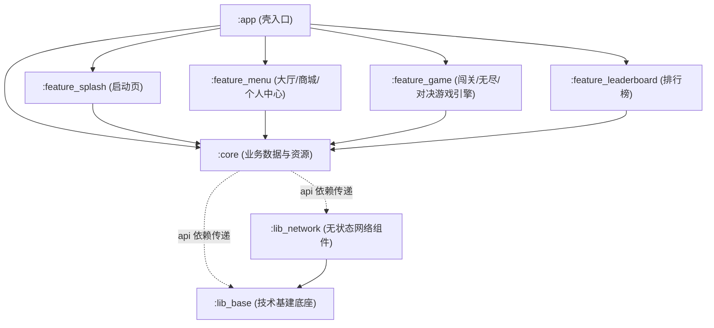

# Sheeps - MVI 现代多模块联机手游项目文档

## 1. 项目简介
**Sheeps** 是一款以视觉背景的益智类层叠三消联机手游。项目集成了单机闯关模式（金字塔叠层网格）、无尽生存模式（死亡之列滑落）以及基于 WebSocket 的实时多人对战系统（天命对决），并包含完整的商城、背包、每日任务、全球排行及离线优先数据同步功能。

项目采用最新的 Android 开发标准，深度实践了 **MVI (Model-View-Intent)** 架构、**Jetpack Compose** 全声明式 UI 渲染，并经过了彻底的**多模块组件化（Multi-Module）**重塑与解耦，具有极高的工程品位和二开友好度。

---

## 2. 物理组件化架构设计

为了实现“高内聚、弱耦合”的编译提效与业务隔离，项目采用了三层物理组件化拓扑架构。在最近的重构中，原公共底座 `:core` 被成功重组剥离出独立的 `:lib_base` 技术基建底座与 `:lib_network` 无状态网络底座，使得物理依赖关系更加清晰健壮：

### 2.1 架构拓扑依赖图 (Mermaid)



### 2.2 模块功能职责划分

| 模块名称 | 物理层次 | 职能描述 | 核心内容 |
| :--- | :--- | :--- | :--- |
| **`:app`** | 壳层 | 应用总入口。 | 关联全部子模块依赖、集成 Application 主类并进行 SDK 初始化。 |
| **`:feature_splash`** | 业务层 | 启动与跳转分发。 | 亮色白金背景启动动画、网络与合规性校验、进入主页的路由分发。 |
| **`:feature_menu`** | 业务层 | 游戏大厅与外围。 | 包含主菜单、积分商城、个人中心（更换皮肤）、每日签到、日常任务。 |
| **`:feature_game`** | 业务层 | 游戏玩法核心引擎。 | 包含层叠金字塔网格棋盘、无尽之渊下坠棋盘、联机 WebSocket 天命对决赛场。 |
| **`:feature_leaderboard`** | 业务层 | 竞技排行数据。 | 展示日榜、总榜，利用 RecyclerView 及 BRVAH 适配器实现高速渲染。 |
| **`:core`** | 数据与资源层 | 业务数据中心。 | 封装 Room 本地数据库、LocalDao、SyncRepository 同步数据流以及公共资源实体。 |
| **`:lib_network`** | 技术基础层 | 纯净网络底座。 | 配置 OkHttpClient、加解密拦截器 `EncryptionInterceptor` 与 Retrofit。 |
| **`:lib_base`** | 技术基础层 | 无状态技术基建。 | 包含 MVI 通用 ViewModel 基类、BaseActivity 基类、MMKV 及 AesGcmCipher 底层算法。 |

---

## 3. 核心架构设计与重构亮点

在最近的架构演进中，我们针对 MVI 健壮性、生命周期泄漏以及模块耦合进行了针对性重塑，取得了以下核心成果：

### 3.1 MVI 串行 Intent 通道（防并发竞态条件）
*   **优化逻辑**：在基类 `BaseMviViewModel` 内部，引入 `Channel<Intent>(Channel.UNLIMITED)` 作为意图队列缓冲区。在初始化时，通过协程在 `viewModelScope` 中排队按序 collect 并分发消费：
    ```kotlin
    init {
        viewModelScope.launch {
            _intentChannel.receiveAsFlow().collect { intent ->
                handleIntent(intent)
            }
        }
    }
    ```
*   **架构收益**：彻底打断了原本点击卡牌、洗牌、使用道具时可能并行的协程流。所有的 `ViewIntent` 都将在后台顺序**串行处理**，从源头上终结了用户高频狂点屏幕时造成的竞态条件（Race Condition）和消除判定状态紊乱。

### 3.2 声明式 Lifecycle-Safe Flow 收集器
*   **优化逻辑**：在 `:lib_base` 模块中封装了 `Flow<T>.collectWithLifecycle` 扩展函数，将 `lifecycle.repeatOnLifecycle` 机制内聚于单链式 API 中。
*   **架构收益**：将 `GameActivity`、`EndlessActivity` 和 `DuelActivity` 中原本繁琐的三层协程嵌套块精炼为单层 Lambda 闭包，彻底净化了 UI 层的订阅代码，保证 Activity 后台挂起时协程自动断开，防止内存泄漏。

### 3.3 契约化 IGameService 跨模块解耦（Hilt 构造注入）
*   **优化逻辑**：
    *   在 `:lib_base` 中声明 `IGameService` 通信接口契约，避免 `feature_menu` 物理依赖 `feature_game`。
    *   在 `feature_game` 的 `GameServiceImpl.kt` 中实现逻辑，并通过 `@Inject` 进行普通 Hilt 构造注入。
    *   在 `feature_game` 下新建 `di/GameServiceModule.kt` 建立契约绑定。
*   **架构收益**：大厅模块 `MenuViewModel` 在构造函数中非空引入 `IGameService`，消除了任何运行期反射和包名不配的风险，且在物理编译上两个业务模块完全隔断，架构符合依赖倒置原则。

---

## 4. 最近技术重构与算法优化

在棋盘视觉体验、动画流畅度、关卡可解性与物理重合度上也进行了地毯式升级：

*   **卡牌尺寸 48.dp 统一**：全场景卡牌尺寸统一修改为 `48.dp`（包括棋盘卡牌、卡槽、置物架、以及飞行动画层），消除空中飞行过程中的突兀缩放感。
*   **双轴完全居中自适应**：棋盘宽度基于 `screenWidthDp - 32.dp` 动态算出，高度按卡牌最高堆叠内容高度自适应，彻底解决折叠屏/大屏卡牌被裁剪、越界或偏移的漏洞。
*   **金字塔渐进式叠层布局算法**：卡牌堆叠采用网格大小逐层递减 1 且网格偏移量逐层累加 0.5f 的三维算法，卡牌层层精准坐落在下层四张卡牌的十字接缝处。
*   **10% 物理重叠面积遮挡法则**：底层碰撞面积判定全部统一重构为 10% 面积碰撞。轻微边缘重合不再压制卡牌，有效消除了死局，保障生成关卡 **100% 可解**。
*   **精确层级锁定抖动**：点击被压住的卡牌时，利用 Z 轴最小极值算法精确筛出直接遮挡它的“第一层”卡牌进行抖动，其余更远的卡牌保持静止，抖动仅执行克制的一次，提供干净的反馈。
*   **万能太极牌完全消除平衡机制**：玩家卡槽中必须存在两张同花色卡牌才允许使用太极牌，使用时会自动搜索并消去第 3 张相同花色的卡牌，保证局内该花色的剩余总卡牌数依然是 3 的倍数，彻底杜绝了因道具使用导致的死局。
*   **卡牌飞行动画 GPU 硬件加速**：将飞行动画中的位移与缩放属性全部收拢至 `Modifier.graphicsLayer { ... }` 绘图扩展块内，在 Draw 阶段延迟读取 State 属性，避开了 Compose 重新测量和重布局的 CPU 性能黑洞，低端设备下依然稳定在 60/120 满帧运行。
*   **长跨度平滑列表滚动与冷启动防锁死**：扩展编写了 `LazyListState.animateScrollToItemSmoothly`。当定位跨度真实大于 4 时，先无缝 Snap 跳转到目标项临近 3 个元素内，再以平滑过渡动画滚动，极大减少了 LazyColumn 对 CPU 造成的严重卡顿负担。

---

## 5. 项目结构导航

```text
com.example.sheeps
├── lib_base        # 最底层无状态基础公共库（MVI ViewModel/BaseActivity/Aes加解密）
├── lib_network     # 基础网络连接与加解密拦截器库
├── core            # 业务数据资产层（本地 Room 数据库、UserPreferences、模型实体类）
├── feature_splash  # 启动分发模块
├── feature_menu    # 大厅、商城、背包与个人中心模块
└── feature_game    # 闯关游戏棋盘、无尽之渊下坠棋盘、联机多人对战赛场
```

---

## 6. 开发与构建

*   **环境要求**：Android Studio Jellyfish+ / AGP 8.0+。
*   **Gradle 构建命令**：
    *   `./gradlew :app:assembleDebug`：构建并打包调试版 APK。
    *   `./gradlew :baselineprofile:generateBaselineProfile`：在连接设备时运行性能基线轮廓分析，自动输出优化文件并在构建 Release 包时自动装载提速。
