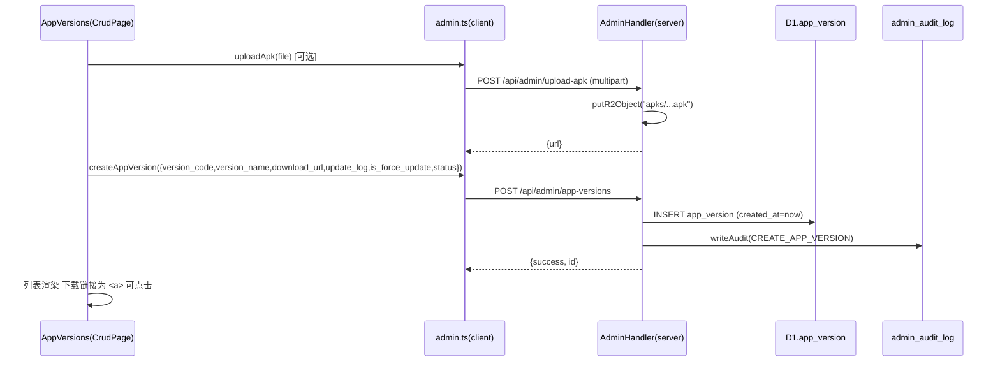
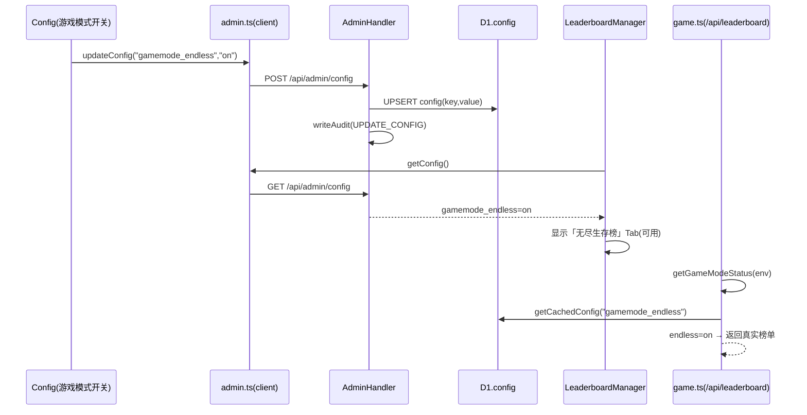
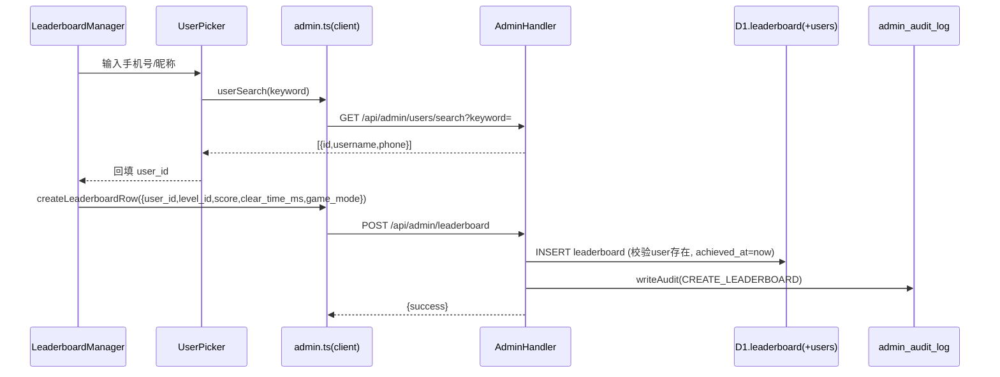
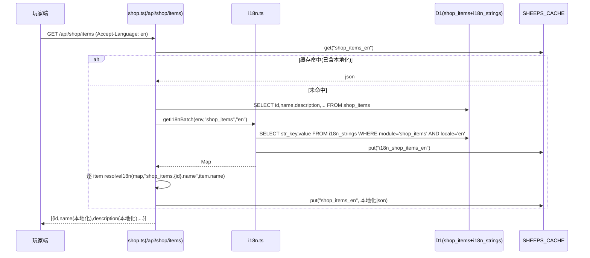
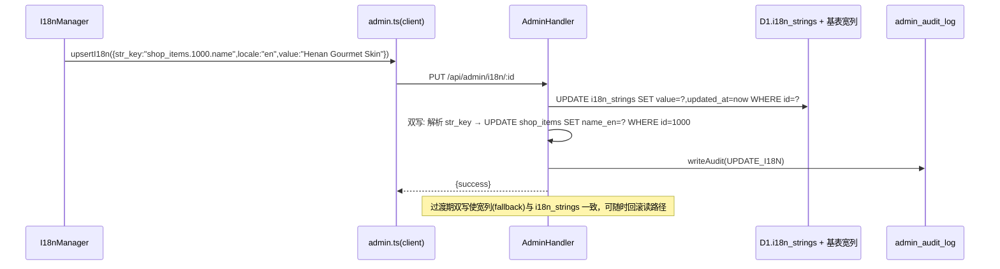
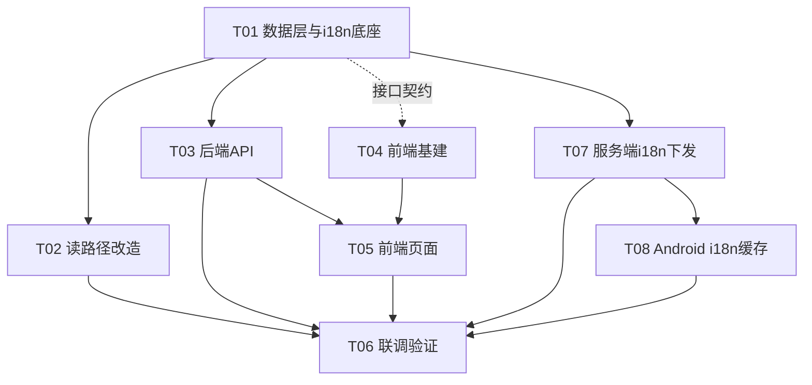

# 秘境消消乐 · 管理后台（admin-console）4 项新功能实施方案

> 文档性质：实施方案（仅方案，未改动任何代码）
> 适用范围：`server/`（Cloudflare Worker + D1 + R2）与 `admin-console/`（React + MUI + Vite + TS）
> 作者：架构师 高见远 ｜ 版本：v2（**方案 B 已确认**，决策已闭环，见 §7）

---

## 0. 探查结论（现状核实，基于仓库真实代码）

为确保方案与现状一致，已逐一核验 `server/schema.sql`、`server/src/**`、`admin-console/src/**`。

### 0.1 现有 D1 表（与本次 4 个需求强相关）

| 表 | 现状 | 与需求关联 |
|---|---|---|
| `app_version` | 已存在。字段：`version_code`(INT PK)、`version_name`、`apk_url`、`update_log` + 多语言 `update_log_en/_tw/_ja/_ko`、`is_force_update`、`created_at` | 需求①基础已具备，但**缺 status / release_time / 独立 download_url 字段**，且**无后台管理路由** |
| `leaderboard` | 已存在。字段：`id`、`user_id`、`level_id`、`score`、`clear_time_ms`、`game_mode`(0=闯关/PvP, 1=无尽)、`achieved_at`，索引 `idx_leaderboard_mode(game_mode,level_id,score DESC)` | 需求④基础已具备（含 game_mode 区分两类榜），**但无后台管理路由**；分数由 `/api/score/submit` 实时写入 |
| `config` | 已存在（key/value）。现有键：`level_2/3/4_unlock_points`、`sign_rewards` | 需求③游戏模式开关**直接复用此表**（无需新建 system_config 表），通过 `getCachedConfig` 读取 |
| `shop_items` / `task` / `notice` / `app_version` | 均含**多语言宽列**：`name/_en/_tw/_ja/_ko`、`description/_en/...`、`title/_en/...`、`content/_en/...`、`update_log/_en/...` | 需求②"多语言统一管理"的**存量数据源**，方案 B 将其全量 ETL 进 `i18n_strings` |
| `users` | 已存在，含 `role`/`is_banned`；`admin_audit_log` 审计表 | 排行榜手动改分需关联 user_id |

### 0.2 多语言存储现状（需求②核心探查）

- **存储方式**：业务文案（商品名/描述、任务名/描述、公告标题/内容、版本更新日志）均以**按语言拆列的宽表**形式存储（`name`=zh，`name_en`, `name_tw`, `name_ja`, `name_ko`）。
- **读取方式**：客户端经 `getLangSuffix(request)` 解析 `Accept-Language` → 后缀（`''/en/tw/ja/ko`），再用 `COALESCE(col_${lang}, col)` 兜底。精确命中点（已 grep 确认）：
  - `handlers/shop.ts:32-33` —— `COALESCE(name_${lang}, name)` / `description_${lang}`
  - `handlers/task.ts:33-34` —— 同上
  - `handlers/system.ts:36-37` —— `title_${lang}` / `content_${lang}`（公告）
  - `update.ts:37` —— `update_log_${lang}`（版本日志）
- **后台现状**：现有 CrudPage（如 `PropProducts`）**未暴露**多语言列，运营无法在后台编辑 en/tw/ja/ko 文案。
- **结论**：当前**无统一 i18n 表**。方案 B 将其**全量归一化**到 `i18n_strings`，并改造以上 4 处读路径。

### 0.3 可复用资产（降低实现风险）

- 后端 `handlers/admin.ts` 已有 `genericList/Create/Update/Delete(cfg)` 通用 CRUD，可直接接管 `i18n_strings` / `app_version` / `leaderboard` 新表（自动审计 + 写权限守卫）。
- 后端 `index.ts` 的 `migrateSchema()` 是**幂等**建表/加列入口（方案 B 的 ETL 兜底 `ensureI18nSeeded` 也登记于此）。
- 后端 `lib/r2.ts` 的 `putR2Image` 可复用；但当前 `uploadImage` 限制 key 必须 `images/` 开头且校验图片类型——**APK 上传需新增独立端点**（放宽约束）。
- 前端 `components/CrudPage.tsx` 可复用（支持 `rowActions` 嵌套弹窗、`ColumnDef.render` 自定义渲染如可点击下载链接）。

---

## 1. 总体设计

### 1.1 架构原则

- **存储最小改动（①③④）**：需求①③④尽量在现有表上加列 / 复用 `config` 表。
- **多语言（需求②）采用【方案 B · 全量归一化】**（已确认）：将业务实体与系统文案的多语言值**全量 ETL 进 `i18n_strings` 单表**，改造 4 处读路径从 `COALESCE(col_${lang},col)` 改为查 `i18n_strings`；**宽列保留为 fallback 不删除**（支撑灰度与回滚）。后台「多语言管理」统一以 `i18n_strings` 为唯一编辑入口。
- **开关联动**：游戏模式开关存 `config`（`gamemode_*` 键），排行榜后台页与游戏端接口均按开关显隐。
- **审计合规**：所有写操作经 `generic*` 或显式 `writeAudit`，延续现有审计规范。

### 1.2 数据库 Schema 设计（新增 / 修改）

#### (a) `app_version` —— 加列（需求①）

```sql
-- 幂等迁移（登记进 index.ts migrateSchema()；已上线库可用 wrangler d1 execute 补）
ALTER TABLE app_version ADD COLUMN download_url TEXT;          -- 独立下载链接（外部URL或R2直链）
ALTER TABLE app_version ADD COLUMN status       INTEGER DEFAULT 0; -- 0=草稿 1=已发布 2=已下线
ALTER TABLE app_version ADD COLUMN release_time INTEGER;        -- 发布时间(ms)，发布时写入
-- 历史数据回填：将原 apk_url 同步到 download_url
UPDATE app_version SET download_url = apk_url WHERE download_url IS NULL;
```

> 说明：`apk_url` 予以保留以兼容 `update.ts` 的 `getDatabaseAppUpdate`；新字段 `download_url` 作为"下载链接"主字段，读取时 `COALESCE(download_url, apk_url)`。

#### (b) `i18n_strings` —— 新建表（需求②·方案 B 归一化底座）

```sql
CREATE TABLE IF NOT EXISTS i18n_strings (
  id         INTEGER PRIMARY KEY AUTOINCREMENT,
  str_key    TEXT    NOT NULL,                 -- 归一化键，规则见 §4.1
  locale     TEXT    NOT NULL DEFAULT 'zh',    -- zh/en/tw/ja/ko
  module     TEXT    NOT NULL DEFAULT 'system',-- shop_items/task/notice/app_version/system/gamemode
  category   TEXT,                             -- 子分组(可选)：如 shop_items 的 "group" 系列
  value      TEXT,                             -- 文案内容
  updated_at INTEGER,
  UNIQUE(str_key, locale, module, category)
);
CREATE INDEX IF NOT EXISTS idx_i18n ON i18n_strings(module, category, locale);
CREATE INDEX IF NOT EXISTS idx_i18n_key ON i18n_strings(str_key, locale);
```

**全量归一化结构与宽列一一映射（方案 B 核心）**

| 业务表 | 宽列（现状） | 归一化 `str_key` | `module` | `locale` |
|---|---|---|---|---|
| `shop_items` | `name` / `name_en` / `_tw` / `_ja` / `_ko` | `shop_items.{id}.name` | `shop_items` | zh/en/tw/ja/ko |
| `shop_items` | `description` / `description_*` | `shop_items.{id}.description` | `shop_items` | 同上 |
| `task` | `name` / `name_*` | `task.{id}.name` | `task` | 同上 |
| `task` | `description` / `description_*` | `task.{id}.description` | `task` | 同上 |
| `notice` | `title` / `title_*` | `notice.{id}.title` | `notice` | 同上 |
| `notice` | `content` / `content_*` | `notice.{id}.content` | `notice` | 同上 |
| `app_version` | `update_log` / `update_log_*` | `app_version.{version_code}.update_log` | `app_version` | 同上 |
| （系统文案） | 无 DB 归宿 | `system.{domain}.{name}` 如 `system.gamemode.endless.name`、`system.btn.confirm` | `system` / `gamemode` | 同上 |

- **`str_key` 命名规则**：`{module}.{entity_ref}.{field}`。
  - 业务实体：`entity_ref` = 该行主键（`shop_items.id`、`task.id` 文本主键、`notice.id`、`app_version.version_code`）。
  - 系统文案：`entity_ref` = 语义路径（如 `gamemode.endless`、`btn.confirm`）。
  - `field` = 语义字段名（`name`/`description`/`title`/`content`/`update_log`）。
- **`locale`**：`zh`(简中,默认) / `en` / `tw`(繁中) / `ja` / `ko`，与 `getLangSuffix` 后缀一致。
- **`category`**：业务表可填其 `"group"` 系列（地域/萌系/数码/生活），便于筛选；系统文案可空。
- **存量迁移**：见 §4.3（一次性 ETL 脚本 + 幂等 `ensureI18nSeeded`）。
- **宽列保留**：v1 **不 DROP** 任何宽列，作为读路径 fallback（回滚安全保障）。

#### (c) `config` —— 复用 + 种子键（需求③游戏模式开关）

```sql
-- 无需新建表；向 config 注入游戏模式开关（默认闯关开启，无尽关闭）
INSERT OR IGNORE INTO config (key, value) VALUES ('gamemode_stage',  'on');   -- 闯关模式(默认开)
INSERT OR IGNORE INTO config (key, value) VALUES ('gamemode_endless','off');  -- 无尽生存模式(默认关)
-- 预留：gamemode_pvp 等可按需追加（本次不纳入）
```

#### (d) `leaderboard` —— 无需改表（需求④）

`game_mode` 列已存在（0=关卡榜, 1=无尽生存榜）。后台管理仅需在其上做 CRUD + 按开关显隐，**无需 DDL 变更**。

### 1.3 后端 API 设计

#### 1.3.1 新增文件 `server/src/i18n.ts`（读路径核心 + ETL 兜底）

- `getI18nBatch(env, module, locale)` → `Map<str_key, value>`（KV 缓存 `i18n_${module}_${locale}`，TTL 300s；`zh` 返回空 Map 走基列 fallback）。
- `resolveI18n(map, strKey, fallback)` → 命中取 i18n 值，否则回退 `fallback`（基列/宽列值）。
- `getI18n(env, module, strKey, locale, fallback)` → 单行读取（notice / app_version 单行场景）。
- `ensureI18nSeeded(env)` → 幂等 ETL（INSERT OR IGNORE，与各业务表宽列 → i18n_strings），由 `migrateSchema()` 首次部署自动调用。

#### 1.3.2 管理路由（在 `handlers/admin.ts` 的 `handleAdminRoutes` 新增，复用 `generic*` + `assertCanWrite` + `writeAudit`）

| 功能 | 方法 & 路径 | 说明 |
|---|---|---|
| App 版本列表 | `GET /api/admin/app-versions` | `genericList({table:'app_version', idColumn:'version_code'})` |
| 新增版本 | `POST /api/admin/app-versions` | `genericCreate`，写入 `created_at=Date.now()` |
| 编辑版本 | `PUT /api/admin/app-versions/:code` | `genericUpdate`；`status` 变 1 且 `release_time` 空时写 `release_time=now` |
| 删除版本 | `DELETE /api/admin/app-versions/:code` | `genericDelete` |
| APK 上传(R2) | `POST /api/admin/upload-apk` | 复用 `putR2Image`，**放宽**：允许 `apks/` 前缀、放行 `.apk`，返回 `{url}` 回填 `download_url` |
| i18n 列表 | `GET /api/admin/i18n?module=&locale=&keyword=` | 查 `i18n_strings`；业务模块可选 enrich `entity_label`（LEFT JOIN 基表取可读名） |
| 新增 i18n 键 | `POST /api/admin/i18n` | `genericCreate` 写 `i18n_strings`（含 `updated_at`）；若是业务宽列 key 模式则**双写**基列 |
| 编辑 i18n 值 | `PUT /api/admin/i18n/:id` | `genericUpdate` 写 `value`+`updated_at`；业务 key 模式**双写**基列（过渡期保持 fallback 同步） |
| 删除 i18n 键 | `DELETE /api/admin/i18n/:id` | `genericDelete` |
| 排行榜列表 | `GET /api/admin/leaderboard?game_mode=&level_id=&page=&pageSize=` | **自定义**：JOIN `users` 取 `username`，按 `score DESC`；`game_mode=1` 且 `gamemode_endless=off` 返回空+提示 |
| 新增排行榜行 | `POST /api/admin/leaderboard` | body: `user_id, level_id, score, clear_time_ms, game_mode`；校验 user 存在；写 `achieved_at` |
| 改排行榜分 | `PUT /api/admin/leaderboard/:id` | 改 `score`/`clear_time_ms`（手动改分） |
| 删排行榜行 | `DELETE /api/admin/leaderboard/:id` | 删除 |
| 用户搜索(反查 id) | `GET /api/admin/users/search?keyword=` | 复用在册 `listUsers` 逻辑，供排行榜手动改分 `UserPicker` 选用户 |

> 方案 B 下**不再需要** `i18n-matrix` / `i18n-row` 两个聚合接口——业务文案已直接存于 `i18n_strings`，由统一的 i18n 管理接口编辑。

**联动改造（需求③→④ + 游戏端）：**
- 新增 `helpers.ts`：`getGameModeStatus(env)` → `{stage:boolean, endless:boolean}`（`getCachedConfig` 读 `gamemode_*`，默认 stage=on/endless=off）。
- `handlers/game.ts` 的 `/api/leaderboard`（`game_mode=1`）与 `/api/leaderboard/daily-popup`：当 `endless=off` 时无尽榜返回 `{success:true, rankings:[], disabled:true}`。
- `update.ts` 的 `getDatabaseAppUpdate`：读取列改为 `COALESCE(download_url, apk_url)`，仅在 `status=1` 判定更新；`update_log` 改经 `getI18n(...)` 读取。

#### 1.3.3 读路径改造（方案 B · 4 处 `COALESCE` → `i18n_strings`）

| 文件 | 现状 | 改造后 |
|---|---|---|
| `handlers/shop.ts` `/api/shop/items` | `COALESCE(name_${lang},name)` 等 | `SELECT` 基列（zh fallback）→ 取 `getI18nBatch(env,'shop_items',lang)` → 逐 item `resolveI18n(map, \`shop_items.${id}.name\`, item.name)` |
| `handlers/task.ts` `/api/task/daily` | 同上 | `getI18nBatch(env,'task',lang)`，`task.${id}.name` |
| `handlers/system.ts` `/api/notice/list` | `COALESCE(title_${lang},title)` 等 | `getI18nBatch(env,'notice',langSuffix)`，`notice.${id}.title` |
| `update.ts` `getDatabaseAppUpdate` | `COALESCE(update_log_${lang},update_log)` | `getI18n(env,'app_version',\`app_version.${code}.update_log\`,lang,release.update_log)` |
| `handlers/game.ts` 等 | 无 i18n 列 | **不受影响**（游戏模式/分数等无多语言列） |

> **客户端/游戏端零改动**：上述改造**仅在服务端**把"已本地化的 JSON 字段"的来源从宽列改为 `i18n_strings`，返回的 JSON 字段名（`name`/`description`/`title`/`content`/`update_log`）**完全一致**，Android 客户端无需任何修改。

### 1.4 前端页面设计

| 页面 | 路由 | 入口(NAV_ITEMS) | 复用方式 |
|---|---|---|---|
| App 版本管理 | `/app-versions` | 「App 版本」`SystemUpdateAlt` 图标 | `CrudPage` |
| 多语言管理 | `/i18n` | 「多语言管理」`Translate` 图标 | 自定义页（**统一 `i18n_strings` 管理**：模块+语言筛选，可编辑 value 网格；业务模块显示实体可读名） |
| 排行榜管理 | `/leaderboards` | 「排行榜管理」`Leaderboard` 图标 | `CrudPage` ×2（关卡榜/无尽榜 Tab，按开关显隐无尽 Tab）；手动改分用 `UserPicker` 选用户 |
| 系统配置(增强) | `/config` | 已有「系统配置」 | 在 `Config.tsx` 增加「游戏模式开关」卡片(Toggle) |

**联动（需求③④）：** `LeaderboardManager` 进入时先 `getConfig` 读 `gamemode_endless`；若为 `off`，无尽生存榜 Tab 置灰并显示"模式未开启"。

**下载链接可点击（需求①）：** `AppVersions` 列定义用 `ColumnDef.render` 输出 `<a href={row.download_url} target="_blank" rel="noreferrer">下载</a>`；表单 `download_url` 字段提供"上传 APK"按钮（走 `/api/admin/upload-apk`）。

**手动改分选用户（需求④·已确认）：** 新增 `UserPicker` 组件——输入手机号/昵称调用 `GET /api/admin/users/search` 反查 `user_id`，回填到排行榜表单。

### 1.5 文件清单（【新增】/【修改】）

**后端 `server/`**
- `server/schema.sql` 【修改】—— `app_version` 加列注释、`i18n_strings` 建表、`config` 种子键
- `server/migrations/i18n_etl.sql` 【新增】—— 一次性 ETL 脚本（各业务表宽列 → `i18n_strings`，INSERT OR IGNORE，可重复执行）
- `server/src/index.ts` 【修改】—— `migrateSchema()` 登记 `i18n_strings` 建表 + `app_version` 加列 + 调用 `ensureI18nSeeded`（幂等）
- `server/src/i18n.ts` 【新增】—— `getI18n` / `getI18nBatch` / `resolveI18n` / `ensureI18nSeeded`
- `server/src/handlers/admin.ts` 【修改】—— 新增 app-versions / i18n / leaderboard 路由 + `UserPicker` 搜索接口 + upload-apk
- `server/src/helpers.ts` 【修改】—— 新增 `getGameModeStatus(env)`
- `server/src/update.ts` 【修改】—— `getDatabaseAppUpdate` 改用 `getI18n` 读 `update_log` + `download_url`/`status=1` 过滤
- `server/src/handlers/game.ts` 【修改】—— 无尽榜按 `getGameModeStatus` 网关
- `server/src/handlers/shop.ts` 【修改】—— 读路径改用 `getI18nBatch('shop_items')`
- `server/src/handlers/task.ts` 【修改】—— 读路径改用 `getI18nBatch('task')`
- `server/src/handlers/system.ts` 【修改】—— 公告读路径改用 `getI18nBatch('notice')`
- `server/src/lib/r2.ts` 【修改】—— （可选）抽 `putR2Object` 通用上传供 APK 复用
- `server/src/handlers/i18n_delivery.ts` 【新增】—— `GET /api/i18n/version`（轻量版本/哈希探测）与 `GET /api/i18n/delivery`（批量字符串+版本号/哈希），复用 T01 的 `server/src/i18n.ts` 的 `getI18nBatch`/`resolveI18n`；结果按 `i18n:delivery:{module}:{locale}` 缓存于 KV，i18n 写路径（T03）/ETL（T01）后失效

**前端 `admin-console/src/`**
- `src/api/admin.ts` 【修改】—— 新增 appVersions / i18n / leaderboard / gameMode / userSearch 客户端函数
- `src/components/Layout.tsx` 【修改】—— `NAV_ITEMS` 增加 3 项
- `src/App.tsx` 【修改】—— 注册 3 条路由
- `src/pages/AppVersions.tsx` 【新增】—— App 版本管理页
- `src/pages/I18nManager.tsx` 【新增】—— 统一 `i18n_strings` 管理页
- `src/pages/LeaderboardManager.tsx` 【新增】—— 排行榜管理页（含 `UserPicker`）
- `src/pages/Config.tsx` 【修改】—— 增加「游戏模式开关」卡片
- `src/components/GameModeSwitch.tsx` 【新增】—— 开关卡片子组件（可选，亦可内联于 Config）
- `src/components/UserPicker.tsx` 【新增】—— 按手机号/昵称搜索反查 id（供排行榜手动改分）

**Android 客户端 `app/`（T07/T08 联动）**
- `app/core/src/main/java/com/example/sheeps/core/i18n/I18nCache.kt` 【新增】—— i18n 缓存层（内存 Map + version/hash，按 module+locale 维度），`getString(module,strKey,fallback)`、`isStale(version,hash)`、`refresh(delivery)`
- `app/core/src/main/java/com/example/sheeps/core/network/I18nApi.kt` 【新增】—— Retrofit 接口：`GET i18n/version`、`GET i18n/delivery`
- `app/core/src/main/java/com/example/sheeps/core/preference/I18nPrefs.kt` 【新增】—— 用 MMKV 持久化每个 module+locale 的 `version`/`hash` + 序列化 strings（冷启动离线可读）
- `app/core/src/main/java/com/example/sheeps/core/game/SkinConstants.kt` 【修改】—— 移除 `provinces` 硬编码中文名 / `SHOP_GROUPS` / `GROUP_OTHER` / `SpecialSkin.nameRes·descRes`（仅留 id+price）
- `app/feature_menu/src/main/java/com/example/sheeps/menu/viewmodel/MenuViewModel.kt` 【修改】—— `fetchShopItems()` 移除 specialSkins/gourmetSkins 本地 `R.string` 构建，改直接用 server 返回 `ShopItem.name/description`
- `app/feature_menu/src/main/java/com/example/sheeps/menu/ui/screens/ShopScreen.kt` 【修改】—— 移除对 `SHOP_GROUPS`/`GROUP_OTHER` 的分组头渲染，改用 server `ShopItem.group`
- `app/core/src/main/res/values*/strings.xml`（zh/en/tw/ja/ko 五个变体）【修改】—— 删除特效皮肤/省份皮肤本地串（`item_skin_electronic(_desc)`/`item_skin_daily(_desc)`/`item_skin_vegetable(_desc)`/`item_skin_fruit(_desc)`/`province_skin_title`/`province_skin_desc`）；保留 `item_skin_shuang(_desc)` 默认皮肤本地兜底

---

## 2. 数据模型与接口（Mermaid classDiagram）

```mermaid
classDiagram
    class AppVersion {
        +Integer version_code
        +String version_name
        +String download_url
        +String apk_url
        +String update_log
        +String update_log_en
        +String update_log_tw
        +String update_log_ja
        +String update_log_ko
        +Integer is_force_update
        +Integer status
        +Integer release_time
        +Integer created_at
    }
    class I18nString {
        +Integer id
        +String str_key   // {module}.{entity_ref}.{field}
        +String locale    // zh/en/tw/ja/ko
        +String module    // shop_items/task/notice/app_version/system/gamemode
        +String category
        +String value
        +Integer updated_at
    }
    class SystemConfig {
        +String key  // gamemode_stage/gamemode_endless...
        +String value
    }
    class LeaderboardEntry {
        +Integer id
        +String user_id
        +Integer level_id
        +Integer score
        +Integer clear_time_ms
        +Integer game_mode
        +Integer achieved_at
    }
    class User {
        +String id
        +String username
        +String phone
    }
    class I18nService {
        +getI18nBatch(env, module, locale) Map
        +getI18n(env, module, key, locale, fallback) String
        +resolveI18n(map, key, fallback) String
        +ensureI18nSeeded(env) void
    }
    class AdminApiHandler {
        +listAppVersions()
        +createAppVersion()
        +updateAppVersion()
        +deleteAppVersion()
        +listI18n()
        +upsertI18n()   // 双写基列(过渡)
        +listLeaderboard(game_mode)
        +createLeaderboardRow()
        +updateLeaderboardRow()
        +deleteLeaderboardRow()
        +searchUsers(keyword)
        +getGameModeStatus()
    }
    class AdminApiClient {
        +appVersions.*
        +i18n.*
        +leaderboard.*
        +gameMode.*
        +userSearch(keyword)
    }

    LeaderboardEntry --> User : user_id
    I18nService ..> I18nString : 读写
    AdminApiHandler ..> AppVersion : CRUD
    AdminApiHandler ..> I18nString : CRUD(双写基列)
    AdminApiHandler ..> SystemConfig : 读开关
    AdminApiHandler ..> LeaderboardEntry : CRUD
    AdminApiHandler ..> I18nService : 读路径
    AdminApiClient ..> AdminApiHandler : HTTP
    note for I18nString "业务表宽列保留为 fallback（不 DROP）"
```

---

## 3. 关键调用流程（Mermaid sequenceDiagram）

### 3.1 新增 App 版本（下载链接可点击 + 可选 R2 上传）


### 3.2 游戏模式开关 ↔ 排行榜联动（需求③④）


### 3.3 排行榜手动改分（需求④ + UserPicker）


### 3.4 方案 B · 读路径改造（shop 列表本地化）


### 3.5 方案 B · 多语言写入（直接写 i18n_strings + 双写基列）


---

## 4. 多语言管理（需求②·方案 B 全量归一化）详细方案

### 4.1 归一化结构与 `str_key` 规则（见 §1.2(b) 映射表）

- 唯一键：`str_key` = `{module}.{entity_ref}.{field}`；联合唯一 `(str_key, locale, module, category)`。
- `module` ∈ `shop_items` / `task` / `notice` / `app_version` / `system` / `gamemode`。
- `entity_ref`：业务表 = 行主键（`shop_items.id`、`task.id`、`notice.id`、`app_version.version_code`）；系统文案 = 语义路径。
- `field`：语义字段（`name` / `description` / `title` / `content` / `update_log`）。
- `locale`：5 语，与 `getLangSuffix` 后缀一致。
- 宽列与 `i18n_strings` 的**一一映射**已在 §1.2(b) 表格列明。

### 4.2 后台页面形态（方案 B：统一单表管理，非双 Tab）

「多语言管理」页**统一以 `i18n_strings` 为唯一编辑入口**（不再区分"业务文案/系统文案"双 Tab）：
- 顶部筛选：`module`（下拉：商品/道具/皮肤/任务/公告/版本日志/系统文案/游戏模式）、`locale`（zh/en/tw/ja/ko）、关键词搜索 `value`/`str_key`。
- 数据网格列：`module` · `str_key`（可拆出"实体/字段"友好显示）· 业务模块额外显示 `entity_label`（如商品名，由端点 LEFT JOIN 基表 enrich）· `locale` · `value`（可编辑）· `updated_at`。
- 编辑 `value` → `PUT /api/admin/i18n/:id`（业务 key 模式自动双写基列）。
- 「新增键」用于系统/游戏模式文案（`system.gamemode.endless.name` 等）→ `POST /api/admin/i18n`。
- 业务实体的多语言从此**只在此页维护**，现有 `PropProducts`/`SkinProducts`/`Tasks`/`Notices` 后台页继续管理非多语言字段（价格/库存/类型等），互不冲突。

### 4.3 存量数据迁移（一次性 ETL）

提供两条等价幂等路径（二选一或并用）：
1. **SQL 文件**（推荐先跑）：`server/migrations/i18n_etl.sql`（见下，全部 `INSERT OR IGNORE`，可重复执行）。
2. **代码兜底**：`server/src/i18n.ts` 的 `ensureI18nSeeded(env)`，由 `migrateSchema()` 首次部署自动调用（防止漏跑 SQL）。

`server/migrations/i18n_etl.sql`（完整可运行，幂等）：

```sql
-- ========== i18n 归一化 ETL（方案 B）==============
-- 将业务宽列多语言值写入 i18n_strings；INSERT OR IGNORE 保证可重复执行
-- str_key = {module}.{entity_ref}.{field}；locale ∈ zh/en/tw/ja/ko
-- updated_at 统一用当前毫秒时间戳

-- ---------- shop_items：name ----------
INSERT OR IGNORE INTO i18n_strings (str_key, locale, module, category, value, updated_at)
  SELECT 'shop_items.'||id||'.name','zh','shop_items',"group",name, CAST((julianday('now')-2440587.5)*86400000 AS INTEGER) FROM shop_items WHERE name IS NOT NULL;
INSERT OR IGNORE INTO i18n_strings (str_key, locale, module, category, value, updated_at)
  SELECT 'shop_items.'||id||'.name','en','shop_items',"group",name_en, CAST((julianday('now')-2440587.5)*86400000 AS INTEGER) FROM shop_items WHERE name_en IS NOT NULL;
INSERT OR IGNORE INTO i18n_strings (str_key, locale, module, category, value, updated_at)
  SELECT 'shop_items.'||id||'.name','tw','shop_items',"group",name_tw, CAST((julianday('now')-2440587.5)*86400000 AS INTEGER) FROM shop_items WHERE name_tw IS NOT NULL;
INSERT OR IGNORE INTO i18n_strings (str_key, locale, module, category, value, updated_at)
  SELECT 'shop_items.'||id||'.name','ja','shop_items',"group",name_ja, CAST((julianday('now')-2440587.5)*86400000 AS INTEGER) FROM shop_items WHERE name_ja IS NOT NULL;
INSERT OR IGNORE INTO i18n_strings (str_key, locale, module, category, value, updated_at)
  SELECT 'shop_items.'||id||'.name','ko','shop_items',"group",name_ko, CAST((julianday('now')-2440587.5)*86400000 AS INTEGER) FROM shop_items WHERE name_ko IS NOT NULL;
-- ---------- shop_items：description ----------
INSERT OR IGNORE INTO i18n_strings (str_key, locale, module, category, value, updated_at)
  SELECT 'shop_items.'||id||'.description','zh','shop_items',"group",description, CAST((julianday('now')-2440587.5)*86400000 AS INTEGER) FROM shop_items WHERE description IS NOT NULL;
INSERT OR IGNORE INTO i18n_strings (str_key, locale, module, category, value, updated_at)
  SELECT 'shop_items.'||id||'.description','en','shop_items',"group",description_en, CAST((julianday('now')-2440587.5)*86400000 AS INTEGER) FROM shop_items WHERE description_en IS NOT NULL;
INSERT OR IGNORE INTO i18n_strings (str_key, locale, module, category, value, updated_at)
  SELECT 'shop_items.'||id||'.description','tw','shop_items',"group",description_tw, CAST((julianday('now')-2440587.5)*86400000 AS INTEGER) FROM shop_items WHERE description_tw IS NOT NULL;
INSERT OR IGNORE INTO i18n_strings (str_key, locale, module, category, value, updated_at)
  SELECT 'shop_items.'||id||'.description','ja','shop_items',"group",description_ja, CAST((julianday('now')-2440587.5)*86400000 AS INTEGER) FROM shop_items WHERE description_ja IS NOT NULL;
INSERT OR IGNORE INTO i18n_strings (str_key, locale, module, category, value, updated_at)
  SELECT 'shop_items.'||id||'.description','ko','shop_items',"group",description_ko, CAST((julianday('now')-2440587.5)*86400000 AS INTEGER) FROM shop_items WHERE description_ko IS NOT NULL;

-- ---------- task：name / description ----------
INSERT OR IGNORE INTO i18n_strings (str_key, locale, module, category, value, updated_at)
  SELECT 'task.'||id||'.name','zh','task',NULL,name, CAST((julianday('now')-2440587.5)*86400000 AS INTEGER) FROM task WHERE name IS NOT NULL;
INSERT OR IGNORE INTO i18n_strings (str_key, locale, module, category, value, updated_at)
  SELECT 'task.'||id||'.name','en','task',NULL,name_en, CAST((julianday('now')-2440587.5)*86400000 AS INTEGER) FROM task WHERE name_en IS NOT NULL;
INSERT OR IGNORE INTO i18n_strings (str_key, locale, module, category, value, updated_at)
  SELECT 'task.'||id||'.name','tw','task',NULL,name_tw, CAST((julianday('now')-2440587.5)*86400000 AS INTEGER) FROM task WHERE name_tw IS NOT NULL;
INSERT OR IGNORE INTO i18n_strings (str_key, locale, module, category, value, updated_at)
  SELECT 'task.'||id||'.name','ja','task',NULL,name_ja, CAST((julianday('now')-2440587.5)*86400000 AS INTEGER) FROM task WHERE name_ja IS NOT NULL;
INSERT OR IGNORE INTO i18n_strings (str_key, locale, module, category, value, updated_at)
  SELECT 'task.'||id||'.name','ko','task',NULL,name_ko, CAST((julianday('now')-2440587.5)*86400000 AS INTEGER) FROM task WHERE name_ko IS NOT NULL;
INSERT OR IGNORE INTO i18n_strings (str_key, locale, module, category, value, updated_at)
  SELECT 'task.'||id||'.description','zh','task',NULL,description, CAST((julianday('now')-2440587.5)*86400000 AS INTEGER) FROM task WHERE description IS NOT NULL;
INSERT OR IGNORE INTO i18n_strings (str_key, locale, module, category, value, updated_at)
  SELECT 'task.'||id||'.description','en','task',NULL,description_en, CAST((julianday('now')-2440587.5)*86400000 AS INTEGER) FROM task WHERE description_en IS NOT NULL;
INSERT OR IGNORE INTO i18n_strings (str_key, locale, module, category, value, updated_at)
  SELECT 'task.'||id||'.description','tw','task',NULL,description_tw, CAST((julianday('now')-2440587.5)*86400000 AS INTEGER) FROM task WHERE description_tw IS NOT NULL;
INSERT OR IGNORE INTO i18n_strings (str_key, locale, module, category, value, updated_at)
  SELECT 'task.'||id||'.description','ja','task',NULL,description_ja, CAST((julianday('now')-2440587.5)*86400000 AS INTEGER) FROM task WHERE description_ja IS NOT NULL;
INSERT OR IGNORE INTO i18n_strings (str_key, locale, module, category, value, updated_at)
  SELECT 'task.'||id||'.description','ko','task',NULL,description_ko, CAST((julianday('now')-2440587.5)*86400000 AS INTEGER) FROM task WHERE description_ko IS NOT NULL;

-- ---------- notice：title / content ----------
INSERT OR IGNORE INTO i18n_strings (str_key, locale, module, category, value, updated_at)
  SELECT 'notice.'||id||'.title','zh','notice',NULL,title, CAST((julianday('now')-2440587.5)*86400000 AS INTEGER) FROM notice WHERE title IS NOT NULL;
INSERT OR IGNORE INTO i18n_strings (str_key, locale, module, category, value, updated_at)
  SELECT 'notice.'||id||'.title','en','notice',NULL,title_en, CAST((julianday('now')-2440587.5)*86400000 AS INTEGER) FROM notice WHERE title_en IS NOT NULL;
INSERT OR IGNORE INTO i18n_strings (str_key, locale, module, category, value, updated_at)
  SELECT 'notice.'||id||'.title','tw','notice',NULL,title_tw, CAST((julianday('now')-2440587.5)*86400000 AS INTEGER) FROM notice WHERE title_tw IS NOT NULL;
INSERT OR IGNORE INTO i18n_strings (str_key, locale, module, category, value, updated_at)
  SELECT 'notice.'||id||'.title','ja','notice',NULL,title_ja, CAST((julianday('now')-2440587.5)*86400000 AS INTEGER) FROM notice WHERE title_ja IS NOT NULL;
INSERT OR IGNORE INTO i18n_strings (str_key, locale, module, category, value, updated_at)
  SELECT 'notice.'||id||'.title','ko','notice',NULL,title_ko, CAST((julianday('now')-2440587.5)*86400000 AS INTEGER) FROM notice WHERE title_ko IS NOT NULL;
INSERT OR IGNORE INTO i18n_strings (str_key, locale, module, category, value, updated_at)
  SELECT 'notice.'||id||'.content','zh','notice',NULL,content, CAST((julianday('now')-2440587.5)*86400000 AS INTEGER) FROM notice WHERE content IS NOT NULL;
INSERT OR IGNORE INTO i18n_strings (str_key, locale, module, category, value, updated_at)
  SELECT 'notice.'||id||'.content','en','notice',NULL,content_en, CAST((julianday('now')-2440587.5)*86400000 AS INTEGER) FROM notice WHERE content_en IS NOT NULL;
INSERT OR IGNORE INTO i18n_strings (str_key, locale, module, category, value, updated_at)
  SELECT 'notice.'||id||'.content','tw','notice',NULL,content_tw, CAST((julianday('now')-2440587.5)*86400000 AS INTEGER) FROM notice WHERE content_tw IS NOT NULL;
INSERT OR IGNORE INTO i18n_strings (str_key, locale, module, category, value, updated_at)
  SELECT 'notice.'||id||'.content','ja','notice',NULL,content_ja, CAST((julianday('now')-2440587.5)*86400000 AS INTEGER) FROM notice WHERE content_ja IS NOT NULL;
INSERT OR IGNORE INTO i18n_strings (str_key, locale, module, category, value, updated_at)
  SELECT 'notice.'||id||'.content','ko','notice',NULL,content_ko, CAST((julianday('now')-2440587.5)*86400000 AS INTEGER) FROM notice WHERE content_ko IS NOT NULL;

-- ---------- app_version：update_log ----------
INSERT OR IGNORE INTO i18n_strings (str_key, locale, module, category, value, updated_at)
  SELECT 'app_version.'||version_code||'.update_log','zh','app_version',NULL,update_log, created_at FROM app_version WHERE update_log IS NOT NULL;
INSERT OR IGNORE INTO i18n_strings (str_key, locale, module, category, value, updated_at)
  SELECT 'app_version.'||version_code||'.update_log','en','app_version',NULL,update_log_en, created_at FROM app_version WHERE update_log_en IS NOT NULL;
INSERT OR IGNORE INTO i18n_strings (str_key, locale, module, category, value, updated_at)
  SELECT 'app_version.'||version_code||'.update_log','tw','app_version',NULL,update_log_tw, created_at FROM app_version WHERE update_log_tw IS NOT NULL;
INSERT OR IGNORE INTO i18n_strings (str_key, locale, module, category, value, updated_at)
  SELECT 'app_version.'||version_code||'.update_log','ja','app_version',NULL,update_log_ja, created_at FROM app_version WHERE update_log_ja IS NOT NULL;
INSERT OR IGNORE INTO i18n_strings (str_key, locale, module, category, value, updated_at)
  SELECT 'app_version.'||version_code||'.update_log','ko','app_version',NULL,update_log_ko, created_at FROM app_version WHERE update_log_ko IS NOT NULL;
```

> **验证**：跑完后 `SELECT module, locale, COUNT(*) FROM i18n_strings GROUP BY module, locale` 应与各表宽列非空计数一致；抽样比对若干 `str_key` 的 `value` 与源宽列。

### 4.4 双写 / 灰度过渡策略

- **Phase 0（部署前）**：在 staging DB 跑 ETL，校验 `i18n_strings` 行数/取值；回归 `shop`/`task`/`notice`/`check-update` 接口。
- **Phase 1（读路径切换）**：上线 `server/src/i18n.ts` + 4 处读路径改造。读路径优先 `i18n_strings`，缺值自动回退宽列——**即使 ETL 有遗漏也不致空白**。
- **Phase 2（写路径切换）**：i18n 管理页编辑经 `PUT /api/admin/i18n/:id` 写入 `i18n_strings`，并对**业务 key 模式**（`{module}.{id}.{field}`）**双写对应宽列**（如 `UPDATE shop_items SET name_en=? WHERE id=1000`），使 fallback 列与 `i18n_strings` 持续一致。双写由 `config` 键 `i18n_dual_write`（默认 `on`）可热关。
- **Phase 3（稳态）**：确认无回归后，宽列可标记为"废弃"（本期不 DROP，留作回滚与审计）。

---

## 5. 任务分解（供后续工程师，按实现顺序，含依赖）

> 遵循"先基础后页面、后端先于前端"；方案 B 新增 ETL 与读路径改造为独立任务。

- **T01 · 数据层与 i18n 归一化底座**【后端】
  - 文件：`server/schema.sql`、`server/src/index.ts`(migrateSchema)、`server/src/i18n.ts`(getI18n/getI18nBatch/ensureI18nSeeded)、`server/migrations/i18n_etl.sql`、`server/src/helpers.ts`(getGameModeStatus)
  - 内容：`app_version` 加列 + `i18n_strings` 建表（幂等）；`config` 种子 `gamemode_*`；`ensureI18nSeeded` 幂等 ETL；`getGameModeStatus`。
  - 依赖：无 ｜ 优先级：P0

- **T02 · 读路径改造（宽列 → i18n_strings）**【后端】
  - 文件：`server/src/handlers/shop.ts`、`server/src/handlers/task.ts`、`server/src/handlers/system.ts`、`server/src/update.ts`
  - 内容：4 处 `COALESCE(col_${lang},col)` 改为 `getI18n`/`getI18nBatch`；KV 缓存键保持不变（现已含本地化结果）；宽列保留 fallback。
  - 依赖：T01 ｜ 优先级：P0

- **T03 · 后端 API（版本/多语言/排行榜/模式网关/上传/用户搜索）**【后端】
  - 文件：`server/src/handlers/admin.ts`、`server/src/handlers/game.ts`、`server/src/lib/r2.ts`(可选通用上传)
  - 内容：app-versions CRUD + upload-apk；i18n 统一 CRUD（业务 key 双写基列）；leaderboard 后台 CRUD + user 校验；`GET /api/admin/users/search`；game.ts 无尽榜网关。
  - 依赖：T01 ｜ 优先级：P0

- **T04 · 前端基础设施（路由/导航/API 客户端/UserPicker）**【前端】
  - 文件：`src/App.tsx`、`src/components/Layout.tsx`(NAV_ITEMS)、`src/api/admin.ts`、`src/components/UserPicker.tsx`
  - 内容：注册 `/app-versions`、`/i18n`、`/leaderboards` 路由与导航项；新增 appVersions/i18n/leaderboard/gameMode/userSearch 客户端；`UserPicker` 组件。
  - 依赖：T01（接口契约）｜ 优先级：P1

- **T05 · 前端页面实现**【前端】
  - 文件：`src/pages/AppVersions.tsx`、`src/pages/I18nManager.tsx`、`src/pages/LeaderboardManager.tsx`、`src/pages/Config.tsx`(模式开关)、`src/components/GameModeSwitch.tsx`(可选)
  - 内容：4 页面/区块（AppVersions 用 CrudPage+可点击链接；I18nManager 统一管 `i18n_strings` 含模块+语言筛选与实体可读名；LeaderboardManager 双 Tab 按开关显隐 + UserPicker 选用户；Config 增加开关卡片）。
  - 依赖：T03、T04 ｜ 优先级：P1

- **T06 · 联调与验证（含 ETL 校验 + 灰度双写 + 回滚演练）**【测试】
  - 文件：`QA_ACCEPTANCE_REPORT.md`(更新)、`server/` 与 `admin-console/` 冒烟
  - 内容：4 功能端到端联调；**ETL 行数/取值校验**；读路径回归（5 语）；开关联动；双写一致性；审计日志；R2 上传；**回滚演练**（见 §9）。
  - 依赖：T02、T03、T05 ｜ 优先级：P2

- **T07 · 服务端 i18n 下发与变更探测接口**【后端】
  - 文件：`server/src/handlers/i18n_delivery.ts`（新增）、复用 `server/src/i18n.ts`(getI18nBatch/resolveI18n)
  - 内容：`GET /api/i18n/version?module=&locale=`（仅返 version/hash，供客户端比对，零字符串流量）；`GET /api/i18n/delivery?module=&locale=`（返 strings 集合 + version/hash，复用 `getI18nBatch`）。结果按 `i18n:delivery:{module}:{locale}` 缓存于 KV；i18n 写路径（T03）/ETL（T01）后失效，保证 version 自增可见。
  - 依赖：T01（i18n 底座与 getI18nBatch）｜ 优先级：P1

- **T08 · Android 端 i18n 缓存层 + 死代码清理**【Android 客户端】
  - 文件：`app/.../core/i18n/I18nCache.kt`、`app/.../core/network/I18nApi.kt`、`app/.../core/preference/I18nPrefs.kt`（新增）；`SkinConstants.kt`/`MenuViewModel.kt`/`ShopScreen.kt`/`strings.xml`(5 语言)（修改，见 §1.5）
  - 内容：新增 i18n 缓存层（本地存储 + version 号）；启动/定时/切前台经 `I18nApi.getVersion` 比对，仅当 `server.version > local.version`（或 hash 不一致）才拉 `getDelivery` 刷新；UI 默认皮肤 `shuang` 走本地 `R.string` 兜底，其余走缓存/接口；清理 `SkinConstants`/`MenuViewModel`/`ShopScreen`/本地 skin 串等死代码。
  - 依赖：T07（接口契约）｜ 优先级：P2

### 5.1 任务依赖图



---

## 6. 依赖包

- **前端**：无需新增 npm 包。MUI 已含 `Switch`/`Tabs`/`Link`/`Table`；`react-router-dom` 已具备。
- **后端**：无需新增 npm 包。APK 上传复用 `putR2Image`；如需更严谨的 APK 校验可后续引入 `file-type` 等（**非必需，列为可选**）。

---

## 7. 待确认事项清单（**全部已确认闭环**）

> 用户已确认最终方案，以下各项均采纳或按确认决策落地；**方案 B 带来的新风险已在 §9 过渡/回滚策略覆盖，无需再次确认**。

1. **排行榜分数来源** → 确认：当前 `leaderboard` 已有玩家实时提交数据；后台"手动改分"定位为**运营校正/补录**（增/删/改行），非从空榜开始。
2. **App 下载链接方式** → 确认：**两者都支持**（默认填外部 URL + 提供"上传 APK 到 R2"按钮，走 `/api/admin/upload-apk`）。
3. **多语言架构选型（关键）** → 确认：**方案 B（全量归一化 i18n_strings + 读路径改造）**；已知悉需迁移历史数据 + 改读路径 + 回归风险，仍明确选 B。
4. **i18n 覆盖范围与默认语言** → 确认：5 语 `zh/en/tw/ja/ko`；业务覆盖商品/道具/皮肤/任务/公告/版本日志，系统文案（游戏模式名、按钮等）纳入 `system`/`gamemode` 模块。
5. **游戏模式范围** → 确认：闯关模式（默认 `on`）+ 无尽生存模式（默认 `off`）；PvP 对战（`matchmaking_queue`）**暂不纳入**，无需开关。
6. **系统配置范围** → 确认：`config` 表**仅承载游戏模式开关**（其余配置暂不纳入）。
7. **版本状态语义** → 确认：`status` ∈ 草稿/已发布/已下线；**已发布（status=1）才对客户端 check-update 生效**。
8. **排行榜手动改分的用户选择** → 确认：提供**按手机号/昵称搜索反查 id** 的 `UserPicker` 辅助（新增 `GET /api/admin/users/search` + `UserPicker` 组件）。

---

## 8. 实施补充说明

- 所有写接口已天然受 `assertCanWrite`（readonly 角色 403）与 `writeAudit` 保护，延续现有合规基线。
- `app_version` 加列、`i18n_strings` 建表、`ensureI18nSeeded` ETL 均设计为**幂等**，可安全登记进 `migrateSchema()`，亦可单独 `wrangler d1 execute` 执行。
- 方案 B **不 DROP 任何宽列**；宽列作为读路径 fallback 与回滚保障保留。
- 前端 3 个新页面 + `UserPicker` 均尊重现有 `useAuth().canWrite()` 角色控制与 `ProtectedRoute`。
- 本方案未修改任何源码/配置文件，仅产出本文档。

---

## 9. 方案 B 风险与回滚策略（新增）

### 9.1 主要风险

| 风险 | 范围 | 说明 |
|---|---|---|
| 迁移遗漏/错位 | `i18n_strings` 数据 | ETL 漏跑或 `str_key` 拼接错误导致某语言/实体缺失 |
| 读路径回归 | 仅服务端 4 处（shop/task/system/update） | `resolveI18n` fallback 逻辑、KV 缓存键一致性 |
| 客户端影响 | **无** | Android 消费的是已本地化 JSON，字段名不变，无需改客户端 |
| 现有后台页影响 | **无** | `PropProducts`/`SkinProducts`/`Tasks`/`Notices` 不读 i18n 列，宽列保留故不受影响 |
| 双写不一致 | 过渡期 | i18n 编辑未同步宽列，导致回滚时 fallback 陈旧 |

### 9.2 缓解与灰度（见 §4.4）

- ETL 前后在 staging 校验行数/抽样；`ensureI18nSeeded` 作为二次兜底。
- 读路径缺值**自动回退宽列**，ETL 遗漏不致空白。
- 过渡期**双写基列**（受 `config.i18n_dual_write` 热开关控制），保持 fallback 与 `i18n_strings` 一致。
- 分阶段发布：先 staging 全量回归 → 再 prod 读路径 → 再写路径。

### 9.3 回滚手段

- **读路径回滚**：git 回退 `shop/task/system/update` 的读路径改造 → 恢复 `COALESCE(col_${lang},col)`；宽列从未删除且经双写保持同步，**立即生效、零数据损失**。
- **数据回滚**：若需彻底弃用归一化，`DELETE FROM i18n_strings`（或只清某 module）即可；基表宽列完好。
- **i18n_strings 表回滚**：`DROP TABLE IF EXISTS i18n_strings`（仅当归档确认后再执行，v1 不删）。

> 核心结论：方案 B 的回归面被严格收敛在**服务端 4 个读接口 + i18n 管理写接口**，且因宽列保留 + 双写，任何时点均可秒级回滚读路径，风险可控。

### 9.4 T07/T08（Android i18n 下发与缓存）专项风险

| 风险 | 范围 | 说明与缓解 |
|---|---|---|
| 版本号不刷新 | 服务端 KV | i18n 写路径（T03）或 ETL（T01）未使 `i18n:delivery:*` 缓存失效 → 客户端比对不到新版本。**缓解**：version 直接取 `MAX(updated_at)` 或写路径主动 `cache.delete`；hash 作二次校验。 |
| 缓存与 server 不一致 | 客户端 | 仅比 version 可能漏 hash 变化。**缓解**：client 同时存 hash，两者任一不同即刷新 delivery。 |
| 首启/离线无缓存 | 客户端 | 冷启动无本地 i18n。**缓解**：`I18nPrefs` 持久化上次 delivery，离线可读快照；UI 对必要文案（默认皮肤 `shuang` 等）保留本地 `R.string` 兜底。 |
| 多 locale 串扰 | 客户端 | 系统语言切换污染缓存。**缓解**：缓存按 `module+locale` 维度隔离，各 locale 独立 version/hash。 |
| 死代码清理回归 | Android | 删 `SHOP_GROUPS`/`specialSkins` 本地构建后，若 server `/api/shop/items` 未返回对应 skin 项则商店缺项。**缓解**：T01/T03 已用 `i18n_strings` 归一化 shop，server 直出 name/description；删除前需确认 server 已覆盖全部 skin 项。 |
| 探活流量 | 客户端 | 定时比对产生请求。**缓解**：`/api/i18n/version` 极轻（仅 version/hash），默认 30min/切前台触发，仅变更才拉 `delivery`。 |

---

## 10. T07/T08 Android i18n 下发与缓存扩展设计（增量特性）

### 10.1 背景与目标
方案 B 已把多语言归一化到 `i18n_strings`，服务端读路径经 T02 改造后直出本地化 JSON。但**客户端原生 UI 文案**（游戏内系统文本、皮肤选择弹窗、商店分组头、省份/特效皮肤名等）仍分散在 Android 本地 `R.string` 与 `SkinConstants` 硬编码中，无法由后台统一运营。T07/T08 补上"服务端 i18n 下发 + 客户端版本化缓存"，让上述文案也能由后台 `i18n_strings` 统一驱动，同时保持零无效流量与离线可用。

### 10.2 T07 服务端接口契约

**`GET /api/i18n/version?module=<module>&locale=<zh|en|tw|ja|ko>`**（公开，无需后台鉴权）
- 响应：`{ code:0, data:{ module, locale, version:Int, hash:String } }`
- `version`：该 module+locale 集合的单调递增版本号，实现取 `MAX(updated_at)`（epoch ms）或写路径维护的计数器。
- `hash`：`strings` 按 `str_key` 字典序拼接 `key=value` 后的 SHA-256（确定性），作二次校验。
- 仅返回聚合元数据，**不返回字符串内容**，供客户端轻量比对。

**`GET /api/i18n/delivery?module=<module>&locale=<...>`**（公开）
- 响应：`{ code:0, data:{ module, locale, version, hash, strings: { "<str_key>":"<value>", ... } } }`
- `strings` 由 `resolveI18n`/`getI18nBatch(module, locale)`（复用 T01 `server/src/i18n.ts`）产出；缺失 key 自动回退默认 locale。
- 若该 module 暂无 localization，返回空 `strings` + 当前 `version`。
- **缓存**：结果按 `i18n:delivery:{module}:{locale}` 缓存于 KV `SHEEPS_CACHE`；i18n 写路径（T03）或 ETL（T01 `ensureI18nSeeded`）后 `cache.delete` 失效，使 `version` 立即可见增长。

### 10.3 变更检测机制（客户端 ↔ 服务端）
1. 客户端本地按 `module+locale` 存 `version` 与 `hash`（持久化于 `I18nPrefs`）。
2. 触发时机：App 启动、`MenuViewModel` 初始化、定时（协程 ticker / WorkManager 每 ~30min）、切回前台（`ProcessLifecycleOwner`）。
3. 每次触发先调 `GET /api/i18n/version`；若 `server.version > local.version` **或** `server.hash != local.hash`，才调 `GET /api/i18n/delivery` 拉全量并 `I18nCache.refresh()`；否则跳过，**零字符串流量**。
4. 多 locale 维度隔离，各存各的 version/hash，互不串扰。

### 10.4 T08 Android 缓存层结构（新增文件）
- `I18nCache.kt`（单例）：持有 `Map<String,Map<String,String>>`（module → str_key → value）+ 每 module 的 `version`/`hash`；API：`getString(module, strKey, fallback)`、`isStale(version,hash)`、`refresh(resp)`。内存为主，落盘委托 `I18nPrefs`。
- `I18nApi.kt`（Retrofit）：`@GET("i18n/version") suspend fun getVersion(@Query module, @Query locale): I18nVersionResp`；`@GET("i18n/delivery") suspend fun getDelivery(@Query module, @Query locale): I18nDeliveryResp`。
- `I18nPrefs.kt`（MMKV，复用现有 `kv`）：持久化每个 module+locale 的 `version`/`hash` + `strings` JSON，保证冷启动/离线可读上次快照。

### 10.5 UI 消费规则
- **默认皮肤 `shuang`**：名称/描述保留本地 `R.string.item_skin_shuang(_desc)` 兜底，不依赖网络（离线必显）。
- **其余皮肤/道具/任务/公告/系统文案**：优先 `I18nCache.getString(module, strKey, localFallback)`；缓存 miss 且无网络时回退本地同名 `R.string`（若有）或硬字符串。
- `ShopItem.name`/`description`：仍由 server `/api/shop/items` 直出（已本地化，与 i18n 缓存同源），`MenuViewModel.fetchShopItems()` 不再本地拼 `R.string`。

### 10.6 待删代码清单（T08 死代码清理）
1. `core/game/SkinConstants.kt`
   - `ProvinceSkin` data class 移除 `name:String` 字段（仅留 `id`）。
   - `provinces` 列表移除硬编码中文 `"河南"/"四川"`，仅保留 id。
   - `specialSkins` 的 `nameRes`/`descRes` 字段移除（保留 `id`/`price`）。
   - 删除 `SHOP_GROUPS` 常量与 `GROUP_OTHER` 常量。
2. `feature_menu/.../MenuViewModel.kt` `fetchShopItems()`：删除 `specialSkins`/`gourmetSkins` 基于 `context.getString(R.string.xxx)` 的本地构建（约 lines 237–261），改直接用 server 返回 `ShopItem.name/description`。
3. `feature_menu/.../ui/screens/ShopScreen.kt`：删除对 `SkinConstants.SHOP_GROUPS`/`GROUP_OTHER` 的分组头渲染（约 lines 151–156），改用 server `ShopItem.group` 字段（或 i18n 缓存的 group 名）。
4. `core/src/main/res/values*/strings.xml`（zh / en / zh-rTW / ja / ko 五变体）：删除特效/省份皮肤本地串——`item_skin_electronic(_desc)`、`item_skin_daily(_desc)`、`item_skin_vegetable(_desc)`、`item_skin_fruit(_desc)`、`province_skin_title`、`province_skin_desc`；**保留** `item_skin_shuang(_desc)`（默认皮肤本地兜底）。

### 10.7 依赖与落地顺序
- T07 依赖 T01（`getI18nBatch`/`resolveI18n` 底座）；T08 依赖 T07（接口契约）。二者作为方案 B 的增量，可并行排期但需 T07 先冻结契约。
- 清理死代码前，确认 T01/T03 已让 server `/api/shop/items` 直出全部 skin 项（含特效/省份）的本地化 name/description，避免商店缺项。
