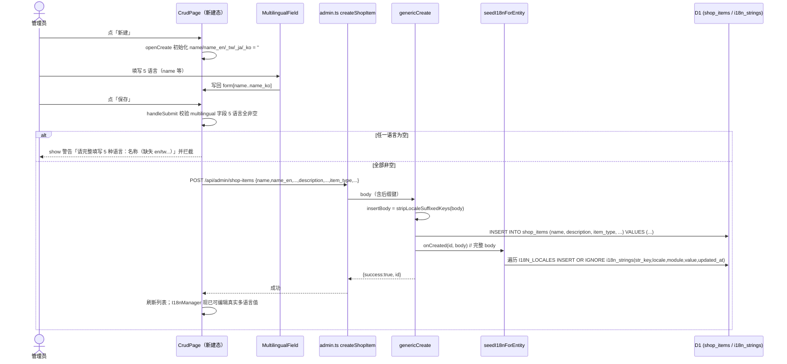
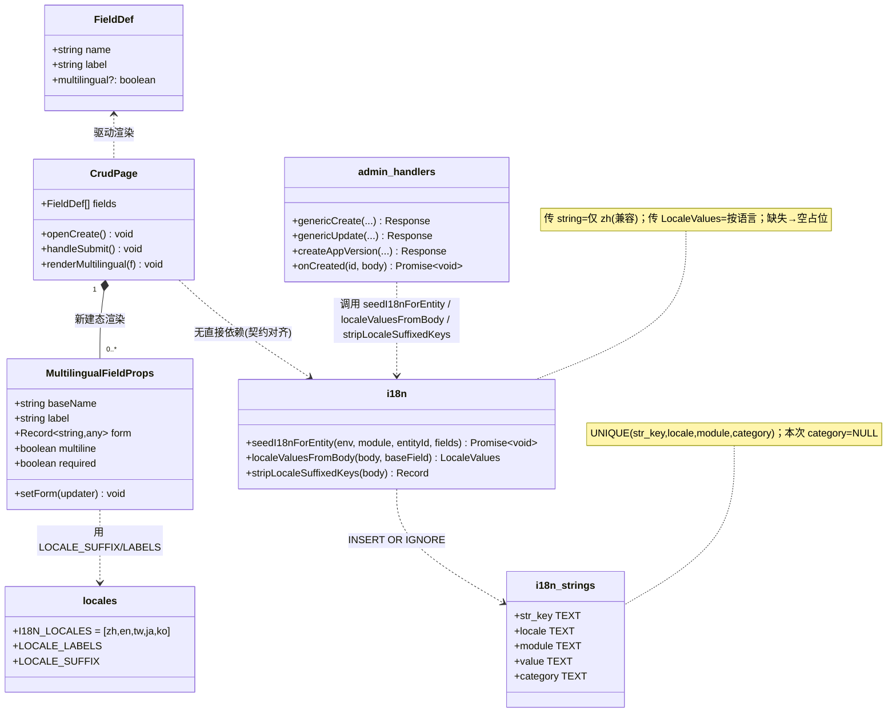
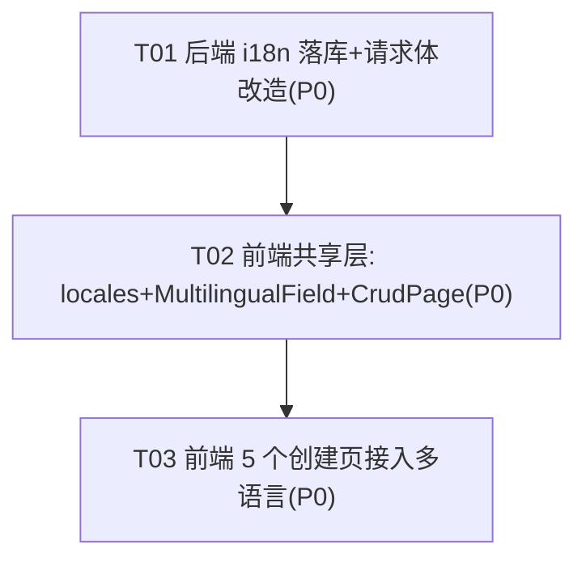

# sheeps · 新增内容强制 5 语言 + 多语言真实落库 —— 增量架构设计 + 任务分解

> 作者：架构师 高见远（Bob）｜ 团队：software-i18n-required
> 背景：管理后台（admin-console）在**新增**内容时，前端必须强制管理员把全部 5 种语言（zh/en/tw/ja/ko）填完才能提交；提交后服务端要把这些多语言值**真实落库**到 `i18n_strings`（而非当前空占位）。
> 本文给出**实现方案、技术选型、文件清单、前后端契约、调用流程、有序任务列表、共享约定与待明确事项**。
> 说明：本设计与仓库内既有 `docs/system_design.md`（另一不相关任务的产物）无关，故输出到独立文件，避免误覆盖。

---

## 1. 实现方案概述 + 技术选型

**结论先行**：复用现有 React/MUI 数据驱动表单（`CrudPage` + `FieldDef[]`）与现有 i18n 底座（`server/src/i18n.ts`），**不引入任何新依赖**。核心改动极小且分层清晰：

- **前端**：给 `FieldDef` 增加 `multilingual?: boolean`；新增一个共用 `MultilingualField` 组件，在**新建**时把 `name/description/title/content/update_log` 渲染成 5 个输入框（zh/en/tw/ja/ko），任一为空则保存被拦截；**编辑**时退化为单 zh 输入框（保持现状）。5 个创建页只需给对应字段加 `multilingual: true`。
- **后端**：`seedI18nForEntity` 签名升级为「支持按语言传值」，旧调用传 `string` 仍只写 zh（**向后兼容**）；4 个 `onCreated` 回调通过新 helper `localeValuesFromBody` 把请求体里的 `*_en/_tw/_ja/_ko` 透传下去。
- **关键约束（已探明）**：`genericCreate` / `genericUpdate` / `createAppVersion` 直接拿请求体 `Object.keys(body)` 拼 `INSERT/UPDATE` 列。由于「宽列」在多语言归一化改造中已 DROP，业务表**不存在** `name_en` 等列，因此必须在写入业务表前用 `stripLocaleSuffixedKeys` 剔除这些仅用于 i18n 传输的后缀键，但要把**完整 body** 传给 `onCreated` 以供 `seedI18nForEntity` 读取。

**架构风格**：保持「业务表只存基础列（zh 原值）+ `i18n_strings` 单表归一化多语言」的现状；读路径中文回退基础列、其它语言读 `i18n_strings` 的逻辑完全不变。

| 难点 | 选型 / 策略 |
|---|---|
| 前端 4~5 个页重复 5 语言输入 | 抽共用 `MultilingualField`，避免复制粘贴 |
| 后端写入业务表会撞不存在的列 | `stripLocaleSuffixedKeys` 在 INSERT/UPDATE 前剔除后缀键；完整 body 仍传给 `onCreated` |
| 旧调用方（Android 等）只发 zh | `seedI18nForEntity` 旧传 `string` 行为不变；新传 `LocaleValues`；缺失语言→空占位，**绝不报错/拒绝** |
| 强制 5 语言但又不破坏旧调用方 | 强制只落在**前端 admin-console**（新增态）；后端保持 lenient（有则写真实值，无则空占位） |
| 编辑是否强制 | **本次仅新增强制**；编辑不强校验，非 zh 增量补全继续由 `I18nManager` 承担 |

---

## 2. 文件列表（相对仓库根 `E:/file/sheeps`，共 11 个，≤12）

**新增（2）**
| 路径 | 作用 |
|---|---|
| `admin-console/src/constants/locales.ts` | 前端多语言常量：`I18N_LOCALES`、`LOCALE_LABELS`、`LOCALE_SUFFIX`（与后端 `i18n.ts` 同值，独立副本需保持同步） |
| `admin-console/src/components/MultilingualField.tsx` | 共用多语言输入组件：渲染 5 个输入框，受控读写 `form[base/_en/_tw/_ja/_ko]` |

**修改（9）**
| 路径 | 改动点 |
|---|---|
| `admin-console/src/components/CrudPage.tsx` | `FieldDef` 增加 `multilingual`；`openCreate` 初始化 5 语言空值；渲染 multilingual 字段（新建→`MultilingualField`，编辑→单 zh 输入）；`handleSubmit` 增加 5 语言校验 + body 组装后缀键 |
| `admin-console/src/pages/PropProducts.tsx` | `name`、`description` 加 `multilingual: true` |
| `admin-console/src/pages/SkinProducts.tsx` | `name`、`description` 加 `multilingual: true` |
| `admin-console/src/pages/Notices.tsx` | `title`、`content` 加 `multilingual: true` |
| `admin-console/src/pages/Tasks.tsx` | `name`、`description` 加 `multilingual: true` |
| `admin-console/src/pages/AppVersions.tsx` | `update_log` 加 `multilingual: true` |
| `server/src/i18n.ts` | 新增 `AppLocale`/`LocaleValues`/`I18nFieldValue` 类型；`seedI18nForEntity` 支持按语言传值（兼容旧 `string`）；新增 `localeValuesFromBody`、`stripLocaleSuffixedKeys` helper |
| `server/src/handlers/admin.ts` | 4 处 `onCreated`/seed 调用改用 `localeValuesFromBody`；`genericCreate`/`genericUpdate`/`createAppVersion` 写入业务表前 `stripLocaleSuffixedKeys`，并把完整 body 传给 `onCreated` |
| `server/test/qa_features.test.js` | 新增/调整断言：新建时 5 语言真实落库；旧 zh-only 调用仍向后兼容 |

> 无需改动：`admin-console/src/api/admin.ts`（`createShopItem` 等已是 `Record<string, any>`，透传带后缀键的 body）；`server/schema.sql` 与 `i18n_strings` 表结构（已有 `UNIQUE(str_key, locale, module, category)`，无需迁移）；`I18nManager.tsx`（只读/编辑 `i18n_strings`，落库后即可正常编辑，不动）。

---

## 3. 前后端契约

### 3.1 请求体字段命名约定

- 基础字段（zh，默认语言，**无后缀**）：`name` / `description` / `title` / `content` / `update_log`。
- 其它语言：`{base}{LOCALE_SUFFIX}` → `name_en`、`name_tw`、`name_ja`、`name_ko`、`description_en` … 后缀与 `server/src/i18n.ts` 的 `LOCALE_SUFFIX`（en→`_en`、tw→`_tw`、ja→`_ja`、ko→`_ko`）**完全一致**，保证前后端单一来源。
- 该后缀仅是「传输约定」；入库后归一化为 `i18n_strings(str_key = {module}.{entityId}.{base}, locale = 语言, value)` —— 字段名用基础名（不含后缀），语言单独存 `locale` 列。

### 3.2 请求体 JSON 示例（shop_items 新建）

```json
POST /api/admin/shop-items
{
  "name": "苹果",
  "name_en": "Apple",
  "name_tw": "蘋果",
  "name_ja": "リンゴ",
  "name_ko": "사과",
  "description": "红红的果子",
  "description_en": "A red fruit",
  "description_tw": "紅紅的果子",
  "description_ja": "赤い果物",
  "description_ko": "빨간 과일",
  "item_type": "PROP_FOOD",
  "points_price": 100,
  "stock": 50
}
```

旧调用方（Android，只发 zh，向后兼容）：
```json
{ "name": "苹果", "description": "", "item_type": "PROP_FOOD", "points_price": 100 }
```
→ 无后缀键，`genericCreate` 写入不变；`seedI18nForEntity` 仅落 zh，`en/tw/ja/ko` 空占位（=当前行为）。

### 3.3 `seedI18nForEntity` 新签名（向后兼容）

```ts
// server/src/i18n.ts
export type AppLocale = 'zh' | 'en' | 'tw' | 'ja' | 'ko';
export type LocaleValues = Partial<Record<AppLocale, string>>;
// 字段值：
//  - 旧调用传 string            → 仅 zh，其余空占位（兼容）
//  - 新调用传 LocaleValues       → 按语言给值
//  - null / undefined           → 整体当作空（zh=''）
export type I18nFieldValue = string | LocaleValues | null | undefined;

export async function seedI18nForEntity(
  env: Env,
  module: string,
  entityId: string | number,
  fields: Record<string, I18nFieldValue>
): Promise<void>;
```

内部逻辑（兼容旧行为）：
```ts
for (const [field, raw] of Object.entries(fields)) {
  const values: LocaleValues = (typeof raw === 'string' || raw == null) ? { zh: raw ?? '' } : raw;
  const strKey = `${module}.${entityId}.${field}`;
  for (const locale of I18N_LOCALES) {
    const value = values[locale] ?? '';          // 缺失语言 → 空占位（不报错）
    statements.push(env.DB.prepare(
      `INSERT OR IGNORE INTO i18n_strings (str_key, locale, module, value, updated_at) VALUES (?, ?, ?, ?, ?)`
    ).bind(strKey, locale, module, value, now));
  }
}
```

新增 helper（同文件）：
```ts
/** 从请求体按后缀提取某基础字段的 5 语言值（空值跳过 → 该语言空占位） */
export function localeValuesFromBody(body: Record<string, any>, baseField: string): LocaleValues {
  const out: LocaleValues = {};
  for (const loc of I18N_LOCALES) {
    const key = loc === 'zh' ? baseField : `${baseField}${LOCALE_SUFFIX[loc]}`;
    const v = body?.[key];
    if (v !== undefined && v !== null && String(v).trim() !== '') out[loc] = String(v);
  }
  return out;
}

/** 业务表 INSERT/UPDATE 时剔除仅用于 i18n 传输的 locale 后缀键，避免引用不存在的列 */
export function stripLocaleSuffixedKeys(body: Record<string, any>): Record<string, any> {
  const out: Record<string, any> = {};
  for (const [k, v] of Object.entries(body)) {
    const isSuffixed = I18N_LOCALES.some((l) => l !== 'zh' && k.endsWith(LOCALE_SUFFIX[l]));
    if (!isSuffixed) out[k] = v;
  }
  return out;
}
```

### 3.4 4 个 `onCreated` / seed 调用改造（`server/src/handlers/admin.ts`）

```ts
// shop_items (原 L1166)
onCreated: (id, body) => seedI18nForEntity(env, 'shop_items', id, {
  name: localeValuesFromBody(body, 'name'),
  description: localeValuesFromBody(body, 'description'),
})

// notice (原 L1186)
onCreated: (id, body) => seedI18nForEntity(env, 'notice', id, {
  title: localeValuesFromBody(body, 'title'),
  content: localeValuesFromBody(body, 'content'),
})

// task (原 L1193)
onCreated: (_rowid, body) => seedI18nForEntity(env, 'task', body.id, {
  name: localeValuesFromBody(body, 'name'),
  description: localeValuesFromBody(body, 'description'),
})

// app_version (原 L670，在 createAppVersion 内)
seedI18nForEntity(env, 'app_version', newId, {
  update_log: localeValuesFromBody(body, 'update_log'),
}).catch((e) => console.error('seedI18nForEntity failed for app_version:', e));
```

### 3.5 `genericCreate` / `genericUpdate` / `createAppVersion` 写入修正

```ts
// genericCreate（原 L264-280）：用 stripLocaleSuffixedKeys 算 INSERT 列，但 onCreated 传完整 body
const body = (await request.json().catch(() => null)) as Record<string, any> | null;
if (!body || typeof body !== 'object') return jsonError('请求体无效', 400, env);
const insertBody = stripLocaleSuffixedKeys(body);
const cols = Object.keys(insertBody).filter((k) => insertBody[k] !== undefined);
const quotedCols = cols.map((c) => `"${c}"`).join(', ');
const sql = `INSERT INTO ${cfg.table} (${quotedCols}) VALUES (${placeholders})`;
// ... run ...
if (cfg.onCreated) cfg.onCreated(entityId, body);   // 传完整 body，含后缀键

// genericUpdate（原 L293）：SET 子句同样用 stripLocaleSuffixedKeys(body)
// createAppVersion（原 L658）：const cols = Object.keys(stripLocaleSuffixedKeys(body))...
```

### 3.6 前端组件接口（`MultilingualField`）

```ts
// admin-console/src/components/MultilingualField.tsx
interface MultilingualFieldProps {
  baseName: string;   // 'name'
  label: string;      // '名称'
  form: Record<string, any>;  // 共享表单状态，含 baseName / baseName_en / _tw / _ja / _ko
  setForm: (updater: (prev: Record<string, any>) => Record<string, any>) => void;
  multiline?: boolean;   // description/content/update_log 用多行
  required?: boolean;    // 仅新建态传 true → 每个空语言标红
  disabled?: boolean;
}
// 内部：对 I18N_LOCALES 各渲染一个 TextField/Textarea，
// value={form[base + suffix] ?? ''}，onChange 写回 form；zh 排第一，标注 LOCALE_LABELS。
```

`FieldDef` 扩展：
```ts
export interface FieldDef {
  name: string;
  label: string;
  // ...既有...
  /** 多语言字段：新建态渲染 5 语言输入框并强制必填；编辑态退化为单 zh 输入 */
  multilingual?: boolean;
}
```

---

## 4. 程序调用流程（新建提交 → 校验 → API → onCreated → 落库）



---

## 5. 数据模型与接口（类图）



---

## 6. 有序任务列表（按依赖与实现顺序，共 3 个，每组 ≥3 文件）

> 说明：项目已存在，故「首任务」= 后端契约底座（全体任务的前置依赖）。依赖链 `T01 → T02 → T03`，仅 3 节点，符合「尽量减少线性依赖」。

**T01 · 后端 i18n 落库与请求体改造（契约底座，P0）**
- 源文件：`server/src/i18n.ts`（改）、`server/src/handlers/admin.ts`（改）、`server/test/qa_features.test.js`（改/增）
- 改动点：
  - `i18n.ts`：新增 `AppLocale`/`LocaleValues`/`I18nFieldValue` 类型；`seedI18nForEntity` 支持按语言传值（旧 `string` 行为不变）；新增 `localeValuesFromBody`、`stripLocaleSuffixedKeys`。
  - `admin.ts`：4 处 `onCreated`/seed 调用改用 `localeValuesFromBody`；`genericCreate`/`genericUpdate`/`createAppVersion` 写入业务表前 `stripLocaleSuffixedKeys`，`onCreated` 传完整 body。
  - `qa_features.test.js`：新增断言——新建时 5 语言真实落库到 `i18n_strings`；旧 zh-only 调用仍只落 zh、其余空占位（向后兼容）。
- 依赖：无 ｜ 优先级：**P0**

**T02 · 前端共享层：locale 常量 + MultilingualField + CrudPage 适配（P0）**
- 源文件：`admin-console/src/constants/locales.ts`（新）、`admin-console/src/components/MultilingualField.tsx`（新）、`admin-console/src/components/CrudPage.tsx`（改）
- 改动点：
  - `locales.ts`：导出 `I18N_LOCALES`、`LOCALE_LABELS`、`LOCALE_SUFFIX`（与后端同值）。
  - `MultilingualField.tsx`：渲染 5 语言输入框（zh 在前），受控读写 `form[base/_en/_tw/_ja/_ko]`，`required` 下空语言标红；`multiline` 支持 textarea。
  - `CrudPage.tsx`：`FieldDef` 增 `multilingual`；`openCreate` 初始化 5 语言空值；渲染时 multilingual+新建态→`MultilingualField`，编辑态→单 zh 输入；`handleSubmit` 对 multilingual 新建字段校验 5 语言全非空并组装后缀键进 body。
- 依赖：**T01**（契约对齐）｜ 优先级：**P0**

**T03 · 前端 5 个创建页接入多语言字段（P0）**
- 源文件：`admin-console/src/pages/PropProducts.tsx`（改）、`SkinProducts.tsx`（改）、`Notices.tsx`（改）、`Tasks.tsx`（改）、`AppVersions.tsx`（改）
- 改动点：给对应多语言字段加 `multilingual: true`：
  - `PropProducts`/`SkinProducts`：`name`、`description`
  - `Notices`：`title`、`content`
  - `Tasks`：`name`、`description`
  - `AppVersions`：`update_log`
  - （multilingual 字段新建态 5 语言恒强制必填，覆盖原 `required` 标志，与「全部 5 种语言都填完」一致）
- 依赖：**T02** ｜ 优先级：**P0**

---

## 7. 共享知识（跨文件约定）

- **字段命名**：`{base}` = zh；`{base}_en/_tw/_ja/_ko` = 其它语言。后缀常量 `LOCALE_SUFFIX` 前端（`constants/locales.ts`）与后端（`i18n.ts`）各一份，**必须保持同步**。
- **语言顺序/标签**：`['zh','en','tw','ja','ko']`；UI 标签 `LOCALE_LABELS = {zh:'中文', en:'English', tw:'繁體', ja:'日本語', ko:'한국어'}`。
- **CrudPage 规则**：multilingual 字段在**新建态** 5 语言强制必填；**编辑态**退化为单 zh 输入（保持现状，非 zh 增量补全由 `I18nManager` 承担）。
- **seedI18nForEntity 语义**：传 `string` = 仅 zh（兼容旧调用）；传 `LocaleValues` = 按语言给值；缺失语言 → 空占位，**不报错、不拒绝**。
- **写入前必 strip**：任何把请求体直接拼 `INSERT/UPDATE` 的路径（genericCreate/genericUpdate/createAppVersion）都必须先 `stripLocaleSuffixedKeys`，否则会引用不存在的列。
- **i18n_strings 不变**：无需 schema 迁移；`category` 本次种子均为 `NULL`，与现有 seed 行为一致。
- **校验文案（建议 key）**：`i18n.requiredAll = "请完整填写 5 种语言：{label}（缺失：{locales}）"`，红色提示。
- **组件接口**：见 §3.6 `MultilingualFieldProps`。

---

## 8. 任务依赖图



---

## 9. 待明确事项（假设 + 需拍板点）

1. **假设核查**：假定**没有任何业务表**存在以 `_en/_tw/_ja/_ko` 结尾的真实列（宽列已在多语言归一化改造中 DROP）。若存在，`stripLocaleSuffixedKeys` 会误删真实列 → 工程师实现前请 `grep -rE "_(en|tw|ja|ko)\b" server/src/handlers` 及 `schema.sql` 复核。
2. **description 强制范围**：`PropProducts`/`SkinProducts` 的 `description` 当前非 `required`，但本次要求「全部 5 种语言都填完」。我建议 multilingual 字段新建态 5 语言**强制必填**（含 description）。是否接受？
3. **编辑态 UX**：我建议编辑时 multilingual 字段退化为单 zh 输入框（避免渲染无法持久化的空框误导）。是否更希望编辑也显示 5 框（仅 zh 可持久化，非 zh 走 `I18nManager`）？
4. **后端是否也对管理后台做强制校验**：为兼容只发 zh 的 Android 调用方，后端**不能全局拒绝**缺失语言。若产品要求「服务端双保险」，需对 admin 端点单独加开关（本次不建议，靠前端强制即可）。是否同意？
5. **编辑落库（Phase 2，可选）**：若未来希望编辑表单也能增量补全并落库非 zh，需要：① `seedI18nForEntity` 支持 UPSERT（`ON CONFLICT(str_key,locale,module,category) DO UPDATE SET value=excluded.value`）；② `genericUpdate` 增加 `onUpdated` 回调。且编辑态 list 响应不含非 zh 值，预填需额外 fetch。本次**不实现**，避免超范围与回归风险。

---

## 10. 落地检查清单（给工程师）

- [ ] `stripLocaleSuffixedKeys` 在 genericCreate/genericUpdate/createAppVersion 三处均生效；用一条带 `name_en` 的创建请求验证业务表 INSERT 不报错、且 `i18n_strings` 出现 5 行真实值。
- [ ] 旧 zh-only 创建请求（模拟 Android）回归：行为与新版前一致（仅 zh 落库）。
- [ ] 前端 5 个页新建：任一度空语言 → 保存被拦截并红字提示；5 语言填全 → 成功且 `I18nManager` 能看到真实多语言值。
- [ ] 前端编辑：multilingual 字段仅 zh 可编辑，保存不报错（无后缀键进入 UPDATE）。
- [ ] 全量 `tsc` 类型检查通过（前端 + 后端）；`qa_features.test.js` 新增断言通过。
