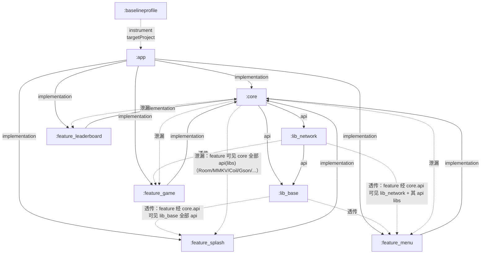
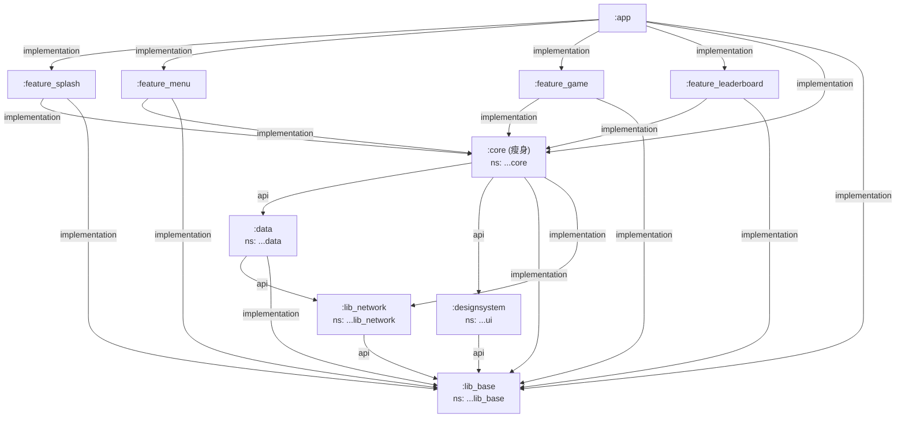

# 羊了个羊 Android 项目 · 结构体检 + 目标结构方案 + 分阶段重构路线图

> **文档性质**：纯架构评审方案，**不修改任何业务代码 / Gradle 配置**，不实际执行重构。
> **项目根**：`E:\file\sheeps\app\`（多模块 Gradle 工程）
> **取证方式**：读取 `settings.gradle.kts`、`*/build.gradle.kts`、`gradle/libs.versions.toml`；全量扫描 `src/main/java` 下 `.kt` 源文件；核对每个文件的 `package` 头；对关键类做交叉引用 `grep`；对全部源文件做行数统计。
> **模块清单**（来自 `settings.gradle.kts`）：`:app`、`:core`、`:lib_base`、`:lib_network`、`:feature_splash`、`:feature_menu`、`:feature_game`、`:feature_leaderboard`、`:baselineprofile`。

---

## 0. 一句话结论（给主理人）

> **产出文档**：`E:\file\sheeps\docs\struct-opt-review.md`
> **建议最先做、性价比最高的阶段 = Phase 1（依赖收紧 + 死依赖清理 + 日志库统一）**：仅改 `build.gradle.kts` 的 `api`→`implementation` 并删除未使用的 `Gson/logcat`，不移动任何源文件，**零运行时风险、可立即降低耦合面**，且是后续所有拆分的地基。

---

## 1. 现状诊断（逐条对照 4 类痛点）

### 1.1 ① core 职责过大

`core` 单模块（namespace=`com.example.sheeps.core`）承载了**数据层 + UI 层 + 业务/工具层**三类本应分离的关注点，跨层边界完全模糊。

| 职责域 | 实际包路径 | 性质 | 说明 |
|---|---|---|---|
| 数据层 | `com.example.sheeps.data.local`（Room：AppDatabase/LocalDao/LocalEntities） | 数据 | DB 与实体 |
| 数据层 | `com.example.sheeps.data.network`（ApiService） | 数据 | 网络接口定义 |
| 数据层 | `com.example.sheeps.data.model`（GameModels 424 行） | 数据 | 数据模型 |
| 数据层 | `com.example.sheeps.data.repository`（Game/Match/Sync/User 共 4 个 Repository） | 数据 | 仓储 |
| 数据层 | `com.example.sheeps.data.result`（ApiResult/safeApiCall/ErrorMessageMapper/TokenRefresher/ResultExt） | 数据 | 统一结果封装 |
| UI 层 | `com.example.sheeps.theme`（Color/Type/Shape/Theme，337 行） | UI | 设计系统主题 |
| UI 层 | `com.example.sheeps.ui.components`（SheepsButton/SheepsDialog/SheepsTopAppBar/RemoteImage/ItemIcon/LoadingIndicator/AnimatedCounter，SheepsButton 达 311 行） | UI | 公共组件 |
| 业务/工具 | `com.example.sheeps.core.game`（GameEngine/SkinConstants/TileIconProvider） | 业务 | 游戏引擎 |
| 业务/工具 | `com.example.sheeps.core.multiplayer`（WebSocketManager 216 行） | 业务 | 实时对战 |
| 业务/工具 | `com.example.sheeps.core.update`（UpdateDownloadManager 207 行） | 业务 | 更新下载 |
| 业务/工具 | `com.example.sheeps.core.preference`（UserPreferences 214 行） | 业务 | 偏好存储 |
| 业务/工具 | `com.example.sheeps.core.cache`（ShopCache） | 业务 | 缓存 |
| 业务/工具 | `com.example.sheeps.core.utils`（ImageCompressor/AuthEventBus/NetworkMonitor） | 工具 | 通用工具 |
| 业务/工具 | `com.example.sheeps.core.startup`（Logcat/Mmkv/TheRouter 三个 Initializer） | 基础设施 | App Startup |
| 业务/工具 | `com.example.sheeps.core.di`（NetworkModule 254 行 / StorageModule） | 基础设施 | Hilt 注入 |

**结论**：数据层（`data/*`）、UI 层（`theme`、`ui/components`）与业务工具（`core/*`）同处一个模块，feature 模块既依赖 `core` 又不受任何边界约束，可随意穿透到任意内层。

> **复核说明**：主理人交接中提到的 `core/model`、`core/result` 经扫描**实际不存在**，对应物为 `data/model`、`data/result`；特此澄清，避免后续改名清单出错。

---

### 1.2 ② 包名 / 命名空间混乱

**核心问题**：AGP 的 `namespace`（资源 R 类 / BuildConfig 生成包）与源码 `package` 目录树不一致，且 `core` 内部混用 4 套包前缀。

| 模块 | `build.gradle` namespace | 实际源包（`package` 头） | 一致性 |
|---|---|---|---|
| `:lib_base` | `com.example.sheeps.lib_base` | `com.example.sheeps.core.base`、`com.example.sheeps.core.crypto` | ❌ **不一致**（源在 `core.*` 下，却声明为 `lib_base`） |
| `:lib_network` | `com.example.sheeps.lib_network` | `com.example.sheeps.core`（AppConfig）、`com.example.sheeps.core.network`（EncryptionInterceptor） | ❌ **不一致**（源在 `core.*` 下，却声明为 `lib_network`） |
| `:core` | `com.example.sheeps.core` | `com.example.sheeps.core.*`、`com.example.sheeps.data.*`、`com.example.sheeps.ui.*`、`com.example.sheeps.theme.*` | ⚠️ **部分一致**（仅 `core.*` 匹配；`data/ui/theme` 三套前缀游离在 namespace 之外） |
| `:feature_splash` | `com.example.sheeps.splash` | `com.example.sheeps.splash.*` | ✅ |
| `:feature_menu` | `com.example.sheeps.menu` | `com.example.sheeps.menu.*` | ✅ |
| `:feature_game` | `com.example.sheeps.game` | `com.example.sheeps.game.*` | ✅ |
| `:feature_leaderboard` | `com.example.sheeps.leaderboard` | `com.example.sheeps.leaderboard.*` | ✅ |

**`core` 内部的 4 套包前缀**（证据：目录树 + `package` 头扫描）：

```
com.example.sheeps.core.*      → core/game, core/multiplayer, core/update, core/preference,
                                  core/cache, core/utils, core/startup, core/di
com.example.sheeps.data.*      → data/local, data/network, data/model, data/repository, data/result
com.example.sheeps.ui.*        → ui/components
com.example.sheeps.theme.*     → theme
```

**后果**：
1. `lib_base`/`lib_network` 的源码包 `com.example.sheeps.core.*` 与模块名（`lib_base`/`lib_network`）、`namespace` 完全对不上，阅读者无法从包路径判断类属于哪个模块。
2. `core` 内 `data/ui/theme` 三套前缀游离在 `com.example.sheeps.core` 之外，导致 `core` 的 R 类为 `com.example.sheeps.core.R`，但 `theme/ui` 源文件却在别的包下引用它，逻辑割裂。
3. 由此引发下游"借道"引用（见 1.3）。

---

### 1.3 ③ 依赖方向 / 透传

**`api` 滥用点（core 的 `build.gradle.kts` 共 16 处 `api` 声明）**：

```
api(project(":lib_base"))          // 透传 lib_base 全部 api
api(project(":lib_network"))       // 透传 lib_network 全部 api
api(libs.logutils.pengwei)         // 日志库
api(libs.workmanager)              api(libs.hilt.work)   api(libs.startup)
api(libs.lifecycle.process)        api(libs.androidx.room.runtime)  api(libs.androidx.room.ktx)
api(libs.mmkv)                     api(libs.androidx.security.crypto)
api(libs.hilt.android)             api(libs.coil)  api(libs.coil.compose)
api(libs.gson)                     api(libs.xxpermissions)
```

`lib_base` 自身也用 `api` 抛出了 Compose BOM、material3、icons、therouter、mmkv、logcat、toaster、utilcode、hilt 等 16 个库。

**透传链路**：`feature_* → implementation(:core)`，而 `:core` 用 `api` 把 `:lib_base`、`:lib_network` 及其全部 `api(libs.*)` 一并抛出 → **每个 feature 无需声明即可直接使用 Room / MMKV / Coil / WorkManager / Retrofit / OkHttp / XXPermissions / 甚至 Gson** 等底层，绕开 `core` 的 Repository 抽象直接触碰数据库与网络传输层，**耦合被指数级放大**。

**实证：feature 直接引用的底层内部类型**（`grep` 交叉引用确认，均为 `core` 用 `api` 泄漏后的"越级依赖"）：

| feature 引用的内部类型 | 实际所属模块 | 应通过的正道 |
|---|---|---|
| `com.example.sheeps.core.R` | `:core`（R 类） | 应使用本模块 R 或设计系统 R |
| `com.example.sheeps.core.base.BaseActivity` | `:lib_base`（包却是 `core.base`） | 应由 feature 直依赖 `:lib_base` |
| `com.example.sheeps.core.base.BaseMviViewModel` | `:lib_base` | 同上 |
| `com.example.sheeps.core.base.IGameService` | `:lib_base` | 同上 |
| `com.example.sheeps.core.preference.UserPreferences` | `:core`（内部） | 应经 Repository 封装 |
| `com.example.sheeps.core.cache.ShopCache` | `:core`（内部） | 应经 Repository 封装 |
| `com.example.sheeps.core.game.TileIconProvider` | `:core`（内部） | 应经设计系统/资源 |
| `com.example.sheeps.core.utils.NetworkMonitor` | `:core`（内部） | 应经封装或下沉 common |
| `com.example.sheeps.core.AppConfig` | `:lib_network`（包却是 `core`） | lib_network 内部，feature 不应见 |

> 其中 `com.example.sheeps.core.AppConfig` 的引用尤其说明问题：`lib_network` 的类被放在 `com.example.sheeps.core` 包下，feature 经 `core` 的 `api` 直接拿到——**跨模块内部类被透传**。

#### 当前模块依赖图（实线=声明依赖；红色虚线=因 `api` 透传而实际可见）



---

### 1.4 ④ 重复 / 死代码

#### （1）死依赖（声明了但源码 0 引用）

| 依赖 | 声明位置 | 引用证据 | 处理建议 |
|---|---|---|---|
| `api(libs.gson)`（Gson） | `:core` | 全工程 `*.kt` 无 `import com.google.gson` / `Gson(` 引用 → **0 引用** | **删除** |
| `api(libs.logcat)`（com.squareup.logcat） | `:lib_base` | 全工程**无任何 `.kt` 文件 `import com.squareup.logcat`**；项目实际日志统一用 `com.apkfuns.logutils.LogUtils`（在 core/features 共 7+ 文件使用） | **删除**（与 logutils 二选一，见下） |

> 注：`grep "logcat("` 在 `app/worker/*` 与 `MyApplication.kt` 命中，但均无对应 `import com.squareup.logcat`，疑为本地函数或字符串误命；**建议人工确认后移除该库**。

#### （2）重复 / 冗余能力

| 项 | 现状 | 建议 |
|---|---|---|
| 日志库 | `lib_base` 带 `logcat`，`core` 带 `logutils`，**两套日志门面并存**；`logutils` 已被广泛采用 | 统一为**一套**（推荐保留 `logutils`，删 `logcat`），或反向；勿并存 |
| 图片压缩 | `core/utils/ImageCompressor.kt`（自定义，仅 `ProfileScreen` 使用） vs `feature_menu` 引入的 `luban` + `cropper` vs `lib_base` 的 `utilcode`(blankj) ImageUtils | 收敛为**单一压缩入口**：头像场景统一走 `luban`，`ImageCompressor` 改为薄封装或下沉 `common` |
| JSON 解析 | `lib_network` 用 `kotlinx-serialization`（Retrofit converter），`core` 又带 `gson`（未用） | 删除 `gson`；统一 `kotlinx-serialization` |
| MMKV | `lib_base` 与 `core` **两处**都 `api(libs.mmkv)` | 保留 `lib_base` 一处即可，`core` 改为 `implementation`（不二次泄漏） |
| 加解密 | `AesGcmCipher`(:lib_base) 为唯一实现，`EncryptionInterceptor`(:lib_network) 已正确复用它 | **无重复**，但密钥硬编码于源码（安全隐患，超出本次范围，提请注意） |

#### （3）注释遗留 / 疑似死代码

| 位置 | 问题 | 建议 |
|---|---|---|
| `core/.../core/di/NetworkModule.kt` 第 93–169 行 | **约 76 行被整段注释的 `tokenRefreshInterceptor`**（双 Token 静默刷新旧实现），与 `data/result/TokenRefresher.kt`（现行实现）功能重复 | **删除注释块**，以 `TokenRefresher` 为单一真相源 |
| `IGameService`（位于 `:lib_base/core/base`） | 属 game 领域，却放在"base"包且包名是 `core.base` | 改名/移动到 `lib_base/service`（见 2.4） |

#### （4）超大文件（行数统计，`>800` 为重点；`>400` 为拆分候选）

| 文件 | 行数 | 层级 | 备注 |
|---|---|---|---|
| `feature_splash/.../splash/ui/SplashActivity.kt` | **916** | feature | splash 竟 916 行，粒子/动画逻辑（Sparkle/Particle）应外提 |
| `feature_menu/.../viewmodel/MenuViewModel.kt` | **846** | feature | 虽已拆 delegate，仍超大 |
| `feature_game/.../ui/components/GameBoardSurfaceView.kt` | 758 | feature | SurfaceView 绘制，渲染逻辑可抽 |
| `feature_game/.../ui/components/DuelGameBoardSurfaceView.kt` | 669 | feature | 同上 |
| `feature_menu/.../ui/MenuActivity.kt` | 570 | feature | |
| `feature_game/.../viewmodel/GameViewModel.kt` | 564 | feature | |
| `feature_game/.../ui/components/EndlessBoardSurfaceView.kt` | 530 | feature | |
| `feature_game/.../ui/screens/DuelScreen.kt` | 463 | feature | |
| `feature_game/.../ui/screens/GameScreen.kt` | 462 | feature | |
| `feature_menu/.../ui/dialogs/PrepareGameDialog.kt` | 453 | feature | |
| `core/.../data/model/GameModels.kt` | 424 | core(数据) | 模型集中，可按域拆分 |
| `feature_menu/.../ui/screens/GameHomeScreen.kt` | 420 | feature | |
| `feature_game/.../viewmodel/helpers/GameLevelGenerator.kt` | 407 | feature | |
| `feature_menu/.../ui/components/BackpackCard.kt` | 401 | feature | |

> 超大文件集中在 `feature_game` / `feature_menu`，属**业务膨胀**，建议随 Phase 2/3 顺手按"视图/逻辑/委托"进一步拆分（非删除）。

---

## 2. 目标结构方案

### 2.1 依赖方向原则（`api` vs `implementation`）

- **`api` 只用于"本模块有意对外暴露的公共 API"**（如 `:lib_base` 的 `BaseActivity`、`:data` 的 Repository）。
- **`implementation` 用于一切内部依赖与第三方库**——Room、MMKV、Coil、WorkManager、Retrofit、OkHttp、安全库、日志库等**一律 `implementation`**，杜绝向 feature 透传。
- feature 模块**只依赖它真正用到的模块的 `api` 面**，越级内部类型（如 `UserPreferences`/`ShopCache`/`NetworkMonitor`）禁止直连，必须走 Repository / 封装层。

### 2.2 推荐目标模块划分 + 命名空间

> 采用"先收紧、后拆分"两步到位。最终目标是在保留现有 feature 数量的前提下，把 `:core` 按关注点拆为 `:data` / `:designsystem` / `:core`(瘦身) 三个模块。

| 模块 | namespace（统一规范） | 职责 | 关键依赖（方向） |
|---|---|---|---|
| `:lib_base` | `com.example.sheeps.lib_base` | 基座：BaseActivity / BaseMviViewModel / FlowExtensions / IGameService(→`service`) / AesGcmCipher(→`crypto`)； foundational 库（Compose BOM、material3、therouter、mmkv、hilt、utilcode、**单一日志库**） | `api` 仅暴露自身公共类；第三方库 `implementation` |
| `:lib_network` | `com.example.sheeps.lib_network` | 传输层：AppConfig / EncryptionInterceptor / OkHttp+Retrofit 客户端构建 | `api(:lib_base)`（crypto+hilt）；Retrofit/OkHttp/serialization `implementation`（仅经客户端接口暴露） |
| `:data` | `com.example.sheeps.data` | 数据层：`data/local`、`data/network`(ApiService)、`data/model`、`data/repository`、`data/result` | `api(:lib_network)`；`implementation(:lib_base)`；Repository 以 `api` 暴露给 feature |
| `:designsystem` | `com.example.sheeps.ui` | 设计系统：`theme/*`、`ui/components/*`、资源（R 类归属此模块） | `api(:lib_base)`（compose/material3） |
| `:core`（瘦身） | `com.example.sheeps.core` | 跨切业务/工具：`core/utils`、`core/preference`、`core/cache`、`core/multiplayer`、`core/update`、`core/game`、`core/startup`、`core/di` | `api(:data)`、`api(:designsystem)`；`implementation(:lib_base)`、`implementation(:lib_network)` |
| `:feature_*` | `com.example.sheeps.<feature>` | 各业务模块 | `implementation(:core)` + 按需 `implementation(:lib_base)`（用 BaseActivity 时）；**不直接碰 data/底层 lib** |
| `:app` | `com.example.sheeps` | 装配 | `implementation(:feature_*)` + `implementation(:core)` + `implementation(:lib_base)` |

### 2.3 目标模块依赖图（无循环 DAG）



> 若团队**暂不愿物理拆模块**，可只落地"依赖收紧"版：保持现有 4 个基础模块不变，仅把 `core` 的所有 `api(libs.*)` 与 `api(project)` 改为 `implementation`（feature 补直依赖），并用 `com.example.sheeps.core.*` 统一 core 内部 4 套前缀——同样能消除 80% 耦合，风险更低（见 Phase 1/2）。

### 2.4 统一包名 / 命名空间规范 + 改名清单

**规范（一句话）**：**模块 `namespace` == 源码根包 == `com.example.sheeps.<模块名>`；模块内所有 `.kt` 必须落在 `com/example/sheeps/<模块名>/...` 之下。**

**需改名的文件 / 目录清单**：

| 模块 | 现状路径 | 目标路径 | 触发改动 |
|---|---|---|---|
| `:lib_base` | `.../com/example/sheeps/core/base/*` | `.../com/example/sheeps/lib_base/base/*` | 移动目录 + 改 `package` + 全工程 import 替换 |
| `:lib_base` | `.../com/example/sheeps/core/crypto/*`（AesGcmCipher） | `.../com/example/sheeps/lib_base/crypto/*` | 同上 |
| `:lib_base` | `core/base/IGameService.kt` | `lib_base/service/IGameService.kt` | 包改为 `...lib_base.service` |
| `:lib_network` | `.../com/example/sheeps/core/AppConfig.kt` | `.../com/example/sheeps/lib_network/AppConfig.kt` | 包改为 `...lib_network` |
| `:lib_network` | `.../com/example/sheeps/core/network/*` | `.../com/example/sheeps/lib_network/network/*` | 包改为 `...lib_network.network` |
| `:core`（不拆时） | `.../com/example/sheeps/data/*` | `.../com/example/sheeps/core/data/*` | 包前缀加 `core.` |
| `:core`（不拆时） | `.../com/example/sheeps/ui/*` | `.../com/example/sheeps/core/ui/*` | 包前缀加 `core.` |
| `:core`（不拆时） | `.../com/example/sheeps/theme/*` | `.../com/example/sheeps/core/theme/*` | 包前缀加 `core.` |
| `:data`（拆分时） | 保持 `com.example.sheeps.data.*` | 不变（feature 现有 `data.*` import 免改） | —— |
| `:designsystem`（拆分时） | `theme/*`→`com.example.sheeps.ui.theme`；`ui/components/*`→`com.example.sheeps.ui.components` | 仅顶层由 `core` 升为 `ui` | feature 中 `com.example.sheeps.core.R` 改为 `com.example.sheeps.ui.R` |

### 2.5 重复 / 死代码清理清单

| 项 | 处理 | 说明 |
|---|---|---|
| `api(libs.gson)`（:core） | **删除** | 0 引用 |
| `api(libs.logcat)`（:lib_base） | **删除** | 0 import；与 `logutils` 二选一，保留 `logutils` |
| `api(libs.androidx.security.crypto)` | 改 `implementation` | 仅 `UserPreferences` 内部用，勿泄漏 |
| `api(libs.xxpermissions)` | 改 `implementation` | 仅 `feature_splash` 用，勿泄漏给全部 feature |
| `api(libs.lifecycle.process)` | 改 `implementation` | 仅 2 处使用 |
| `api(libs.workmanager)` / `api(libs.hilt.work)` / `api(libs.coil*)` / `api(libs.room.*)` / `api(libs.mmkv)` / `api(libs.startup)` / `api(libs.logutils.*)` | 改 `implementation`（或仅 `:data`/`:designsystem` 按需 `api`） | 收紧透传 |
| `NetworkModule.kt` 第 93–169 行注释块 | **删除** | 与 `TokenRefresher` 重复 |
| `core/utils/ImageCompressor.kt` | **合并/下沉** | 收敛为唯一压缩入口，内部委托 `luban` |
| `MMKV` 双声明 | 仅保留 `:lib_base` 一处 `api` | `:core` 改 `implementation` |
| 超大文件（见 1.4 表） | **拆分**（非删） | 按视图/逻辑/委托进一步拆 |

---

## 3. 分阶段重构路线图

原则：**小步推进、每阶段保持 `:app:assembleDebug` 绿；先收紧依赖与删死代码（低风险），再统一包名（中风险），最后物理拆模块（高风险、可选）。**

### Phase 1 — 低风险·高收益：依赖收紧 + 死依赖清理 + 日志统一

| 项 | 内容 |
|---|---|
| 涉及模块 | `:core`、`:lib_base`（仅改 `build.gradle.kts`，**不移动任何源文件**） |
| 改动类型 | 仅改依赖声明：`core` 的 14 个 `api(libs.*)` → `implementation`；删 `api(libs.gson)`；`lib_base` 删 `api(libs.logcat)`；`core` 的 `api(project(:lib_base))`/`api(project(:lib_network))` → `implementation`，并**在 `:feature_*` 与 `:app` 补 `implementation(project(:lib_base))`**（因 feature 直用 BaseActivity/IGameService） |
| 预估影响面 | 编译期；若某 feature 误用了泄漏类型，会出现"unresolved reference"——**机械补对应 `implementation` 依赖即可**，无运行时风险 |
| 验证方式 | `./gradlew :core:compileDebugKotlin :feature_menu:compileDebugKotlin :feature_game:compileDebugKotlin :app:compileDebugKotlin`（或 `./gradlew :app:assembleDebug`） |

### Phase 2 — 中风险：包名 / 命名空间统一

| 项 | 内容 |
|---|---|
| 涉及模块 | `:lib_base`、`:lib_network`、`:core`（移动目录 + 改 `package` + 全工程 import 替换） |
| 改动类型 | 按 2.4 清单移动 `core.base`→`lib_base.base`、`core.crypto`→`lib_base.crypto`、`core.AppConfig`→`lib_network`、`core.network`→`lib_network.network`；`core` 内部 `data/ui/theme` 统一到 `com.example.sheeps.core.*`（不拆方案）或升为 `:data`/`:designsystem`（拆分方案）；feature 中 `com.example.sheeps.core.R` 改为对应 R |
| 预估影响面 | 中：触发**全量 import / R 引用替换**；易漏改导致 `ClassNotFound`/`ResourceNotFound`（编译期可暴露大部分） |
| 验证方式 | `./gradlew :app:assembleDebug` + 冒烟测试（splash→menu→game 跑通）+ `./gradlew :app:lintDebug` |

### Phase 3 — 高风险（可选）：物理拆分 `:core` → `:data` / `:designsystem` / `:core`

| 项 | 内容 |
|---|---|
| 涉及模块 | 新建 `:data`、`:designsystem`；`:core` 瘦身；重接 `:feature_*`、`:app`、`settings.gradle.kts` |
| 改动类型 | 移动文件 + 新建模块 `build.gradle.kts` + 按 2.2/2.3 重接依赖；Hilt `@Module` 迁移需确认 `@InstallIn` 作用域；TheRouter 路由重生成 |
| 预估影响面 | 高：跨模块 DI 图、资源 R 归属、Baseline Profile 生成均受影响；建议仅在"需要严格模块边界 / 加速 feature 独立编译"时做 |
| 验证方式 | `./gradlew :app:assembleDebug` + `./gradlew :baselineprofile:generateBaselineProfile`（设备）→ 重新合入 release 基线 + 全量回归 |

> **顺手项（任意阶段）**：删除 `NetworkModule` 注释块；拆分 1.4 列出的超大文件；统一图片压缩入口。这些不单独占阶段，随 Phase 1–3 的编译窗口一并提交。

---

## 4. 风险与回滚

### 主要风险点

| 风险 | 触发场景 | 缓解 |
|---|---|---|
| 编译断裂 | `api`→`implementation` 后 feature 越级类型报错 | 逐模块 `compileDebugKotlin`；报错即补 `implementation` 依赖（机械） |
| 引用漏改 | 包名/命名空间重命名时漏替换 import 或 R | AGP 命名空间化 R 在**编译期**暴露；用 IDE 全局 rename + `git grep` 复核；优先选"拆分方案"以减少 `data.*` import 改动 |
| DI 图错乱 | 拆分模块导致 Hilt `@Module`/`@InstallIn` 作用域错位 | 迁移后逐个模块编译；确认 Singleton 组件仍覆盖全工程 |
| 路由/基线失效 | TheRouter 注解处理器、Baseline Profile 因类移动失效 | 重跑 therouter kapt；Phase 3 后重新生成 Baseline Profile |
| 密钥硬编码 | `AesGcmCipher` 密钥在源码（安全债，非本次范围） | 仅提示；建议后续移至服务端下发 / Android Keystore |

### 回滚策略

1. **分支隔离**：每个 Phase 独立分支（如 `refactor/struct-phase1`），主分支 `main` 始终可发布。
2. **阶段性基线**：每阶段开始前 `git tag struct-phaseN-base`；阶段内小步 commit（按模块/按依赖类型）。
3. **门禁**：以 `./gradlew :app:assembleDebug` 绿为合并门槛；任一阶段出问题，`git checkout struct-phaseN-base` 或 `git revert` 该阶段提交即可整体回退，**不影响已合并的前序阶段**。
4. **不破坏 feature 编译**：Phase 1 先收紧、再移动；移动文件（Phase 2/3）保持 feature 仍可编译（import 一次性替换），避免"拆到一半工程跑不起来"。

---

> **交付总结**：本文档定位 4 类痛点并附实证（含当前/目标两张 Mermaid 依赖图、包一致性表、feature 越级引用表、死依赖与超大文件清单、改名清单、三阶段路线图与回滚策略）。**建议从 Phase 1 起步**——仅改 Gradle 依赖声明即可立竿见影收紧耦合，且零运行时风险。
