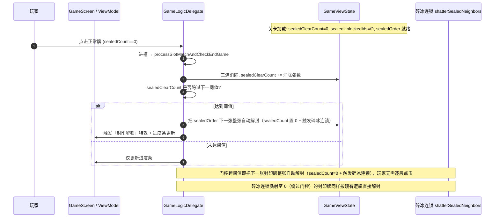
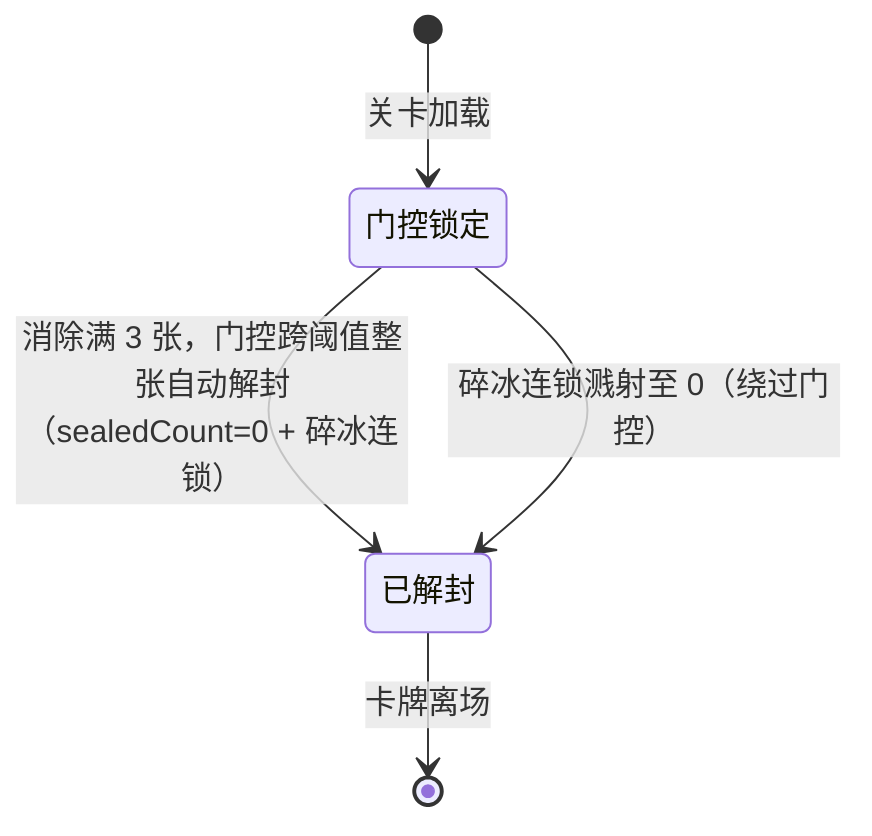

# 封印关卡「进度门控解锁」机制设计方案

> 作者：高见远（软件架构师 / software-architect）
> 日期：2026-07-07
> 范围：仅机制设计，不含实现代码。供产品 / 主理人评审。
> 背景：在现有「卡牌层数封印（sealedCount）」之上，叠加一层「进度门控」——玩家每消除 3 张正常卡牌，门控跨过阈值即把下一张封印牌整张自动解封（`sealedCount` 置 0 + 碎冰连锁），无需逐层点击。

---

## 1. 现有封印逻辑回顾（源码核实）

以下 5 点均已读源码核实，定位精确到文件:行号。

| # | 设计点 | 结论 | 精确位置 |
|---|--------|------|----------|
| 1 | **封印关卡判定公式** | 偶数关为封印关，优先级 `休息 > 盲盒 > 封印 > 普通`：`isSealedLevel = !isRest && !isBlindLevel && levelId >= 2 && levelId % 2 == 0` | 安卓 `GameLevelGenerator.kt:182-184`；服务端 `server/src/level.ts:232-234`；开局弹窗 `PrepareGameDialog.kt:71-73`（三处逻辑一致） |
| 2 | **sealedCount 字段定义** | `data class Tile` 中 `var sealedCount: Int = 0`（0 = 未封印）；生成时按「簇状分布 + 层数随关卡递增」，且只生成在 `z <= maxZ * 0.7`（下方 70% 层） | 字段：`app/core/.../data/model/GameModels.kt:22`；生成参数：`GameLevelGenerator.kt:206-227`；簇算法：`GameLevelGenerator.kt:255-324`（同逻辑 `level.ts:34-109`） |
| 3 | **点击解封 + 碎冰连锁** | 点击封印牌 `sealedCount--`；归零时触发 `shatterSealedNeighbors()`：相邻同层（同 z、曼哈顿 ≤1.5）封印牌 −1 层并递归 | 点击解封：`GameLogicDelegate.kt:85-97`；连锁算法：`GameLogicDelegate.kt:232-249`。⚠️ 注意：**对战模式 `DuelActionDelegate.kt:61-66` 只有递减、没有碎冰连锁** |
| 4 | **进槽拦截判定** | 不是显式「拦截」，而是分支隔离：封印牌在 `if (tile.sealedCount > 0)` 分支内被处理（递减），**永远不会进入「落槽」的 else 分支**，因此 `sealedCount > 0` 时无法进槽 | `GameLogicDelegate.kt:85-114`（分支结构）；遮挡判定是独立的 `isTileBlocked` 检查（`GameLogicDelegate.kt:41`） |
| 5 | **渲染层数的 UI 组件** | 1 层冰晶蓝（🔒）/ 2 层岩石灰（⛓️，显示 `x2`）/ 3 层暗晶紫（🔐，显示 `x3`） | `app/feature_game/.../ui/components/TileView.kt:219-255`（`isSealed = tile.sealedCount > 0`，按 `sealedCount` 切换配色与角标） |
| 6 | **开局预警 Banner** | `isSealed` 为真时展示 `R.string.prepare_sealed_warning` 文案卡 | `PrepareGameDialog.kt:202-226` |

**对战技能干扰（边界相关）**：`SEAL_ALL` 技能对**所有 `state == NORMAL` 的牌 +1 层封印**（`DuelCommandHandler.kt:147-151`）；另有一种封印技能对随机 2 张正常牌 +1 层（`DuelCommandHandler.kt:94-98`）。封印牌的 `state` 默认仍是 `NORMAL`（封印是独立字段），因此技能可能命中已带封印的牌、只加层数，不改变「门控」概念。

---

## 2. 新机制设计（核心）

### 2.1 计数对象：「正常卡牌」如何定义

> 在 `processSlotMatchAndCheckEndGame` 的**三连消除**处计数最干净——每次 `removedCount` 累加的牌即「成功消除的卡牌」。

- **推荐定义**：每张通过三连匹配**成功从槽位移除**的卡牌计 1。由于封印牌在解封前无法进槽，被消除的牌天然都是 `sealedCount == 0` 的「正常牌」，无需额外过滤。
- **不计数**的情况：进槽但未消除（最终溢出判负）、被 `moveOut` 移到置物架、被 `shuffle` 重排——这些都不算「消除」。
- 备选（不推荐）：在「进槽」瞬间计数（更易触发、但会被槽位抖动刷高，且溢出时不算消除却已计数，语义混乱）。

**计数粒度争议（需产品拍板，见第 5 节）**：用户示例「消除 3 张」按字面是「3 张」，但一次三连消除恰好移除 3 张 → 一次匹配即达标，门控几乎无感。建议把阈值 N 理解为**「消除组数」（1 组 = 3 张）**，N=3 即「先消除 3 组」才更合理。下文以「按张计数、N 可配」为底层实现，产品可决定 N 的语义。

### 2.2 计数作用域：3 种方案对比

| 方案 | 描述 | 优点 | 缺点 | 推荐度 |
|------|------|------|------|--------|
| **A. 关卡级共享计数器（滚动）** | 整关一个 `sealedClearCount`，每累计达到阈值 N 就解锁「下一张 / 下一个封印目标」，之后继续累加 | 实现最简单、UI 单一进度条、与现有单计数器风格一致；**完全兼容碎冰连锁** | 封印目标按固定顺序解锁，缺少空间策略性 | ⭐⭐⭐ 推荐作 v1 |
| **B. 每「封印簇」独立计数** | 每个簇维护独立的计数器，根据对应簇的消除进度解锁该簇 | 空间策略性强，玩家可自主选择路线 | 复杂度高，需要多个进度条或特殊的 UI 指示，且簇边界划分易有歧义 | ⭐⭐ |

**默认采用方案 A**；方案 B 作为后续可插拔增强，数据模型预留簇 ID 即可。

### 2.3 解锁目标：计数达标后解锁什么

| 选项 | 描述 | 与现有 sealedCount 关系 |
|------|------|------------------------|
| **T1. 解锁「下一张封印牌」为整张自动解封（推荐）** | 计数器跨过阈值后，把生成顺序中的「下一张封印牌」加入「已解锁集合」即整张解封：`sealedCount` 置 0、触发 `shatterSealedNeighbors` 碎冰连锁，门控生效瞬间封印消失，玩家无需逐层点击 | 门控跨阈值即整张解封（`sealedCount` 置 0 + 碎冰连锁），门控即解封，逐层点击不再作为独立机制 |
| T2. 解锁「整个封印簇」 | 跨过阈值即解锁当前簇全部牌 | 同上，只是批量开门 |
| T3. 直接给所有封印牌各 −1 层 | 计数达标不控制点击，而是直接减层 | 与「必须点光层数」的现有手感冲突，且会干扰碎冰连锁的触发时机，**不推荐** |

> 推荐 **T1（单次解锁一张）**，**解锁顺序 = 按 z 轴从大到小降序排列（自上而下解锁）**。这样可以确保最表层、暴露可见的封印牌最先解锁，避免底层牌被遮挡点不到而导致死锁（Soft-lock）。门控跨过阈值即把该封印牌整张解封（`sealedCount` 置 0 + 碎冰连锁），门控即解封，玩家无需逐层点击。

### 2.4 与现有 sealedCount 层数的关系（叠加方式）

- **推荐（门控即解封：跨阈值整张自动解封）**：
  - 门控开关 `id ∈ sealedUnlockedIds` 与「该封印牌是否整张解封」同步：计数器跨过阈值时，门控生效，封印在瞬间消失。
  - 跨阈值瞬间直接把 `sealedOrder` 中下一张封印牌的 `sealedCount` 置 0（整张解封），并立即触发 `shatterSealedNeighbors()` 碎冰连锁——**原碎冰连锁逻辑一行不改**。
  - 门控达到阈值即「开门 + 解封」二合一：一次性把该封印牌 `sealedCount` 归零并触发连锁，玩家**无需逐层点击**。
- **为什么门控即解封（而非只开门留待逐层点击）**：产品拍板后，门控在跨阈值那一刻顺带完成整张解封，逐层点击不再作为独立机制存在；这样计数达标即「冰封整张碎裂」，节奏干脆，且碎冰连锁在解封瞬间自然触发，连锁节奏不失控（反而更顺）。
- **碎冰连锁可绕过门控（预期且 desirable）**：若某张「已解锁牌」被点至归零，溅射把一张「尚未门控解锁的牌」减到 0，则该牌直接解封——这是现有行为，保留即可，反而奖励连锁。

### 2.5 阈值 N 的设定与难度控制

* **修改目的**：玩法修改为**「每次消除一组（1 组 = 3 张正常牌）可解锁一张封印牌」**。
* **阈值固定为 3**：为实现上述玩法，解锁阈值 $N$ 必须在所有关卡中固定为 **3**（即按卡牌张数计算，每消除 3 张正常牌即为消除一组，解锁一张封印）。**不采用**随关卡阶梯递增 $N$ 的设计（即不要在后期把 $N$ 增加到 6 或 9，以免破坏“消除一组解锁一张”的直观手感）。
* **难度控制机制**：后期的关卡难度应当通过现有的**「最大封印层数（maxSealLayer，1~3层）」**、**「封印牌占比（sealRatio）」**以及**「封印簇数量（clusterCount）」**来平滑加难，而非通过提高解锁门槛。
* **可配置位置**：作为封印配置段的新字段 `sealUnlockThreshold`，与现有 `maxSealLayer / sealRatio / clusterCount` 并列，放在 `GameLevelGenerator` 封印配置（`GameLevelGenerator.kt:206-220`）与服务端 `level.ts:281-284` 双端同步。默认固定为 3。

### 2.6 进度反馈（UI）

1. **顶部进度条**（主反馈）：`已消除 X / N · 已解锁 k 张封印`。每消除一张推进，跨阈值时高亮「封印解锁」特效。
2. **封印牌渲染优化**：为了避免卡牌上显示过多数字（例如同时出现 `🔒需消3`、`🔒需消6` 等倒计时）导致 UI 极度杂乱和信息过载，**卡牌本体不显示文字倒数**：
   - 门控锁定时：卡牌统一渲染为灰色加暗，并在其上叠加一个半透明的锁链/枷锁图案，作为锁定指示。
   - 门控解锁后：恢复正常的封印层渲染（冰蓝 / 岩灰 / 暗晶紫）。
   - 下一个目标：在 `sealedOrder` 中下一个即将解锁的封印卡牌若当前暴露可见，可以带有一个微小的呼吸动效作为提示。
3. **开局预警**：`PrepareGameDialog` 的 `isSealed` 文案扩展，提示「需先消除正常卡牌才能解锁封印牌」。
4. **解锁瞬间**：复用 `SoundType.UNSEAL` 或新增轻提示音 + 卡牌微光动画。

### 2.7 边界情况

| 场景 | 处理建议 |
|------|----------|
| **对战技能（SEAL_ALL 等）新增层数** | 技能只改 `sealedCount`（内层），**不动门控开关**。已解锁牌被加层 → 仍可点击、只是多一层；未解锁牌被加层 → 门控不变，仅更难解。与现有行为一致。 |
| **关卡中途重开** | `GameViewState` 重新构建、`sealedUnlockedIds` 默认空、`sealedClearCount` 归零 → 天然重置，无需特殊处理。 |
| **正常牌耗尽仍不足阈值（软锁风险）** | 兜底：当盘面上无可交互正常牌、且仍有未解锁封印牌时，**自动解锁剩余封印牌**；或约束生成器「始终预留足够正常牌」。需产品拍板采用哪种（见第 5 节）。 |
| **Undo / 洗牌 / 移出 道具** | 计数器**单调不减**（防刷分），道具不增减 `sealedClearCount`。 |
| **碎冰连锁绕过门控** | 允许（见 2.4），视为正向涌现玩法。 |
| **N 张中混入「曾被封印、已解封后消除」的牌** | 计为正常消除（解封后已无封印），计入计数，符合直觉。 |

---

## 3. 多方案对比与推荐

| 维度 | **方案 ① 关卡级共享计数器 + 顺序解锁（推荐 v1）** | **方案 ② 封印簇独立计数器** |
|------|------|------|
| 核心 | 整关 1 个 `sealedClearCount`，按序解锁封印牌 | 每簇 1 个计数器，解锁该簇 |
| 实现复杂度 | 低（单状态 + 单进度条） | 中高（多状态 + 多 UI + 簇顺序映射） |
| 玩家体验 | 清晰、线性、易理解 | 策略性更强、空间感好 |
| 与碎冰连锁兼容 | ✅ 完全兼容（门控独立于层数） | ✅ 兼容（簇内仍走原逻辑） |
| 与现有代码改动 | 小（State 加 3 字段 + 2 处逻辑） | 中（需簇 ID、簇级状态） |
| 风险 | 门控感偏线性 | 簇边界与计数归属易歧义 |
| 上线速度 | 快 | 慢 |

> **推荐方案 ① 作为首个版本**：改动小、风险低、体验清晰，且完整保留现有「层数 + 碎冰连锁」手感。方案 ② 在数据模型预留 `clusterId` 后可作为后续增强，不影响 v1 落地。

---

## 4. 与现有系统的集成点（改动清单 · 不含代码）

| # | 文件 | 改动性质 | 说明 |
|---|------|----------|------|
| 1 | `app/core/.../data/model/GameModels.kt` | **基本不变** | Tile 维持 `sealedCount`；门控状态放 State（见 #3）。如需 per-tile 去重标记可后续加 `sealGateUnlocked`，本方案不强制。 |
| 2 | `app/feature_game/.../helpers/GameLevelGenerator.kt` | **新增参数** | 封印配置段增加 `sealUnlockThreshold`（默认 3）；产出关卡时确定封印牌解锁顺序（按 z 轴从大到小降序排列以自上而下解锁）。 |
| 3 | `app/feature_game/.../state/GameMviContract.kt`（GameViewState） | **新增字段** | `sealedClearCount: Int`、`sealedUnlockThreshold: Int`、`sealedUnlockedIds: Set<String>`、`sealedOrder: List<String>`（封印牌按 z 轴降序的解锁顺序）。 |
| 4 | `app/feature_game/.../delegates/GameLogicDelegate.kt` | **两处改动** | ① `handleClickTile` 封印分支：点击前校验 `id ∈ sealedUnlockedIds`，否则 no-op + 「还需消除 X 张」反馈；② `processSlotMatchAndCheckEndGame`：每次三连消除累加 `sealedClearCount`，结算后判断是否跨过下一阈值，跨过则把 `sealedOrder` 中下一张加入 `sealedUnlockedIds`。 |
| 5 | `server/src/level.ts` + `server/src/types.ts` | **同步** | 双端一致：新增 `sealUnlockThreshold` 与（若需要）门控语义；保证本地 / 云端生成同源。 |
| 6 | `app/feature_game/.../state/DuelMviContract.kt`（DuelViewState） | **新增字段** | 同 #3（对战模式镜像）。 |
| 7 | `app/feature_game/.../delegates/DuelActionDelegate.kt` + `DuelCommandHandler.kt` | **镜像逻辑** | 对战模式应用相同门控；注意对战**无碎冰连锁**，门控 + 层数仍生效；`SEAL_ALL` 等技能只改 `sealedCount`、不动门控。 |
| 8 | `app/feature_game/.../ui/components/TileView.kt` | **渲染扩展** | 门控锁定态（暗化 + 半透明锁链图案，**不显示文字倒数**），门控开后正常显示封印层。 |
| 9 | `app/feature_game/.../ui/screens/GameScreen.kt` / `DuelScreen.kt` | **新增 UI** | 顶部「封印解锁进度条」。 |
| 10 | `app/feature_menu/.../ui/dialogs/PrepareGameDialog.kt` | **文案扩展** | `isSealed` 分支预警文案补充「需先消除 N 张正常卡牌」。 |
| 11 | 字符串资源（`strings.xml` 等） | **新增** | 门控相关文案（进度条、角标、预警、解锁提示），含多语言。 |

**与碎冰连锁的共存原则**：门控达到阈值即把下一张封印牌整张自动解封（sealedCount 置 0 + 触发碎冰连锁），门控既开门也解封；碎冰连锁逻辑本身不变、仍可绕过门控——任何因连锁而 `sealedCount` 归零的牌（无论是否已门控解锁）都按现有逻辑直接解封。

---

## 5. 待确认的产品决策点（请产品 / 用户拍板）

> ⚠️ 以下决策点已于 §6「最终锁定方案」全部拍板，**以 §6 为准**；本节约作历史留痕，不再作为待定项。

1. **阈值 N 的语义**：N 是按「张数」（1 次三连即达标）还是按「消除组数」（N 组 = N×3 张）？推荐按组数，N=3＝先消除 3 组。
2. **默认 N 值**：是否固定 3？还是随关卡难度递增（如 L2=3、L10=5）？
3. **计数作用域**：确认采用「关卡级共享计数器（方案 A）」还是想要「每簇独立（方案 B）」？
4. **解锁目标粒度**：计数达标后解锁「单张封印牌（T1）」还是「整簇（T2）」？
5. **软锁兜底**：正常牌耗尽仍不足阈值时，采用「自动解锁剩余封印牌」还是「约束生成器预留足够正常牌」？
6. **跨关保留**：计数器是否仅本关有效（推荐每关归零），还是需要跨关累计？
7. **无尽 / 对战模式**：该门控是否同时作用于「无尽生存模式」与「对战模式」？对战模式无碎冰连锁，门控手感是否需要差异化？
8. **解封后剩余**：封印牌全部解锁并解封后，若盘面上只剩正常牌，结局判定是否不变（维持现有 `remainingOnBoard == 0` 判胜）？
9. **道具影响**：Undo / 洗牌 / 移出是否应回退或冻结计数器？（本方案建议单调不减。）
10. **音效 / 特效**：解锁瞬间是否复用现有 `UNSEAL` 音效，还是新增专属反馈？

---

## 6. 最终锁定方案（v1 · 2026-07-08 评审确认）

用户（产品）已对核心机制拍板，以下为 v1 落地口径，可直接进入实现。

### 6.1 四条核心决策（已确认）

| # | 决策点 | 锁定结果 |
|---|--------|----------|
| 1 | 阈值 N 语义 | **底层按卡牌张数计数，`sealedUnlockThreshold = 3`**：每累计消除 3 张正常牌（= 消除 1 组三连）即把 `sealedOrder` 中下一张封印牌加入 `sealedUnlockedIds` 解锁 1 张。产品语境称"消除 1 组"＝"消除 3 张"，二者等价。等价于用户原话「消除 3 张正常卡牌才能解锁一个封印的卡牌」。 |
| 2 | 计数作用域 | **关卡级共享计数器（方案 A）**：整关 1 个 `sealedClearCount`，**按封印生成降序顺序（z 轴自上而下）** 依次解锁，避免卡牌覆盖导致死锁。 |
| 3 | 解锁目标粒度 | **单张封印牌（T1）**：跨阈值解锁下一张即整张自动解封（`sealedCount` 置 0 + 碎冰连锁），门控既开门也解封，玩家无需逐层点击。 |
| 4 | 软锁兜底 | **自动解锁剩余**：盘面上无可交互正常牌、且仍有未解锁封印牌时，自动解锁剩余封印牌。 |

### 6.2 其余待定项（采用推荐默认值，可后续调整）

- **默认 N**：固定 3，不随关卡递增（高关靠封印层数 `maxSealLayer` 与封印比例 `sealRatio` 自然加难）。
- **跨关保留**：每关归零（`sealedClearCount` 随 `GameViewState` 重建重置）。
- **模式范围**：v1 先落地「闯关模式」；无尽 / 对战模式镜像同一门控；对战无碎冰连锁，门控 + 层数仍生效，`SEAL_ALL` 等技能只改 `sealedCount`、不动门控。
- **解封后剩余**：判胜规则不变（仍 `remainingOnBoard == 0 && remainingInMovedOut == 0`）。
- **道具影响**：**Undo（撤销）依靠 MVI 快照自动回退**（包括 `sealedClearCount` 和 `sealedUnlockedIds`）以防刷分；洗牌与移出道具不增减 `sealedClearCount`。
- **音效 / 特效**：解锁瞬间复用 `SoundType.UNSEAL` + 卡牌微光动画。

### 6.3 解锁规则一句话

> 关卡加载时所有封印牌处于「门控锁定」；玩家每完成一次三连消除，`sealedClearCount += removedCount`（单次三连通常移除 3 张正常牌），每当累计值跨过下一个 3 的倍数（即 `sealedUnlockThreshold` 的倍数），便把**降序生成顺序（z 轴自上而下）**中的下一张封印牌加入 `sealedUnlockedIds`；被解锁（门控跨阈值）的封印牌在开门瞬间整张自动解封——`sealedCount` 直接置 0 并立即触发碎冰连锁（可绕过门控），封印整张碎裂消失，玩家无需逐层点击。

### 6.4 实现插入点（复用第 4 节改动清单）

- `GameLogicDelegate.processSlotMatchAndCheckEndGame`（服务端同 `level.ts` 的匹配逻辑）：在三连 `removedCount` 累加处，令 `sealedClearCount += removedCount`；结算后 `while (sealedClearCount >= (unlockedCount+1) * sealedUnlockThreshold) 把 z 轴降序排列的 sealedOrder[unlockedCount] 整张自动解封（sealedCount 置 0 + 触发 shatterSealedNeighbors 碎冰连锁）`。
- `GameLogicDelegate.handleClickTile` 第 85 行封印分支前：若 `tile.id !in sealedUnlockedIds`，no-op + 「还需消除 X 张」反馈。
- `GameViewState` 新增：`sealedClearCount / sealedUnlockThreshold(=3) / sealedUnlockedIds / sealedOrder`。
- 顶部进度条 UI + `TileView` 门控锁定渲染 + `PrepareGameDialog` 预警文案（「每消除 3 张正常卡牌，下一张封印牌即整张自动解封（sealedCount 置 0）」）。

---

## 新机制调用流程（Mermaid 时序图）

### 门控状态机（单张封印牌）

---

## 推荐方案总结

**推荐 v1 采用「关卡级共享计数器（方案 A）+ 顺序解锁单张封印牌（T1）」：在 `GameViewState` 维护 `sealedClearCount / sealedUnlockThreshold / sealedUnlockedIds / sealedOrder` 四个字段，于三连消除处累加计数、跨阈值时按生成顺序把下一张封印牌整张自动解封（sealedCount 置 0 + 触发碎冰连锁），门控既开门也解封，玩家无需逐层点击，从而以最小改动、最低风险叠加出「消除 3 张正常卡牌即自动解封」的新门控体验。**
