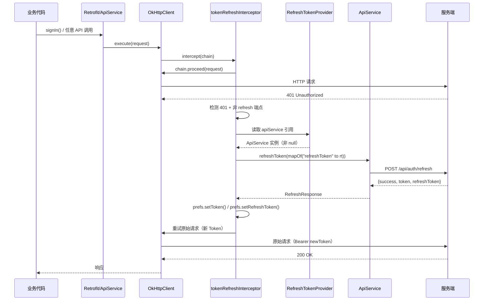
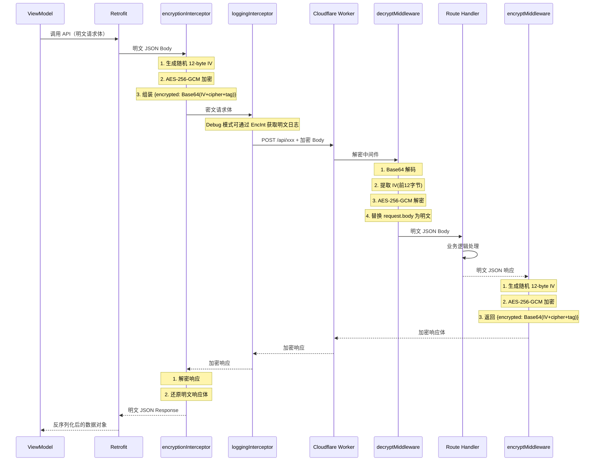
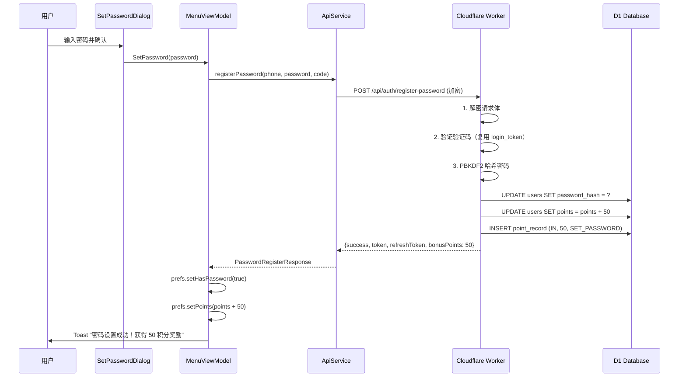
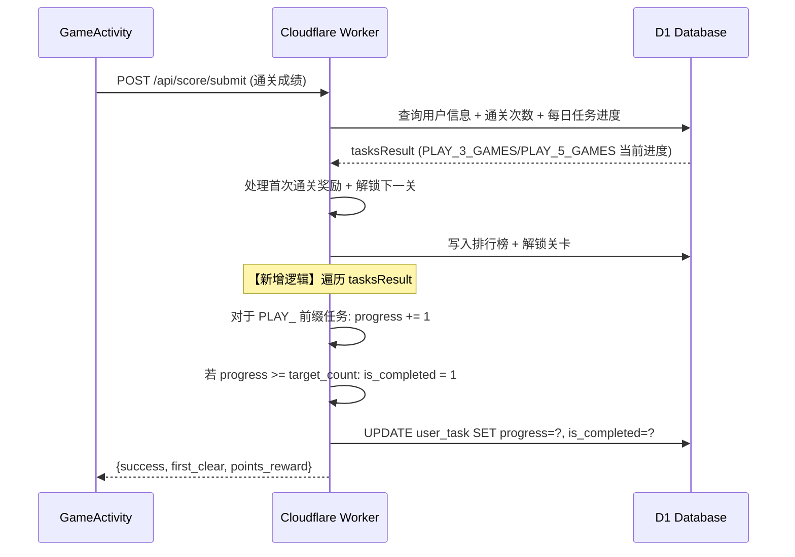
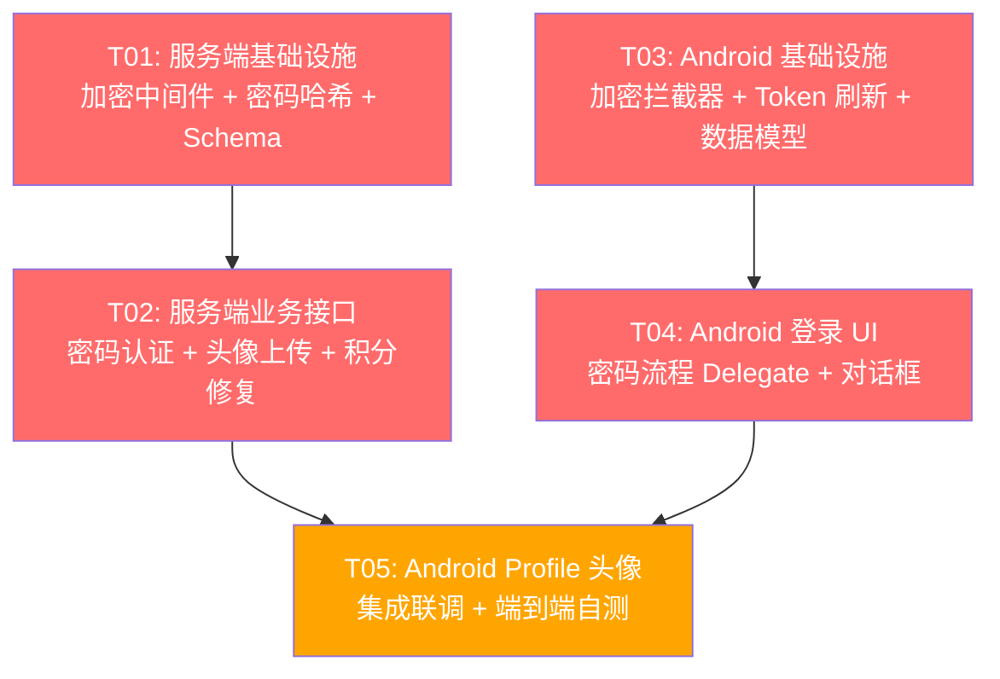

# 秘境消消乐 — 全栈认证与积分系统重构 系统设计文档

> **文档版本**: v1.0  
> **作者**: Bob (Architect)  
> **日期**: 2025-07-11  

---

## 目录

- [Part A: 系统设计](#part-a-系统设计)
  - [1. 实现方案与框架选型](#1-实现方案与框架选型)
  - [2. 文件列表](#2-文件列表)
  - [3. 数据结构与接口](#3-数据结构与接口)
  - [4. 程序调用流程](#4-程序调用流程)
  - [5. 待明确事项](#5-待明确事项)
- [Part B: 任务分解](#part-b-任务分解)
  - [6. 依赖包列表](#6-依赖包列表)
  - [7. 任务列表](#7-任务列表)
  - [8. 共享知识](#8-共享知识)
  - [9. 任务依赖图](#9-任务依赖图)

---

## Part A: 系统设计

### 1. 实现方案与框架选型

#### P1-4: Token 刷新拦截器复用 ApiService

**当前问题**：
`NetworkModule.kt` 的 `tokenRefreshInterceptor`（第 90-163 行）手动创建 `OkHttpClient`、手动拼 JSON 字符串 `{"refreshToken":"$refreshToken"}`、手动 `json.decodeFromString<RefreshResponse>` 解析。完全绕过了 `ApiService.refreshToken()` 方法，导致：
- 代码重复（序列化/反序列化逻辑两处维护）
- 无法享受 Retrofit 的类型安全与错误处理
- 新增临时 OkHttpClient 开销

**技术挑战**：
OkHttp Interceptor 在 `OkHttpClient.Builder` 中注册时，Retrofit/ApiService 尚未创建（Hilt 对象图构建顺序：`OkHttpClient` → `Retrofit` → `ApiService`），存在循环依赖。

**方案：Hold-And-Set 模式（懒静态持有者）**

创建 `RefreshTokenProvider` 单例对象，在 `NetworkModule.provideApiService()` 中注入引用，Interceptor 通过静态持有者懒获取：

```
NetworkModule:
  provideOkHttpClient() → 创建 OkHttpClient（含所有拦截器）
    拦截器内通过 RefreshTokenProvider.apiService 获取（可能为 null，降级到旧逻辑）
  provideRetrofit() → 创建 Retrofit
  provideApiService() → 创建 ApiService → 注入到 RefreshTokenProvider.apiService
```

- 无额外框架依赖
- 降级逻辑：若 `apiService` 为 null（极端情况），fallback 到当前手动实现
- 线程安全：`@Volatile` 变量确保多线程可见性

#### P2-1/2: API 全量 AES-256-GCM 加解密

**方案选型**：

| 层 | 技术 | 说明 |
|---|------|------|
| Android 加密 | `javax.crypto.Cipher` (JDK 内置) | AES/GCM/NoPadding，无需额外依赖 |
| 服务端加密 | Web Crypto API (`crypto.subtle`) | Cloudflare Workers 原生支持 |
| 密钥管理 | 硬编码共享密钥（`AppConfig` / 服务端常量） | 首次实现，后续可迁移到 Worker Secrets |

**架构**：
- **客户端加密拦截器**：在 `NetworkModule` 中添加 `encryptionInterceptor`，位置在 `authInterceptor` 之后、`loggingInterceptor` 之前
- **服务端解密中间件**：Hono 中间件 `decryptMiddleware` 在路由分发前解密请求体
- **服务端加密中间件**：`encryptMiddleware` 在响应返回前加密响应体

**拦截器顺序（客户端）**：
```
languageInterceptor → authInterceptor → tokenRefreshInterceptor → encryptionInterceptor → weakNetworkRetryInterceptor → loggingInterceptor
```

注意：`encryptionInterceptor` 在 `loggingInterceptor` 之前加密，因此日志输出的是密文。在 Debug 模式下，通过 `encryptionInterceptor` 内部判断 `BuildConfig.DEBUG`，决定是否将明文回写到日志可见的请求体副本中。

**豁免路径**：
- WebSocket `/api/ws`：不经过 HTTP 拦截器，自然豁免
- `/api/auth/refresh`：**不豁免**，全量 `/api/` 统一加密（刷新 Token 请求体也是敏感数据）

**加密格式**：
- 请求体：`{"encrypted": "<Base64(AES-256-GCM(iv + ciphertext + tag))>"}`
- 响应体：`{"encrypted": "<Base64(AES-256-GCM(iv + ciphertext + tag))>"}`
- iv：12 字节随机生成，前置附在密文之前，一起 Base64 编码

#### P0-1: 积分系统修复

**根因分析**：

经代码审查，发现 **两个独立 Bug**：

**Bug #1（主因）：成绩提交后任务进度永不更新**

文件：`server/src/handlers/game.ts` 第 141-183 行（`POST /api/score/submit`）

代码在第 154-158 行读取了每日任务进度：
```typescript
const tasksResult = await env.DB.batch([...]);
```
但 `tasksResult` 变量**从未被后续代码使用**。成绩提交后，`PLAY_3_GAMES` 和 `PLAY_5_GAMES` 任务的 `progress` 字段永远停留在初始化值 0，`is_completed` 永远为 0。

结果：每日任务列表中 "小试牛刀" / "大显身手" 永远显示进度 0，永远不可领取。

**修复方案**：在成绩提交成功后，遍历 `tasksResult`，对 `task_id` 匹配 `PLAY_` 前缀的任务执行 `progress + 1`，并在 `progress >= target_count` 时设置 `is_completed = 1`。

**Bug #2（次因）：签到后 SIGN_IN_ONCE 任务状态不一致**

文件：`server/src/handlers/game.ts` 第 222-227 行（`POST /api/sign/today`）

签到处理器正确地将 `SIGN_IN_ONCE` 的 `user_task` 记录设置为 `is_completed=1, is_rewarded=0`。但随后用户需要**手动点击"领取"**才能获得这 10 积分。如果用户不知道要手动领取，就会认为"签到积分没到账"。

实际上签到奖励的积分（连签奖励 20~100）已经直接在 `sign/today` 接口中加到 `users.points` 了。`SIGN_IN_ONCE` 额外奖励 10 积分需要单独领取。

**修复方案**：签到接口中，在设置 `SIGN_IN_ONCE` 为 `is_completed=1` 的同时，直接设置 `is_rewarded=1` 并自动发放 10 积分（从 task 表读取 `points_reward`），写入 `point_record`。这样签到后无需额外操作。

#### P1-1/2: 头像上传 + 昵称修改 + Profile 扩展

**方案**：

- **头像存储**：Base64 编码存 D1 `users.avatar`（TEXT 字段，已有）
- **上传接口**：`POST /api/user/avatar` — 接收 `{"avatar_base64": "data:image/png;base64,..."}`，校验大小 ≤ 512KB，写入 D1
- **昵称修改**：已有 `POST /api/user/rename`，但缺少鉴权校验（直接用 `body.id` 查用户，无 Token 校验）
  - 修复：改用 `getAuthenticatedUser` 鉴权，从 JWT 中取 `userId`，删除 body 中的 `id` 字段
- **Profile 返回字段扩展**：在 `GET /api/user/profile` 响应中增加 `phone`、`avatar` 字段（当前 `UserInfo` 已包含但 `users` 表查询可能缺失）
- **客户端 PersonalScreen**：增加头像点击 → 调用系统图片选择器（`ActivityResultContracts.PickVisualMedia`）→ Base64 编码 → 上传
- **强制设密后 50 积分奖励**：在密码设置接口中，首次设密成功后回写 50 积分

#### P0-2/3/4/5/6: 密码注册/登录/找回 + 登录界面切换 + 强制设密

**方案**：

**服务端密码存储**：
- 使用 Web Crypto API 的 PBKDF2 进行密码哈希（HMAC-SHA256，100,000 次迭代，16 字节盐值）
- 存储格式：`salt_hex:hash_hex`（64 字符 + 冒号 + 64 字符）
- 不引入外部 bcrypt 依赖（Cloudflare Workers 不友好），使用原生 `crypto.subtle`

**新增接口**：

| 端点 | 方法 | 说明 |
|------|------|------|
| `/api/auth/register-password` | POST | 密码注册/设置 |
| `/api/auth/login-password` | POST | 密码登录 |
| `/api/auth/reset-password` | POST | 找回密码（验证码校验后重置） |
| `/api/auth/check-password` | GET | 检查用户是否已设置密码 |

**D1 Schema 变更**：
```sql
ALTER TABLE users ADD COLUMN password_hash TEXT;  -- NULLABLE
```

**登录界面切换**：
- `LoginDialog.kt` 改造为双模式：验证码登录 Tab + 密码登录 Tab
- 密码登录：手机号 + 密码 → `/api/auth/login-password`
- 验证码登录：保持现有逻辑
- 找回密码：验证码登录 Tab 中，输入验证码后检测 `has_password` 字段

**强制设密流程**：
- 验证码登录成功后，服务端在 `LoginResponse` 中增加 `has_password: boolean` 字段
- 客户端收到 `has_password == false` 时，弹出"设置密码"对话框（不可跳过）
- 设密成功后奖励 50 积分（服务端 `/api/auth/register-password` 接口处理）
- 对话框包含跳过按钮但提示"跳过将不获得 50 积分奖励"（允许跳过但不给积分）

**D1 迁移**：
- `password_hash TEXT` 字段 NULLABLE，兼容老用户
- 老用户 `password_hash IS NULL` → `has_password = false`
- 无需数据迁移脚本

---

### 2. 文件列表

#### Android 端（需要创建或修改的文件）

```
app/
├── core/
│   └── src/main/java/com/example/sheeps/
│       ├── core/
│       │   ├── AppConfig.kt                          # [修改] 新增 AES_KEY 常量
│       │   ├── di/
│       │   │   └── NetworkModule.kt                  # [修改] 新增加密拦截器 + 重构 Token 刷新
│       │   ├── preference/
│       │   │   └── UserPreferences.kt                # [修改] 新增 hasPassword/password 相关方法
│       │   └── utils/
│       │       ├── CryptoUtil.kt                     # [新增] AES-256-GCM 加解密工具函数
│       │       ├── RefreshTokenProvider.kt           # [新增] ApiService 静态持有者
│       │       └── AuthEventBus.kt                   # [修改] 新增 ForceSetPassword 事件
│       └── data/
│           ├── model/
│           │   └── GameModels.kt                     # [修改] 新增密码/头像相关数据模型
│           └── network/
│               └── ApiService.kt                     # [修改] 新增密码/头像相关 API 接口
├── feature_menu/
│   └── src/main/java/com/example/sheeps/menu/
│       ├── state/
│       │   └── MenuViewState.kt                      # [修改] 新增 hasPassword 状态字段
│       ├── viewmodel/
│       │   ├── MenuViewModel.kt                      # [修改] 新增密码/头像相关 Intent 处理
│       │   └── delegates/
│       │       ├── AuthDelegate.kt                   # [修改] 新增密码登录/注册/找回逻辑
│       │       └── SocialActionDelegate.kt           # [修改] 修复签到后积分状态更新
│       └── ui/
│           ├── dialogs/
│           │   ├── LoginDialog.kt                    # [修改] 改造为双模式（验证码 + 密码）
│           │   ├── SetPasswordDialog.kt              # [新增] 强制设密对话框
│           │   └── ForgotPasswordDialog.kt           # [新增] 找回密码对话框
│           └── screens/
│               └── PersonalScreen.kt                 # [修改] 新增头像上传入口
```

#### 服务端（需要创建或修改的文件）

```
server/
└── src/
    ├── index.ts                                      # [修改] 注册新路由 + 添加加密中间件
    ├── types.ts                                      # [修改] Env 新增 AES_KEY 字段声明
    ├── helpers.ts                                    # [修改] 新增密码哈希/加密/解密工具函数
    ├── crypto.ts                                     # [修改] 新增 PBKDF2 密码哈希函数
    ├── middleware/
    │   └── encryption.ts                             # [新增] 请求解密 + 响应加密中间件
    └── handlers/
        ├── auth.ts                                   # [修改] 新增密码注册/登录/找回/检查接口
        ├── game.ts                                   # [修改] 修复任务进度更新 + 签到自动领奖
        └── user.ts                                   # [修改] rename 接口加鉴权 + 新增头像上传接口
```

---

### 3. 数据结构与接口

#### 3.1 数据模型（Kotlin / TypeScript）

```mermaid
classDiagram
    %% ── Android 端数据模型 ──
    class EncryptedRequest {
        +String encrypted
    }
    
    class EncryptedResponse {
        +String encrypted
        +String error
    }

    class PasswordRegisterRequest {
        +String phone
        +String password
        +String code
    }

    class PasswordLoginRequest {
        +String phone
        +String password
    }

    class PasswordResetRequest {
        +String phone
        +String code
        +String newPassword
    }

    class HasPasswordResponse {
        +Boolean success
        +Boolean hasPassword
    }

    class PasswordRegisterResponse {
        +Boolean success
        +String token
        +String refreshToken
        +Int bonusPoints
    }

    class AvatarUploadRequest {
        +String avatarBase64
    }

    class AvatarUploadResponse {
        +Boolean success
        +String avatarUrl
    }

    class SetPasswordRequest {
        +String token
        +String password
    }

    class SetPasswordResponse {
        +Boolean success
        +Int bonusPoints
    }

    %% LoginResponse 扩展字段
    class LoginResponse {
        +Boolean success
        +String token
        +String refreshToken
        +UserInfo user
        +List~Int~ unlocked_levels
        +List~UserItem~ items
        +Boolean today_signed
        +Int sign_streak
        +Boolean has_password
    }

    class UserInfo {
        +String id
        +String phone
        +String username
        +String avatar
        +Int points
    }

    %% ── Android 基础设施 ──
    class RefreshTokenProvider {
        +ApiService apiService$ @Volatile
        <<object>>
    }

    class CryptoUtil {
        +String encrypt(String plaintext, String key)$
        +String decrypt(String ciphertext, String key)$
        <<object>>
    }

    class AppConfig {
        +String AES_KEY$
        <<object>>
    }

    %% ── 服务端类型 ──
    class Env {
        +D1Database DB
        +KVNamespace SHEEPS_CACHE
        +String AES_KEY
    }

    class CryptoHelpers {
        +Promise~String~ hashPassword(String password)$
        +Promise~Boolean~ verifyPassword(String password, String hash)$
        +Promise~String~ aesEncrypt(String plaintext, String key)$
        +Promise~String~ aesDecrypt(String ciphertext, String key)$
    }

    %% ── 服务端中间件 ──
    class EncryptionMiddleware {
        +MiddlewareHandler decryptBody()
        +MiddlewareHandler encryptResponse()
    }

    %% 关系
    RefreshTokenProvider --> ApiService : 持有静态引用
    CryptoUtil ..> AppConfig : 读取 AES_KEY
    LoginResponse --> UserInfo : 包含
    EncryptionMiddleware ..> CryptoHelpers : 调用
```



#### 3.2 新增/修改 API 接口

| 方法 | 路径 | 请求体 | 响应体 | 鉴权 | 加密 |
|------|------|--------|--------|------|------|
| POST | `/api/auth/register-password` | `{phone, password, code}` | `{success, token, refreshToken, bonusPoints}` | 否（验证码校验） | 是 |
| POST | `/api/auth/login-password` | `{phone, password}` | `{success, token, refreshToken, user, unlocked_levels, items, today_signed, sign_streak, has_password}` | 否 | 是 |
| POST | `/api/auth/reset-password` | `{phone, code, newPassword}` | `{success}` | 否（验证码校验） | 是 |
| GET | `/api/auth/check-password` | — | `{success, hasPassword}` | 是 | 是 |
| POST | `/api/user/avatar` | `{avatarBase64}` | `{success, avatarUrl}` | 是 | 是 |

**修改的现有接口**：

| 方法 | 路径 | 变更说明 |
|------|------|----------|
| POST | `/api/auth/login` | 响应新增 `has_password: boolean` 字段 |
| POST | `/api/user/rename` | 改用 `getAuthenticatedUser` 鉴权，从 JWT 取 userId，删除 body.id 字段 |
| POST | `/api/sign/today` | 签到后自动领取 SIGN_IN_ONCE 任务奖励 |
| POST | `/api/score/submit` | 新增每日任务进度更新逻辑 |

---

### 4. 程序调用流程

#### 4.1 Token 刷新（Hold-And-Set 模式）



#### 4.2 AES 加密请求/响应流程



#### 4.3 密码注册流程



#### 4.4 积分修复：成绩提交 → 任务进度更新



---

### 5. 待明确事项

1. **AES 密钥生命周期**：当前设计为硬编码。后续是否需要在服务端通过 Admin API 提供密钥轮换接口？
   - **影响**：当前无影响，已在架构中预留 `AppConfig.AES_KEY` 集中管理入口
2. **密码规则严格度**：已确认为 6-20 位、包含字母和数字、特殊字符可选。是否需要防弱密码字典？
   - **建议**：首版不加入弱密码检测，降低复杂度
3. **头像 Base64 大小上限**：建议 512KB（约 400×400 JPEG 质量 80%），是否需要调整？
4. **强制设密对话框"跳过"按钮**：已设计为"可跳过但不给 50 积分"。产品是否接受？

---

## Part B: 任务分解

### 6. 依赖包列表

**Android 端**：无需新增外部依赖。所有加密操作使用 JDK 内置 `javax.crypto`。

**服务端**：无需新增 npm 依赖。密码哈希使用 Cloudflare Workers 内置 `crypto.subtle`（PBKDF2），AES 加解密使用 `crypto.subtle`（AES-GCM）。

### 7. 任务列表

| Task ID | 任务名称 | 涉及文件 | 依赖 | 优先级 |
|---------|----------|----------|------|--------|
| **T01** | 服务端基础设施：加密中间件 + 密码哈希 + Schema 迁移 | `server/src/middleware/encryption.ts`（新增）, `server/src/helpers.ts`（修改）, `server/src/crypto.ts`（修改）, `server/src/types.ts`（修改）, `server/src/index.ts`（修改）, `server/schema.sql`（修改） | — | P0 |
| **T02** | 服务端业务接口：密码认证 + 头像上传 + 积分修复 | `server/src/handlers/auth.ts`（修改）, `server/src/handlers/user.ts`（修改）, `server/src/handlers/game.ts`（修改） | T01 | P0 |
| **T03** | Android 基础设施：加密拦截器 + Token 刷新重构 + 数据模型 | `app/core/.../core/AppConfig.kt`（修改）, `app/core/.../core/di/NetworkModule.kt`（修改）, `app/core/.../core/utils/CryptoUtil.kt`（新增）, `app/core/.../core/utils/RefreshTokenProvider.kt`（新增）, `app/core/.../data/model/GameModels.kt`（修改）, `app/core/.../data/network/ApiService.kt`（修改）, `app/core/.../core/preference/UserPreferences.kt`（修改）, `app/core/.../core/utils/AuthEventBus.kt`（修改） | — | P0 |
| **T04** | Android 登录 UI + 密码流程 Delegate | `app/feature_menu/.../ui/dialogs/LoginDialog.kt`（修改）, `app/feature_menu/.../ui/dialogs/SetPasswordDialog.kt`（新增）, `app/feature_menu/.../ui/dialogs/ForgotPasswordDialog.kt`（新增）, `app/feature_menu/.../viewmodel/delegates/AuthDelegate.kt`（修改）, `app/feature_menu/.../viewmodel/delegates/SocialActionDelegate.kt`（修改）, `app/feature_menu/.../state/MenuViewState.kt`（修改）, `app/feature_menu/.../viewmodel/MenuViewModel.kt`（修改） | T03 | P0 |
| **T05** | Android Profile 头像 + 集成联调 | `app/feature_menu/.../ui/screens/PersonalScreen.kt`（修改）, `app/feature_menu/.../ui/dialogs/LoginDialog.kt`（修改-集成）, 全量端到端自测 | T02, T04 | P1 |

### 8. 共享知识

跨文件约定（供 Engineer 实现时参考）：

```
## AES 加密相关

- 客户端密钥常量：AppConfig.AES_KEY = "SheepsAES256Key!2025Secret!!"
- 服务端密钥常量：helpers.ts 中 const AES_KEY = "SheepsAES256Key!2025Secret!!"
- 算法：AES-256-GCM（AEAD），IV 长度 12 字节，Tag 长度 128 bit
- 加密格式：Base64(IV[12] || ciphertext || tag[16])
- 传输格式：{"encrypted": "<上述 Base64 字符串>"}
- 加密拦截器类名：EncryptionInterceptor（com.example.sheeps.core.di.NetworkModule 内部类）
- 解密工具函数：CryptoUtil.decrypt(encryptedBase64: String, key: String): String
- 加密工具函数：CryptoUtil.encrypt(plaintext: String, key: String): String

## Token 刷新相关

- ApiService 静态持有者：RefreshTokenProvider（object, @Volatile var apiService: ApiService?）
- 降级逻辑：若 apiService 为 null，tokenRefreshInterceptor 保留当前手动实现作为 fallback
- Token 存储：EncryptedSharedPreferences，key 为 "jwt_token" / "refresh_token"

## 密码相关

- 密码规则：6-20 字符，必须包含字母和数字，特殊字符可选
- 哈希算法：PBKDF2-HMAC-SHA256，100,000 次迭代，16 字节随机盐值
- 存储格式：salt_hex:hash_hex（用冒号分隔）
- users.password_hash 字段：TEXT NULLABLE，老用户为 NULL
- 强制设密流程：验证码登录后检查 has_password，为 false 时弹出不可跳过的设密对话框

## 积分系统

- 签到积分规则：连签天数对应的奖励 = [20,20,30,30,40,50,100]（7 天循环）
- 首次通关奖励：50 积分
- 强制设密奖励：50 积分
- SIGN_IN_ONCE 任务奖励：10 积分（签到后自动领取，无需手动）
- 所有积分变更必须写 point_record 流水表
- D1 批量写入使用 batch() 保证原子性

## API 通用约定

- 所有 `/api/` 请求/响应均通过 AES-256-GCM 加密（WebSocket 除外）
- 加密后的请求 Content-Type 仍为 application/json
- 服务端中间件在路由分发前解密，响应返回前加密
- Debug 模式（BuildConfig.DEBUG = true）时，loggingInterceptor 可输出解密后的明文
```

### 9. 任务依赖图



**并行执行策略**：T01 和 T03 无依赖关系，可完全并行执行。T02 依赖 T01，T04 依赖 T03。T05 需要等 T02 和 T04 都完成。

---

*本设计文档由 Bob (Architect) 生成，涵盖全栈认证与积分系统重构的所有技术细节。*
