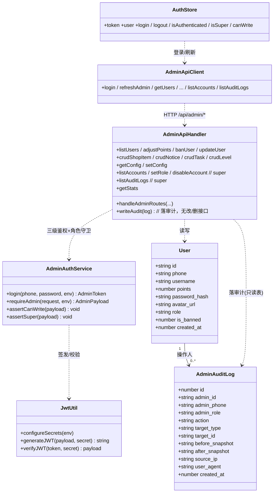

# 秘境消消乐 · 管理后台架构设计 + 任务分解（v1.1）

> 文档性质：架构设计稿（仅设计，不写实现代码）。确认后再进入开发。
> 作者：架构师高见远 ｜ 版本：v1.1（依据 `docs/admin-prd.md` v0.1 增量 PRD 修订）｜ 语言：中文
> 基线：v1.0 已落盘并源码核实；本版**仅修订角色模型、鉴权分层、审计日志、seed 脚本**四处，其余（前端栈、Pages 独立站、明文 JSON、CORS、密钥迁 Secrets、接口清单、部署）沿用 v1.0。

---

## 0. 现状核实与本轮修订点

### 0.1 源码核实结论（沿用 v1.0，已读 server/src）
- 路由：`index.ts` 用 `if/else` 按 `path.startsWith` 分发；`/api/admin` 原与 `/api/app`、`/api/notice` 同属 `handleSystemRoutes`。
- 🔴 `/api/admin/config`（GET/POST）在 `handlers/system.ts` 中**完全无鉴权**。
- 🔴 `crypto.ts` 硬编码 `JWT_SECRET='antigravity_secret_key'` 与 `AES_KEY_HEX`；payload 原仅 `{userId, phone, type, exp}` 无 role。
- 现有鉴权：`helpers.ts: getAuthenticatedUser()` 校验 `type==='access'`；CORS `Allow-Origin:'*'`、仅 GET/POST。
- 加密中间件：`middleware.ts` 仅在 body 含 `{encrypted}` 时解密，且响应仅在请求被加密时才加密 → **后台 Web 发明文 JSON 即可直通，无需客户端 AES**。
- 用户表：`users(id, phone, username, avatar, points, password_hash, avatar_url, created_at)`；`migrateSchema()` 幂等加列。
- 密码：`auth-utils.ts` PBKDF2-SHA256 10 万次，存 `salt_hex:hash_hex`，可直接复用。

### 0.2 本轮修订点（对比 v1.0）
| v1.0 | v1.1（PRD 要求） |
|---|---|
| `users` 加 `is_admin INTEGER`（二值） | 改为 `role TEXT`（super/operator/readonly，默认 readonly），取消 `is_admin`；保留 `is_banned` |
| JWT payload `role:'admin'`（固定） | payload 携带**真实角色** `role`（super/operator/readonly） |
| `requireAdmin` 仅校验 `type==='access'` | 三级校验 `role IN (super,operator,readonly)` → 401；**写操作追加 `role!='readonly'` → 403**；super 专属接口追加 `role==='super'` → 403 |
| 无审计 | 新增 `admin_audit_log` 表，关键写操作 + 登录必落审计，记录不可改/删 |
| seed 脚本细节未定 | 从环境变量 `ADMIN_PHONE`/`ADMIN_PASSWORD` 读取，幂等，创建首个 `super` |

---

## 1. 实现方案 + 框架选型

### 1.1 总体架构（同 v1.0，略）
Cloudflare Pages（React+Vite）独立站 → fetch 调现有 Worker `/api/admin/*`；明文 JSON + `Authorization: Bearer`；CORS 用 `ADMIN_WEB_ORIGIN` 具体源。

### 1.2 前端框架选型（同 v1.0）
React18 + Vite5 + MUI5 + React Router6 + Zustand(token 持久化) + Axios(拦截器挂 Bearer/401 跳登录)。不引入客户端 AES。

### 1.3 后端如何挂载 `/api/admin/*`（同 v1.0）
`index.ts` 把 `/api/admin` 从 system 分支拆出 → `handleAdminRoutes`；`/api/admin/login`、`/api/admin/refresh` 不鉴权，其余先过 `requireAdmin`。

### 1.4 管理员账户 + 三级角色模型（本轮修订核心）

- **数据模型**：复用 `users` 表，新增 `role TEXT`（取值 `super`/`operator`/`readonly`，默认 `readonly`）取代 `is_admin`；保留 `is_banned INTEGER DEFAULT 0`。"是否管理员" = `role != 'readonly'`（派生，不单列）。
- **管理员登录** `POST /api/admin/login {phone, password}`：按 phone 查用户 → 校验 `role != 'readonly'`（否则 `401 该账号无管理员权限`）→ `verifyPassword` → 签发带**真实角色**的 access(2h)/refresh(7d) JWT。
- **JWT payload**：`{userId, phone, role, type:'access'|'refresh', exp}`，`role` 携带真实角色；刷新（`/api/admin/refresh`）须保留 `role`。
- **鉴权分层**（后端为最终防线，前端禁用仅为体验）：
  1. `requireAdmin(request, env)`：校验 `type==='access' && role IN ('super','operator','readonly')`，否则返回 `401`（无 token/无效/非管理员/被封禁）。
  2. 写操作守卫 `assertCanWrite(payload)`：若 `role==='readonly'` → `403`（POST/PUT/DELETE 业务接口统一调用）。
  3. 超级守卫 `assertSuper(payload)`：若 `role!=='super'` → `403`（管理员账户管理、审计日志查看专属）。
- **被封禁管理员**：登录时 `is_banned=1` 直接拒绝；已登录者 `requireAdmin` 额外校验 `is_banned!=1` → 401。

### 1.5 密钥迁移到 Worker Secrets（同 v1.0）
`crypto.ts` 新增 `configureSecrets(env)` 注入 `JWT_SECRET`/`AES_KEY_HEX`（保留 dev fallback）；`Env` 增加 `JWT_SECRET`、`AES_KEY_HEX`、`ADMIN_WEB_ORIGIN`；部署 `wrangler secret put`。

---

## 2. 文件列表及相对路径（标注新增/修改）

> 仅列出与 v1.0 的差异点；未提及的文件（前端 `admin-console/*` 全套、后端 `index.ts` 路由分发、`system.ts` 移除 config 等）同 v1.0 §2。

### 2.1 后端（现有 `server/`）

| 路径 | 状态 | 本轮改动要点 |
|---|---|---|
| `server/src/crypto.ts` | 【修改】 | `configureSecrets(env)`；`generateJWT/verifyJWT` 透传任意 payload（含 `role`） |
| `server/src/helpers.ts` | 【修改】 | `requireAdmin()` 三级校验 + `is_banned` 校验；新增 `assertCanWrite(payload)`、`assertSuper(payload)`；`getCorsHeaders()` 支持 `ADMIN_WEB_ORIGIN` 与 PUT/DELETE |
| `server/src/types.ts` | 【修改】 | `Env` 增加 `JWT_SECRET`、`AES_KEY_HEX`、`ADMIN_WEB_ORIGIN` |
| `server/src/index.ts` | 【修改】 | `configureSecrets` 调用；`migrateSchema` 加 `role TEXT DEFAULT 'readonly'` 与 `is_banned INTEGER DEFAULT 0`（**不再加 `is_admin`**） |
| `server/src/handlers/system.ts` | 【修改】 | 移除 `/api/admin/config`（迁 admin，加鉴权） |
| `server/src/handlers/admin.ts` | 【新增】 | 全部后台接口 + 三级角色守卫 + **落审计**（`writeAudit`）+ 管理员账户管理/审计查看（super） |
| `server/schema.sql` | 【修改】 | `users` 加 `role`/`is_banned`；**新增 `admin_audit_log` 表 + 索引**（见 §3.3） |
| `server/scripts/seed-admin.mjs` | 【新增】 | 读 `ADMIN_PHONE`/`ADMIN_PASSWORD` 环境变量，幂等创建首个 `super`（PBKDF2 哈希） |

### 2.2 前端（新建 `admin-console/`，同 v1.0）
全套文件同 v1.0 §2.2。本轮需在前端补充：
- `src/store/auth.ts`：`user.role` 持久化，暴露 `useCanWrite()`（role!=='readonly'）、`isSuper`（role==='super'）。
- `src/components/Layout.tsx`：按 `isSuper` 显隐「管理员账户管理」「审计日志」导航；按 `useCanWrite` 禁用写按钮。
- `src/pages/{Users,ShopItems,Notices,Tasks,Levels,Config}.tsx`：写按钮 `disabled={!canWrite}`；`src/pages/Accounts.tsx`、`src/pages/AuditLogs.tsx`（super 专属，P1）。
- `src/api/admin.ts`：补充 `refreshAdmin`、`listAccounts`/`setRole`/`disableAccount`、`listAuditLogs`。

---

## 3. 数据结构和接口

### 3.1 类图（详见 `docs/class-diagram.mermaid`）



### 3.2 接口表（后台 `/api/admin/*`，明文 JSON + Bearer）

> 统一：成功 `{success:true,...}`；失败 `{error:"msg"}`：无 token/无效/非管理员/被封禁 → **401**；readonly 调写接口 / 非 super 调 super 专属 → **403**。

#### 3.2.1 管理员登录 / 刷新（无鉴权）
- `POST /api/admin/login` `{phone,password}` → `{success, token, refreshToken, user:{id,phone,username,role,is_banned}}`；失败 `401`。
- `POST /api/admin/refresh` `{refreshToken}` → `{success, token, refreshToken}`（保留 `role`）；失败 `401`。

#### 3.2.2 用户管理
| 方法 & 路径 | 角色 | 请求/响应 |
|---|---|---|
| `GET /api/admin/users?page&pageSize&keyword` | 全部 | `{list,total,page,pageSize}` |
| `POST /api/admin/users/:id/points` `{amount,reason}` | super/operator | `{success,current_points}`；落 `ADJUST_POINTS` 审计 |
| `POST /api/admin/users/:id/ban` `{banned}` | super/operator | `{success}`；落 `BAN/UNBAN_USER` 审计 |
| `PUT /api/admin/users/:id` `{username}` | super/operator | `{success}` |

#### 3.2.3 商品 / 公告 / 任务 / 关卡 CRUD（同 v1.0 §3.2.3–3.2.6）
- 读（GET）全部角色；写（POST/PUT/DELETE）super/operator，readonly → 403；每类写操作落对应 `CREATE/UPDATE/DELETE_*` 审计（关卡 `layout_data` 仅记长度/hash）。

#### 3.2.7 系统配置（迁自 system，加鉴权）
- `GET/POST /api/admin/config`：POST 仅 super/operator；落 `UPDATE_CONFIG` 审计。

#### 3.2.8 概览统计 `GET /api/admin/stats`（全部角色）
返回：`users_total, today_signup, exchange_total, points_total, notice_count, banned_count, shop_item_count, task_count, level_count`。

#### 3.2.9 管理员账户管理（super 专属，P1）
| 方法 & 路径 | 角色 | 说明 |
|---|---|---|
| `GET /api/admin/accounts` | super | 列出管理员账号（role!='readonly' 或含全部，按设计） |
| `POST /api/admin/accounts` `{phone, role}` | super | 将已有用户提升为 operator/readonly（落 `CREATE_ADMIN`） |
| `PUT /api/admin/accounts/:id/role` `{role}` | super | 改他人角色（落 `UPDATE_ADMIN_ROLE`） |
| `POST /api/admin/accounts/:id/disable` `{disabled}` | super | 禁用/启用其他管理员（落 `DISABLE_ADMIN`） |

#### 3.2.10 审计日志查看（super 专属，P1）
- `GET /api/admin/audit-logs?page&pageSize&admin_id&action&from&to` → `{list,total}`（只读，可导出 CSV；**无写/删接口**）。

---

### 3.3 审计表结构（新增 `admin_audit_log`，PRD §5.1）

```sql
CREATE TABLE IF NOT EXISTS admin_audit_log (
  id              INTEGER PRIMARY KEY AUTOINCREMENT,
  admin_id        TEXT    NOT NULL,
  admin_phone     TEXT    NOT NULL,
  admin_role      TEXT    NOT NULL,
  action          TEXT    NOT NULL,   -- 见 3.4 枚举
  target_type     TEXT,               -- user/shop_item/notice/task/level/config/admin_account
  target_id       TEXT,
  before_snapshot TEXT,
  after_snapshot  TEXT,
  source_ip       TEXT,
  user_agent      TEXT,
  created_at      INTEGER NOT NULL
);
CREATE INDEX idx_audit_admin   ON admin_audit_log(admin_id);
CREATE INDEX idx_audit_created ON admin_audit_log(created_at);
```

### 3.4 必须落审计的 action 枚举（PRD §5.2）
`LOGIN_SUCCESS` / `LOGIN_FAILED`（记 attempted phone）/ `ADJUST_POINTS` / `BAN_USER` `UNBAN_USER` / `CREATE|UPDATE|DELETE_SHOP_ITEM` / `CREATE|UPDATE|DELETE_NOTICE` / `CREATE|UPDATE|DELETE_TASK` / `CREATE|UPDATE|DELETE_LEVEL`（layout 仅记长度/hash）/ `UPDATE_CONFIG` / `CREATE_ADMIN` `UPDATE_ADMIN_ROLE` `DISABLE_ADMIN`。
**不记录**：所有读操作、readonly 查看、静态资源。

---

## 4. 程序调用流程（时序图）

> 完整 Mermaid 见 `docs/sequence-diagram.mermaid`。要点：登录（带 role）→ 写操作经 `requireAdmin`(401) + `assertCanWrite`(403) → DB 变更成功后 `writeAudit` 落审计。

```mermaid
sequenceDiagram
    actor Admin as 管理员
    participant FE as 前端(AdminConsole)
    participant MW as requireAdmin+角色守卫
    participant H as AdminApiHandler
    participant DB as D1
    participant AL as admin_audit_log

    Note over Admin, FE: ① 登录（带真实 role）
    Admin->>FE: 输入手机号 + 密码
    FE->>H: POST /api/admin/login {phone,password}
    H->>DB: SELECT * FROM users WHERE phone=?
    H->>H: role!='readonly' 且 verifyPassword 且 is_banned=0
    H->>H: generateJWT(role=真实角色)
    H->>AL: INSERT LOGIN_SUCCESS
    H-->>FE: {token, refreshToken, user{role}}

    Note over Admin, AL: ② readonly 调写接口 → 403
    Admin->>FE: (readonly) 点"新建商品"
    FE->>MW: POST /api/admin/shop-items (Bearer)
    MW->>MW: requireAdmin OK, assertCanWrite → role=='readonly'
    MW-->>FE: 403 {error:'无写权限'}

    Note over Admin, AL: ③ operator 改积分（成功路径）
    Admin->>FE: (operator) 改用户积分
    FE->>MW: POST /api/admin/users/:id/points (Bearer)
    MW->>MW: requireAdmin OK, assertCanWrite OK
    MW->>H: 放行
    H->>DB: UPDATE users SET points...; INSERT point_record
    H->>AL: INSERT ADJUST_POINTS(before/after/reason)
    H-->>FE: {success, current_points}
```

---

## 5. 任务列表（有序、含依赖）

> 共 **5 个任务**（硬上限），每任务 ≥3 文件；本轮重点更新 T01（角色模型+分层鉴权+JWT role）与 T02（admin handler+审计+seed）。

| Task | 名称 | 分类 | 源文件 | 依赖 | 优先级 |
|---|---|---|---|---|---|
| **T01** | 后端安全与鉴权基座（三级角色） | 后端+安全 | `server/src/crypto.ts`【修改】、`server/src/helpers.ts`【修改】、`server/src/types.ts`【修改】、`server/src/index.ts`【修改】、`server/src/handlers/system.ts`【修改】 | 无 | P0 |
| **T02** | 后端管理接口 + 数据层 + 审计 + seed | 后端 | `server/src/handlers/admin.ts`【新增】、`server/schema.sql`【修改】、`server/scripts/seed-admin.mjs`【新增】 | T01 | P0 |
| **T03** | 前端工程基础设施 | 前端 | `admin-console/package.json`、`vite.config.ts`、`tsconfig.json`、`index.html`、`src/main.tsx`、`src/api/client.ts` | 无 | P0 |
| **T04** | 前端登录/布局/用户管理/角色守卫 | 前端 | `src/pages/Login.tsx`、`src/components/Layout.tsx`、`src/components/ProtectedRoute.tsx`、`src/store/auth.ts` | T03 | P0 |
| **T05** | 前端其余页面/路由/审计与账户页/部署 | 前端+部署 | `src/App.tsx`、`src/pages/{Dashboard,Users,ShopItems,Notices,Tasks,Levels,Config,Accounts,AuditLogs}.tsx`、`src/api/admin.ts`、`.github/workflows/deploy-pages.yml` | T03,T04 | P1 |

**执行顺序**：T01 与 T03 并行；T02 依赖 T01；T04 依赖 T03；T05 依赖 T03+T04。后端线（T01→T02）与前端线（T03→T04→T05）并行，最后联调。
**P1 端点归属**：账户管理（§3.2.9）、审计查看（§3.2.10）、token 静默刷新（§3.2.1）在设计中已预留，随 T02（后端）/T05（前端）一并实现。

---

## 6. 依赖包列表（同 v1.0，略）

前端：react, react-dom, react-router-dom, @mui/material, @emotion/react, @emotion/styled, @mui/icons-material, zustand, axios, vite, @vitejs/plugin-react, typescript。后端无新运行时依赖。

---

## 7. 共享知识（跨文件约定，含本轮修订）

- **Admin Token 与角色**：localStorage 持久化；Axios 拦截器统一加 `Authorization: Bearer`；`requireAdmin` 校验 `type==='access' && role IN (super,operator,readonly) && is_banned=0`，失败 401。`refresh`（`/api/admin/refresh`）须保留 `role`，避免刷新后角色丢失。
- **写/超级守卫**：所有 POST/PUT/DELETE 业务接口在 `requireAdmin` 之后调用 `assertCanWrite(payload)`（readonly→403）；super 专属接口（账户管理、审计查看）额外 `assertSuper(payload)`（非 super→403）。**前端禁用仅为体验，后端 403 是唯一防线**。
- **统一错误响应**：`{error:"msg"}`（4xx/5xx）；前端非 2xx → toast，401 清 token 跳登录，403 提示"无权限"。
- **分页规范**：`?page=1&pageSize=20`（默认 20，最大 100），响应 `{list,total,page,pageSize}`，后端 `LIMIT/OFFSET`。审计列表复用同一规范。
- **审计落库约定**：业务 handler 在 **DB 变更成功后** 调用 `writeAudit({admin_id, admin_phone, admin_role, action, target_type, target_id, before_snapshot, after_snapshot, source_ip, user_agent})`；`source_ip` 取自 `CF-Connecting-IP` 否则 `x-forwarded-for`；`user_agent` 取自 `User-Agent`。**审计表无任何写/删接口**，保证不可篡改。快照为 JSON 摘要；关卡 `layout_data` 仅记长度/hash。
- **CORS**：`Allow-Origin` 读 `env.ADMIN_WEB_ORIGIN`（Pages 域名，弃用 `*`）；`Allow-Methods` 扩为 `GET,POST,PUT,DELETE,OPTIONS`；后台明文 JSON 不触发加密中间件。
- **密钥与 seed 环境变量**：`configureSecrets(env)` 注入生产密钥；seed 脚本运行期读取 `ADMIN_PHONE`/`ADMIN_PASSWORD`（本地/CI 环境变量，非 Worker Secret），幂等（已存在则确保 `role='super'`），仅运行一次。
- **前端角色助手**：`useCanWrite()` 返回 `role!=='readonly'`；`isSuper` 返回 `role==='super'`，用于控制导航显隐与按钮 `disabled`。

---

## 8. 待明确事项（v1.0 七项经 PRD §7 已确认，本轮无新增悬而未决）

| 原 v1.0 问题 | PRD 确认结论 |
|---|---|
| 初始账号创建 | seed 脚本读 `ADMIN_PHONE`/`ADMIN_PASSWORD`，幂等建首个 super |
| 审计日志 | 已纳入（§3.3/§3.4），本期 P0 落审计，查看页 P1（super） |
| 自定义域 | 不建，用 `ADMIN_WEB_ORIGIN` 具体源 CORS |
| 登录态持久化 | localStorage 默认；access 2h / refresh 7d 静默刷新（P1-5） |
| 封禁实时拦截游戏端 | 二期（P2-1），本期仅数据标记 |
| 管理员是否分级 | **三级**（super/operator/readonly），本期落地 |
| 多语言字段维护 | 本期仅默认语言，P2-2 |

> 结论：设计已与 PRD 完全对齐，无新增需用户决策项，可进入开发。

---

## 9. 部署方案（同 v1.0，seed 部分更新）

### 9.1 前端（Cloudflare Pages）
连 Git 仓库，`npm run build` → `dist`，设 `VITE_API_BASE`=Worker 地址；`.github/workflows/deploy-pages.yml` 自动发布；免费额度内。

### 9.2 后端（现有 Worker）
1. **密钥注入**：
   ```
   cd server
   wrangler secret put JWT_SECRET
   wrangler secret put AES_KEY_HEX
   wrangler secret put ADMIN_WEB_ORIGIN
   ```
2. **D1 加列**（幂等，`migrateSchema` 首请求自动执行；如需立即生效）：
   ```
   wrangler d1 execute my-app-db --remote --command="ALTER TABLE users ADD COLUMN role TEXT DEFAULT 'readonly'; ALTER TABLE users ADD COLUMN is_banned INTEGER DEFAULT 0;"
   ```
3. **初始化首个 super**（读环境变量，幂等，仅一次）：
   ```
   ADMIN_PHONE=13800000000 ADMIN_PASSWORD='初始强密码' node server/scripts/seed-admin.mjs
   ```
4. **发布**：`wrangler deploy`（绑定不变）。

### 9.3 跨域（同 v1.0）
`Allow-Origin=Pages源` + Bearer（非 Cookie）即可；`OPTIONS` 预检由 `index.ts` 统一返回 CORS 头（已扩 PUT/DELETE）。

### 9.4 整体结论
复用现有 Worker + D1/KV/R2，仅新增 Secrets、两列与一张审计表；前端独立 Pages 站。两端均落 Cloudflare 免费额度内。安全改造（密钥迁移 + 三级鉴权 + 审计）为上线前置硬条件。
