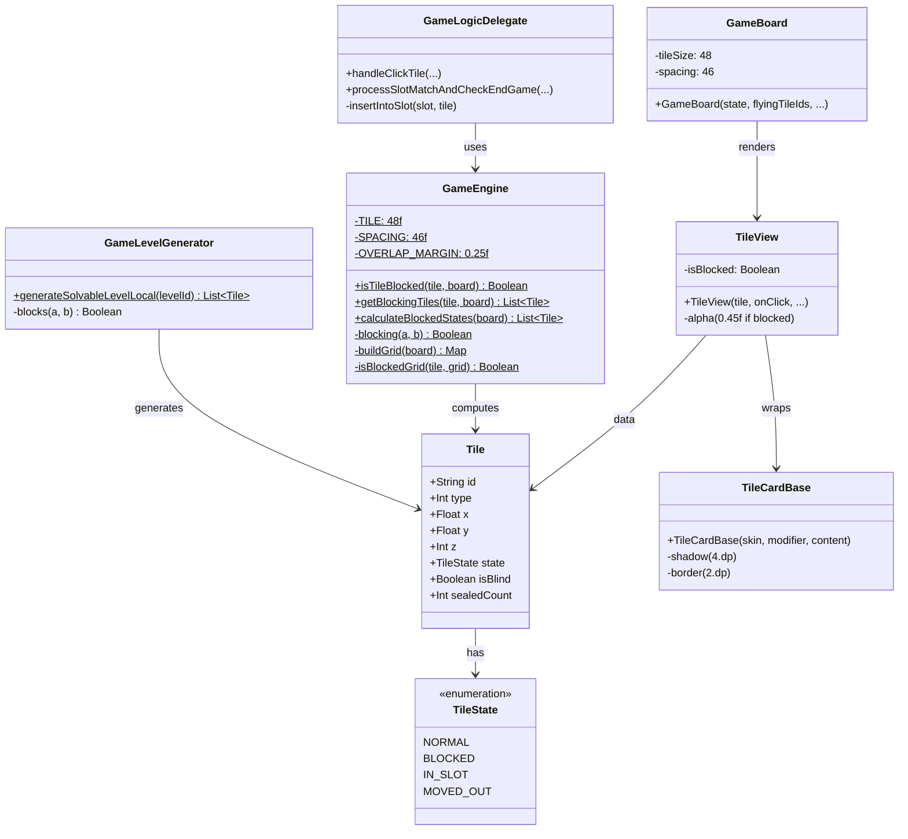
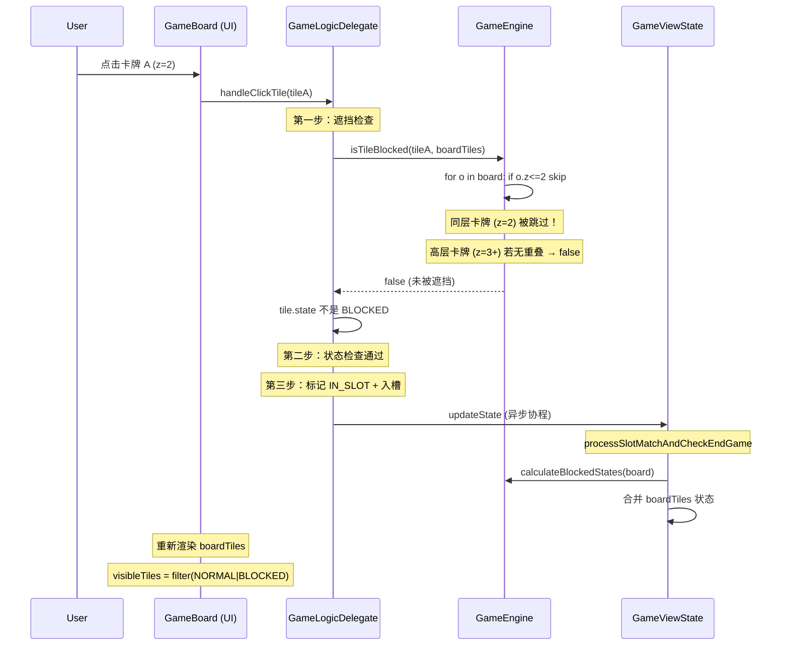

# 遮挡检测深度分析报告

## Part A: 系统分析

### 1. 核心分析结论

经过对全部关键代码路径的深入分析（GameEngine.kt、GameBoard.kt、GameLogicDelegate.kt、TileView.kt、TileCardBase.kt、level.ts、GameLevelGenerator.kt），得出以下结论：

#### 根因定位

**根本原因：同层（same-z）卡牌视觉重叠 + 遮挡判定排除同层卡牌**

具体机制如下：

1. **SPACING(46) < TILE(48)**：相邻卡牌在渲染时中心距 46dp，牌宽 48dp，产生 2dp 逻辑重叠。加上 4dp shadow → 视觉重叠 ~9dp（在 scale≈0.5 时约占牌面的 ~40%）。

2. **遮挡判定跳过同层卡牌**：`GameEngine.isTileBlocked()` / `blocking()` 使用 `if (o.z <= tile.z) continue`，同层卡牌从不被视为遮挡者。

3. **渲染顺序导致"上下层"错觉**：同层卡牌按 `boardTiles` 列表顺序渲染（来源于关卡生成时的 row-major 顺序）。后渲染的卡牌通过 Compose `zIndex` 同值时的组合顺序覆盖先渲染的卡牌，从用户视角看就像是"上层卡牌盖住了下层卡牌"。

4. **复杂形状加剧问题**：在星形/花朵等密集形状（如 180 张牌的大关卡）中，每个 z 层可能有 ~15-18 张牌密集排列，相邻同层卡牌大量视觉重叠。

#### 为什么之前的修复没有解决

| 之前修复 | 为什么无关 |
|----------|-----------|
| `updateState` 合并策略（基于 `currentState`） | 涉及状态更新传播，与重叠检测公式无关 |
| 服务端/客户端 `blocks()` 面积→逐轴判定 | 只影响边界阈值情况（ox/oy 接近 0.25），与同层重叠无关 |
| 编译错误修复 | 纯语法问题 |

**这三个修复都没有触及"同层卡牌不参与遮挡判定"这一核心设计决策。**

### 2. 关键代码路径分析

#### 2.1 遮挡判定（GameEngine.kt）

```kotlin
// 行 88-97：核心碰撞判定
private fun blocking(a: Tile, b: Tile): Boolean {
    if (b.z <= a.z) return false  // ← 同层直接跳过！
    val ox = TILE - abs(b.x - a.x) * SPACING  // 48 - dx*46
    val oy = TILE - abs(b.y - a.y) * SPACING
    return ox > OVERLAP_MARGIN && oy > OVERLAP_MARGIN
}
```

#### 2.2 渲染布局（GameBoard.kt）

```kotlin
val tileSize = 48   // dp
val spacing = 46    // dp：中心间距

// 行 127-130：渲染偏移
.offset(
    x = ((tile.x - minX) * spacing * scale).dp,
    y = ((tile.y - minY) * spacing * scale).dp
)
.zIndex(tile.z.toFloat())   // 同 z 则按列表顺序渲染
```

#### 2.3 视觉尺寸 vs 逻辑尺寸（TileCardBase.kt）

```kotlin
.shadow(4.dp, RoundedCornerShape(8.dp))  // 向外扩展 4dp
// Canvas 边框 2dp（内向）
```

视觉有效尺寸 ≈ 48 + 4×2 = **56dp**，而逻辑 TILE = **48**。差异 = 8dp。

#### 2.4 点击处理（GameLogicDelegate.kt）

```kotlin
// 行 35：双重检查
val isBlocked = tile.state == TileState.BLOCKED
    || isTileBlocked(tile, state.boardTiles)
```

`isTileBlocked` 做 O(N²) 实时检测，但同样使用 `blocking()` → 同层被跳过。

### 3. 数据流与类图



### 4. 点击流程时序图



### 5. 坐标归一化影响分析

**结论：归一化不影响遮挡检测的正确性。**

归一化（`targetCenter=5.5, targetRadius=4.8`）是均匀缩放变换：
- 原始 dx=0.5 → 归一化 dx=0.5×normScale（normScale ≤ 1.0）
- `ox = 48 - dx_norm × 46`：dx 缩小 → ox 放大 → 遮挡检测更敏感，不会漏检
- 渲染使用相同归一化坐标 → 视觉重叠与逻辑重叠成比例

### 6. 哈希网格精度分析

**结论：哈希网格 ±2 搜索范围足够，不会遗漏遮挡关系。**

- 归一化坐标范围 ~[0.7, 10.3]，分桶键 = floor(x)
- 搜索范围 ±2：覆盖 5×5 = 25 个桶
- 如果遮挡卡牌在搜索范围外（dx > 2.5），则 `ox = 48 - 2.5×46 = -67 < 0.25`，本身就不满足遮挡条件
- 因此在搜索范围内未找到 = 不存在遮挡

---

## Part B: 修复方案

### 6. 推荐修复方案

#### 方案 A（推荐，最小改动）：增大渲染间距以消除同层视觉重叠

**改动范围**：仅 GameBoard.kt（1 行）

```kotlin
// GameBoard.kt 第 53 行
val spacing = 48   // 原值 46
```

**效果**：
- 同层相邻卡牌 (dx=1.0)：中心距 48dp，牌宽 48dp → 恰好相切，无重叠
- 跨层卡牌 (dx=0.5)：中心距 24dp，牌宽 48dp → 重叠 24dp，遮挡正确
- 跨层卡牌 (dx=1.5)：中心距 72dp，牌宽 48dp → 间距 24dp，无遮挡
- **棋盘宽度增加约 4.3%**，对大多数关卡影响可忽略

**优点**：简单、安全、不改动核心逻辑

**缺点**：轻微改变视觉效果（卡牌间距增大 2dp）

#### 方案 B（备选）：增大 TILE 常量以匹配视觉范围

**改动范围**：仅 GameEngine.kt（1 行）

```kotlin
// GameEngine.kt 第 18 行
private const val TILE = 56f   // 原值 48f（匹配视觉尺寸：48dp + 4dp×2 shadow）
```

同时在 `blocking()` 中添加同层支持：

```kotlin
private fun blocking(a: Tile, b: Tile, board: List<Tile>): Boolean {
    if (b.z < a.z) return false
    
    // 同层：b 必须在 a 之后（渲染在上层）才算遮挡
    if (b.z == a.z) {
        val aIdx = board.indexOfFirst { it.id == a.id }
        val bIdx = board.indexOfFirst { it.id == b.id }
        if (bIdx <= aIdx) return false
    }
    
    val ox = TILE - abs(b.x - a.x) * SPACING
    val oy = TILE - abs(b.y - a.y) * SPACING
    return ox > OVERLAP_MARGIN && oy > OVERLAP_MARGIN
}
```

**效果**：
- 视觉有效尺寸 56dp = TILE 逻辑值 56，完全匹配
- 同层相邻 (dx=1.0)：`ox = 56 - 46 = 10`，满足 > 0.25 → **被遮挡** ✓
- 但会导致大量同层卡牌被遮挡 → 可玩性下降

**优点**：精确匹配视觉预期

**缺点**：改动较大，需调 `blocking()` 签名和所有调用点；可能导致大量同层卡牌被锁

#### 方案 C（权衡方案）：仅增大 TILE，不改同层逻辑

```kotlin
// GameEngine.kt
private const val TILE = 52f   // 原值 48f
```

**效果**：使跨层遮挡判定更敏感。对于 `dx=1.5` 原始间距（经归一化后约 0.75-1.05）：`ox = 52 - 1.05×46 = 3.7 > 0.25` → 被遮挡。之前 TILE=48 时 `ox = -0.3` → 不被遮挡。

**优点**：改动最小（1 行），不影响同层行为

**缺点**：不解决同层重叠问题；可能引入新的过度遮挡

---

### 7. 推荐实施方案：方案 A（渲染间距调整）

**修改文件**：`E:\file\sheeps\app\feature_game\src\main\java\com\example\sheeps\game\ui\components\GameBoard.kt`

**具体修改**（第 53 行）：

```diff
- val spacing = 46
+ val spacing = 48
```

**验证方法**：

1. **视觉验证**：进入高级关卡（如第 15+ 关，星形/花朵形状），观察同层相邻卡牌是否还有重叠
2. **功能验证**：点击被跨层卡牌遮挡的下层卡牌，确认抖动和被拒绝
3. **回归验证**：确认棋盘缩放（scale 计算）仍然正确，卡牌不超出边界
4. **边界验证**：第 1 关固定布局（含同层相邻卡牌如 z=0 的 4 张）确认布局正常

**为什么不需要改 GameEngine.kt**：

渲染间距调整只影响视觉布局，不影响逻辑判定。遮挡引擎仍然使用 `SPACING=46` 的公式，跨层遮挡检测完全不受影响。

---

### 8. 其他发现

#### 8.1 潜在的性能问题

`GameViewState.boardTiles` 在每次消除后合并时，已消除的 IN_SLOT 卡牌不会被移除，`boardTiles` 列表随时间增长。对于 180 张牌的关卡，每消除一组（3 张），列表保留 3 个 IN_SLOT 引用。消除全部 180 张后，列表将有 180 个 IN_SLOT 条目。`isTileBlocked` 的 O(N²) 循环中虽然会跳过它们，但仍需遍历。

#### 8.2 Tile 可变性风险

`Tile` 是 `data class` 但包含 `var state`、`var isBlind`、`var sealedCount`。在 `handleClickTile` 中直接 `tile.state = TileState.IN_SLOT` 会改变共享引用。当前代码由 `updateState { copy(boardTiles = state.boardTiles) }` 传递同一引用，在协程中依赖这个可变性传递 IN_SLOT 状态。虽然当前工作正常，但未来维护风险较高。
