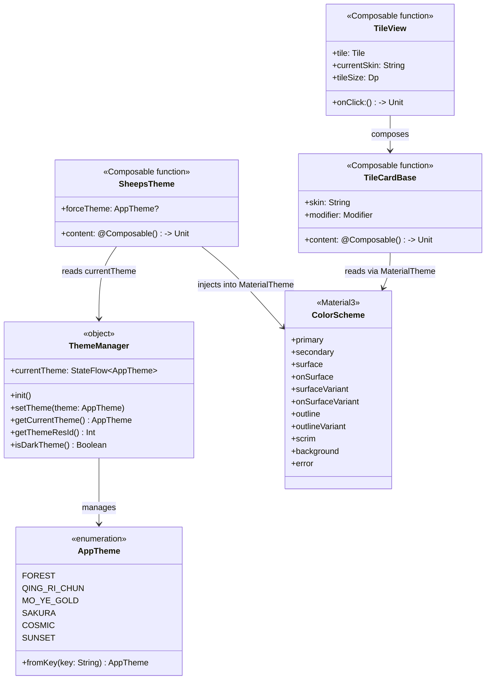
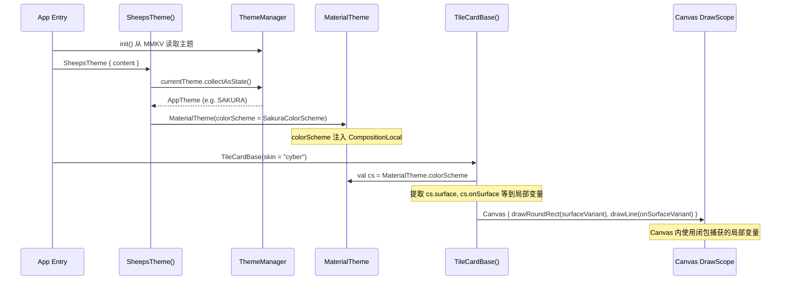
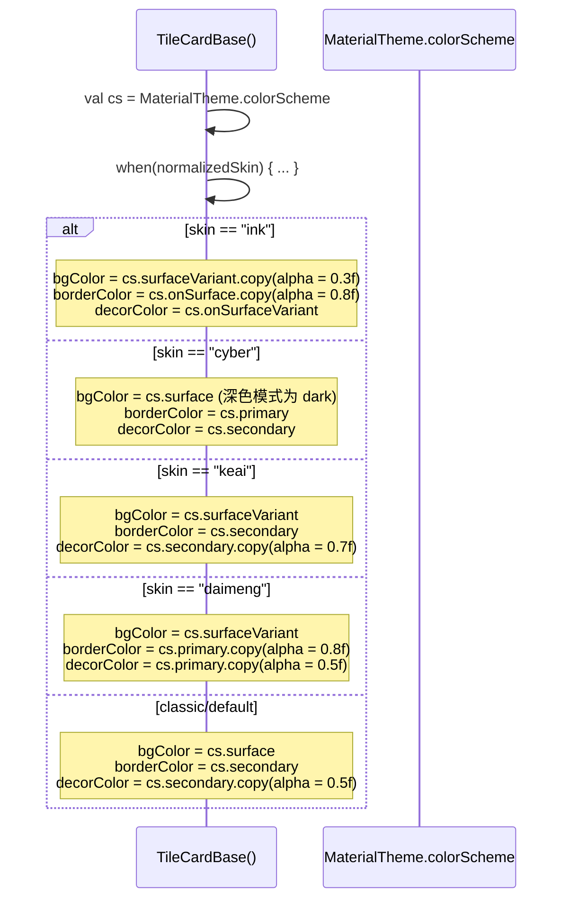
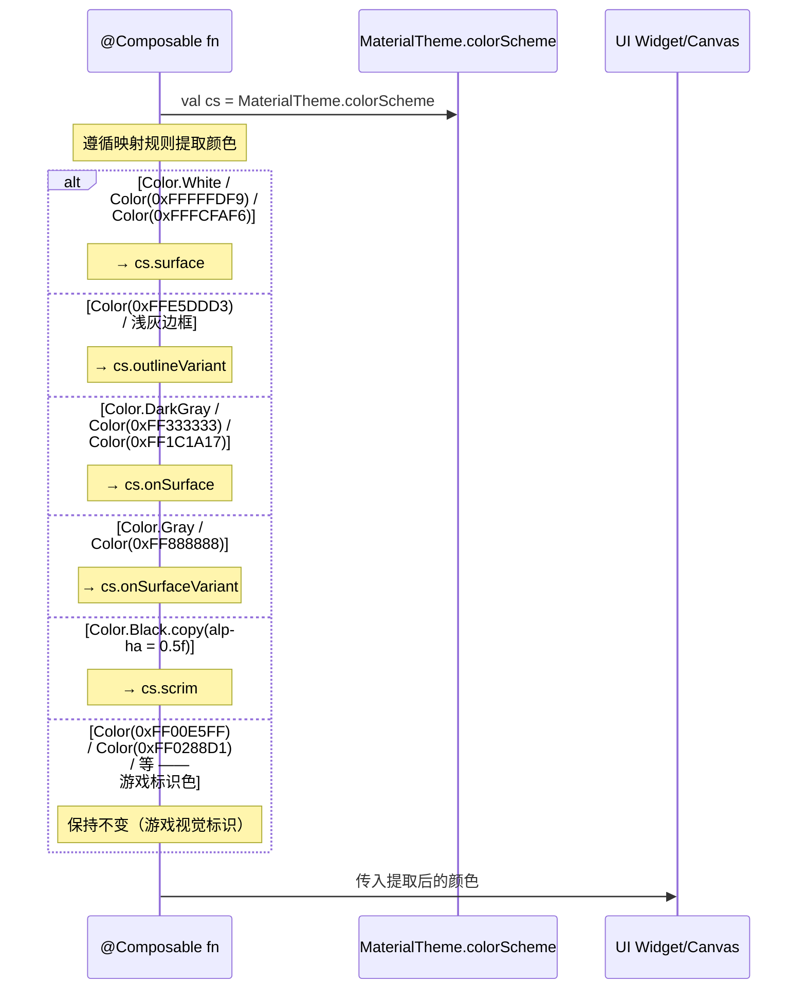
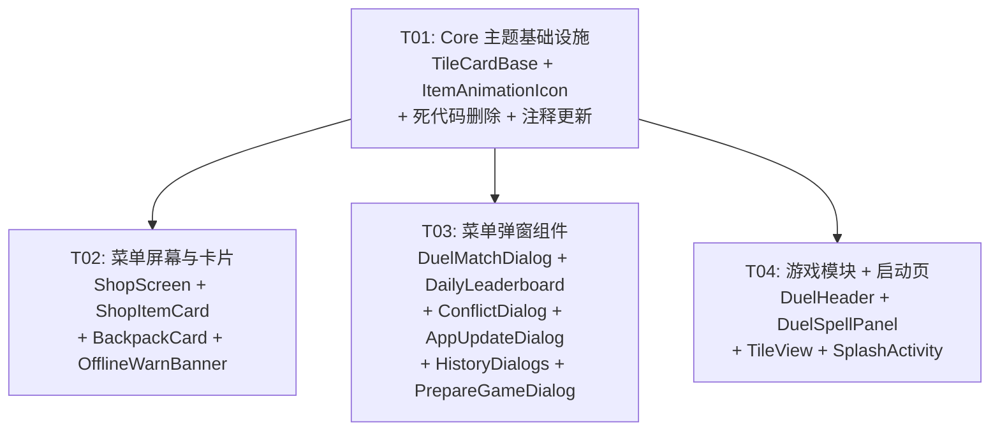

# 秘境消消乐 · 主题配置完善 — 系统架构设计 + 任务分解

> **设计者**：Bob (Architect)
> **日期**：2025-07-11
> **版本**：v1.0

---

## Part A: 系统设计

### 1. 实现方案

#### 1.1 核心挑战

| 挑战 | 描述 | 解决方案 |
|------|------|----------|
| **Canvas 颜色提取** | `Canvas` 的 `DrawScope` 无法访问 `MaterialTheme.colorScheme`（因为 `DrawScope` 不在 `@Composable` 作用域内） | 在 `@Composable` 函数体内提前提取需要的颜色为局部变量，传入 `Canvas {}` lambda |
| **TileCardBase 皮肤差异化** | 四种皮肤（ink/cyber/keai/daimeng）需要保留辨识度，但基础色必须来自主题 | 背景/边框/装饰色改用 `MaterialTheme.colorScheme` 的语义 token，在此基础上叠加 alpha 变换保持 skin 特征 |
| **游戏道具图标色** | `ItemAnimationIcon.kt` 中大量游戏视觉标识色（金、霓虹、暗色）不宜全部替换为主题色 | 仅替换符合"通用 UI 色彩"规则的硬编码值（White、Gray、DarkGray、near-white backgrounds），保留游戏美术设计色 |
| **模块分散** | 14 个文件分散在 5 个 Gradle 模块中 | 按模块 + 功能分组，同一模块内相似文件批量处理 |

#### 1.2 框架与库（无需新增）

本次为纯代码改造，不引入新依赖。使用的现有框架：

- **Jetpack Compose**：UI 框架，`MaterialTheme.colorScheme` 为核心改造入口
- **Material3**：`ColorScheme` 提供语义化颜色 token（primary, secondary, surface, onSurface 等）
- **MMKV**：主题持久化（已由 `ThemeManager` 管理，无需改动）

#### 1.3 架构模式

本次改造遵循 **MVVM + Compose Declarative UI** 模式，不改动架构层次：

```
┌─────────────────────────────────────────┐
│  @Composable 函数                        │
│  ├─ val cs = MaterialTheme.colorScheme   │  ← 提取颜色变量
│  ├─ Canvas { ... cs.surface ... }        │  ← Canvas 内使用局部变量
│  └─ 其他 Composable 组件                 │
└─────────────────────────────────────────┘
         ↓ 读取
┌─────────────────────────────────────────┐
│  MaterialTheme.colorScheme               │
│  ← SheepsTheme() 根据 AppTheme 注入      │
└─────────────────────────────────────────┘
         ↓ 管理
┌─────────────────────────────────────────┐
│  ThemeManager (MMKV 持久化)              │
└─────────────────────────────────────────┘
```

### 2. 文件列表

#### 2.1 P0 — TileCardBase 主题适配

| 文件 | 路径 | 操作 |
|------|------|------|
| TileCardBase.kt | `app/core/src/main/java/com/example/sheeps/core/game/TileCardBase.kt` | **修改** |

#### 2.2 P1 — 残留硬编码清理

**core 模块：**
| 文件 | 路径 | 操作 |
|------|------|------|
| ItemAnimationIcon.kt | `app/core/src/main/java/com/example/sheeps/ui/components/ItemAnimationIcon.kt` | **修改** |

**feature_menu 模块：**
| 文件 | 路径 | 操作 |
|------|------|------|
| ShopScreen.kt | `app/feature_menu/src/main/java/com/example/sheeps/menu/ui/screens/ShopScreen.kt` | **修改** |
| ShopItemCard.kt | `app/feature_menu/src/main/java/com/example/sheeps/menu/ui/components/ShopItemCard.kt` | **修改** |
| BackpackCard.kt | `app/feature_menu/src/main/java/com/example/sheeps/menu/ui/components/BackpackCard.kt` | **修改** |
| OfflineWarnBanner.kt | `app/feature_menu/src/main/java/com/example/sheeps/menu/ui/components/OfflineWarnBanner.kt` | **修改** |
| DuelMatchDialog.kt | `app/feature_menu/src/main/java/com/example/sheeps/menu/ui/dialogs/DuelMatchDialog.kt` | **修改** |
| DailyLeaderboardPopupDialog.kt | `app/feature_menu/src/main/java/com/example/sheeps/menu/ui/dialogs/DailyLeaderboardPopupDialog.kt` | **修改** |
| ConflictDialog.kt | `app/feature_menu/src/main/java/com/example/sheeps/menu/ui/dialogs/ConflictDialog.kt` | **修改** |
| AppUpdateDialog.kt | `app/feature_menu/src/main/java/com/example/sheeps/menu/ui/dialogs/AppUpdateDialog.kt` | **修改** |
| HistoryDialogs.kt | `app/feature_menu/src/main/java/com/example/sheeps/menu/ui/dialogs/HistoryDialogs.kt` | **修改** |
| PrepareGameDialog.kt | `app/feature_menu/src/main/java/com/example/sheeps/menu/ui/dialogs/PrepareGameDialog.kt` | **修改** |

**feature_game 模块：**
| 文件 | 路径 | 操作 |
|------|------|------|
| DuelHeader.kt | `app/feature_game/src/main/java/com/example/sheeps/game/ui/components/DuelHeader.kt` | **修改** |
| DuelSpellPanel.kt | `app/feature_game/src/main/java/com/example/sheeps/game/ui/components/DuelSpellPanel.kt` | **修改** |
| TileView.kt | `app/feature_game/src/main/java/com/example/sheeps/game/ui/components/TileView.kt` | **修改** |

**feature_splash 模块：**
| 文件 | 路径 | 操作 |
|------|------|------|
| SplashActivity.kt | `app/feature_splash/src/main/java/com/example/sheeps/splash/SplashActivity.kt` | **修改** |

#### 2.3 P2 — 死代码删除 + 注释更新

| 文件 | 路径 | 操作 |
|------|------|------|
| Theme.kt (旧) | `app/core/src/main/java/com/example/sheeps/core/theme/Theme.kt` | **删除** |
| Theme.kt (新) | `app/core/src/main/java/com/example/sheeps/theme/Theme.kt` | **修改**（注释） |

### 3. 数据结构和接口

本改造不新增类/接口，仅使用现有架构。核心数据流：



### 4. 程序调用流

#### 4.1 TileCardBase 主题适配流程



#### 4.2 皮肤差异化决策流程



#### 4.3 P1 硬编码替换通用流程



### 5. 待明确事项

| # | 问题 | 假设 |
|---|------|------|
| 1 | `core/theme/ThemeManager.kt` 和 `core/theme/ThemeSwitchDialog.kt` 是否也是死代码？ | 按 PRD 要求，仅删除 `core/theme/Theme.kt`，保留另两个文件。后续如需清理，另开任务。 |
| 2 | `ItemAnimationIcon.kt` 中 `Color(0xFFCBAA6A)` 等金色系是否应替换？ | 不替换。这些是游戏美术标识色（太极图金、铜钱金），不属于通用 UI 色彩，不在映射规则内。 |
| 3 | `SplashActivity.kt` 的渐变背景色 `Color(0xFF0D1117)` / `Color(0xFF1A0A0A)` / `Color(0xFF2D0808)` 如何映射？ | 这是 splash 专属暗红色渐变特效。`Color(0xFF0D1117)` → `MaterialTheme.colorScheme.background` 为基础，叠加 primary 透明度渐变。保留视觉意图但使用主题 token。 |
| 4 | `DuelSpellPanel.kt` 的法术颜色（`Color(0xFF8C7B70)` 等）是否替换？ | 部分替换。FOG/SILENCE/SHUFFLE 的颜色转为从 `primary`/`secondary` 的 alpha 变体派生，保持辨识度；SHRINK 和 SEAL_ALL 已使用主题色，不变。 |
| 5 | `Color(0xFF2E7D32)` (matched 状态绿色) 映射目标？ | 已使用 `Jade_Success` → `MaterialTheme.colorScheme.tertiary` |

---

## Part B: 任务分解

### 6. 所需依赖包

无需新增依赖。所有改造基于现有依赖：

```
- org.jetbrains.compose.material3:material3 (现有)
- androidx.compose.ui:ui (现有)
- com.tencent.mmkv:mmkv (现有，ThemeManager 使用)
```

### 7. 任务列表（按依赖顺序）

---

#### T01: Core 模块主题基础设施 + P0 P2 改造

| 属性 | 值 |
|------|------|
| **Task ID** | T01 |
| **Priority** | P0 |
| **Dependencies** | 无 |

**源文件**：
1. `app/core/src/main/java/com/example/sheeps/core/game/TileCardBase.kt` — **修改**
2. `app/core/src/main/java/com/example/sheeps/ui/components/ItemAnimationIcon.kt` — **修改**
3. `app/core/src/main/java/com/example/sheeps/core/theme/Theme.kt` — **删除**
4. `app/core/src/main/java/com/example/sheeps/theme/Theme.kt` — **修改**（注释）

**范围**：
- **TileCardBase.kt**：将 `when(normalizedSkin)` 内所有硬编码 Color 替换为 `MaterialTheme.colorScheme` 的语义化 token。在 Composable 入口处提取 `val cs = MaterialTheme.colorScheme`，Canvas lambda 内使用闭包捕获的局部变量。
  - `bgColor`：ink→`cs.surfaceVariant.copy(alpha=0.3f)`, cyber→`cs.surface`, keai→`cs.surfaceVariant`, daimeng→`cs.surfaceVariant`, classic/default→`cs.surface`
  - `borderColor`：ink→`cs.onSurface.copy(alpha=0.8f)`, cyber→`cs.primary`, keai→`cs.secondary`, daimeng→`cs.primary.copy(alpha=0.8f)`, classic/default→`cs.secondary`
  - `decorColor`：ink→`cs.onSurfaceVariant`, cyber→`cs.secondary`, keai→`cs.secondary.copy(alpha=0.7f)`, daimeng→`cs.primary.copy(alpha=0.5f)`, classic/default→`cs.secondary.copy(alpha=0.5f)`
  - 赛博装饰渐变 `listOf(Color(0xFF00F2FE), Color(0xFFFF2A6D))` → `listOf(cs.primary, cs.secondary)`
- **ItemAnimationIcon.kt**：仅替换符合"通用 UI 色彩"规则的硬编码值：
  - `Color(0xFFFCFAF6)` (背景) → `MaterialTheme.colorScheme.surface`
  - `Color.White` (太极图/Cavas) → `MaterialTheme.colorScheme.surface`
  - `Color(0xFFFFFDF9)` (天眼高光) → `MaterialTheme.colorScheme.surface`
  - 保留所有金色系 (`0xFFCBAA6A`, `0xFFE5B55F`, `0xFFFFD60A`)、霓虹色系 (`0xFF00F2FE`, `0xFFFF2A6D`)、暗灰色系 (`0xFF2C2F33`, `0xFF5A6065`) 等游戏标识色
- **core/theme/Theme.kt**：删除整个文件（已被 `theme/Theme.kt` + `ThemeManager` 取代）
- **theme/Theme.kt**：第 14 行注释更新为 `// 支持森林绿 / 清日春 / 墨夜金 / 樱花粉 / 星空蓝 / 暖阳橙 六套主题`

---

#### T02: 菜单模块屏幕与卡片组件

| 属性 | 值 |
|------|------|
| **Task ID** | T02 |
| **Priority** | P1 |
| **Dependencies** | T01 |

**源文件**：
1. `app/feature_menu/src/main/java/com/example/sheeps/menu/ui/screens/ShopScreen.kt` — **修改**
2. `app/feature_menu/src/main/java/com/example/sheeps/menu/ui/components/ShopItemCard.kt` — **修改**
3. `app/feature_menu/src/main/java/com/example/sheeps/menu/ui/components/BackpackCard.kt` — **修改**
4. `app/feature_menu/src/main/java/com/example/sheeps/menu/ui/components/OfflineWarnBanner.kt` — **修改**

**范围**（遵循 §8 共享约定中的映射规则）：
- **ShopScreen.kt**：
  - `Color.Transparent` → 保留（语义透明）
  - `Color.White.copy(alpha = 0.85f)` → `MaterialTheme.colorScheme.surface.copy(alpha = 0.85f)`
  - `Color(0xFFFFFDF9)` → `MaterialTheme.colorScheme.surface`
  - `Color.Gray` → `MaterialTheme.colorScheme.onSurfaceVariant`
  - `Button` 的 `Color.White` content → `MaterialTheme.colorScheme.onPrimary`
- **ShopItemCard.kt**：
  - `Color.White` (Card container) → `MaterialTheme.colorScheme.surface`
  - `Color(0xFFE5DDD3)` → `MaterialTheme.colorScheme.outlineVariant`
  - `Color.Gray` (placeholder, desc, stock) → `MaterialTheme.colorScheme.onSurfaceVariant`
  - `Color.DarkGray` (title) → `MaterialTheme.colorScheme.onSurface`
  - `Color(0xFFE0E0E0)` (disabled) → `MaterialTheme.colorScheme.outlineVariant`
  - `Color.White` (button text) → `MaterialTheme.colorScheme.onPrimary`
- **BackpackCard.kt**：
  - `Color.Gray` (背包物品计数、详情) → `MaterialTheme.colorScheme.onSurfaceVariant`
  - `Color.DarkGray` (库存) → `MaterialTheme.colorScheme.onSurface`
  - `Color(0xFFCBAA6A)` (黄金边框) → `MaterialTheme.colorScheme.secondary`（此色为 UI 装饰边框，非游戏标识）
  - `Color(0xFF9E1F1F)` (主要按钮容器色) → `MaterialTheme.colorScheme.primary`
  - `Color.White` (按钮文字) → `MaterialTheme.colorScheme.onPrimary`
- **OfflineWarnBanner.kt**：
  - `Color(0xFFFBEBEB)` (背景) → `MaterialTheme.colorScheme.errorContainer`（淡红警告背景）

---

#### T03: 菜单模块弹窗组件

| 属性 | 值 |
|------|------|
| **Task ID** | T03 |
| **Priority** | P1 |
| **Dependencies** | T01 |

**源文件**：
1. `app/feature_menu/src/main/java/com/example/sheeps/menu/ui/dialogs/DuelMatchDialog.kt` — **修改**
2. `app/feature_menu/src/main/java/com/example/sheeps/menu/ui/dialogs/DailyLeaderboardPopupDialog.kt` — **修改**
3. `app/feature_menu/src/main/java/com/example/sheeps/menu/ui/dialogs/ConflictDialog.kt` — **修改**
4. `app/feature_menu/src/main/java/com/example/sheeps/menu/ui/dialogs/AppUpdateDialog.kt` — **修改**
5. `app/feature_menu/src/main/java/com/example/sheeps/menu/ui/dialogs/HistoryDialogs.kt` — **修改**
6. `app/feature_menu/src/main/java/com/example/sheeps/menu/ui/dialogs/PrepareGameDialog.kt` — **修改**

**范围**（遵循 §8 共享约定）：
- **DuelMatchDialog.kt**：
  - `Color.White` (太极图白色半圆) → `MaterialTheme.colorScheme.surface`
  - `Color.Gray` → `MaterialTheme.colorScheme.onSurfaceVariant`
  - `Color(0xFF2E7D32)` (匹配成功绿色) → `MaterialTheme.colorScheme.tertiary`
  - `Color.White` (按钮文字) → `MaterialTheme.colorScheme.onPrimary`
- **DailyLeaderboardPopupDialog.kt**：
  - `Color.White` (按钮文字) → `MaterialTheme.colorScheme.onPrimary`
  - `Color(0xFFFCFAF6)` → `MaterialTheme.colorScheme.surface`
  - `Color(0xFFE5DDD3)` → `MaterialTheme.colorScheme.outlineVariant`
  - `Color.DarkGray` → `MaterialTheme.colorScheme.onSurface`
- **ConflictDialog.kt**：
  - `Color.DarkGray` → `MaterialTheme.colorScheme.onSurface`
  - `Color.Gray` → `MaterialTheme.colorScheme.onSurfaceVariant`
  - `Color(0xFFF9F7F5)` / `Color(0xFFF5F9F7)` → `MaterialTheme.colorScheme.surfaceVariant`
- **AppUpdateDialog.kt**：
  - `Color.White` → `MaterialTheme.colorScheme.onPrimary`
  - `Color(0xFFFF9800)` (权限提示) → 保留（系统级警告色，非主题色）
- **HistoryDialogs.kt**：
  - `Color.Gray` → `MaterialTheme.colorScheme.onSurfaceVariant`
  - `Color(0xFF4CAF50)` (入账绿色) → `MaterialTheme.colorScheme.tertiary`
- **PrepareGameDialog.kt**：
  - `Color.Black.copy(alpha = 0.5f)` (遮罩) → `MaterialTheme.colorScheme.scrim`
  - `Color(0xFFFFFDF9)` → `MaterialTheme.colorScheme.surface`
  - `Color.DarkGray` / `Color.Gray` → `MaterialTheme.colorScheme.onSurface` / `onSurfaceVariant`
  - `Color(0xFFFCFAF6)` → `MaterialTheme.colorScheme.surface`
  - `Color(0xFFE5DDD3)` → `MaterialTheme.colorScheme.outlineVariant`
  - `Color(0xFFFFF0EC)` / `Color(0xFFF0F4FF)` → `MaterialTheme.colorScheme.surfaceVariant` + alpha
  - `Color(0xFFF5F5F5)` → `MaterialTheme.colorScheme.surfaceVariant`
  - `Color.White` (按钮文字) → `MaterialTheme.colorScheme.onPrimary`
  - `Color(0xFFEDD9A3)` (渐变边框) → 保留（装饰性渐变，非主题色）

---

#### T04: 游戏模块 + 启动页

| 属性 | 值 |
|------|------|
| **Task ID** | T04 |
| **Priority** | P1 |
| **Dependencies** | T01 |

**源文件**：
1. `app/feature_game/src/main/java/com/example/sheeps/game/ui/components/DuelHeader.kt` — **修改**
2. `app/feature_game/src/main/java/com/example/sheeps/game/ui/components/DuelSpellPanel.kt` — **修改**
3. `app/feature_game/src/main/java/com/example/sheeps/game/ui/components/TileView.kt` — **修改**
4. `app/feature_splash/src/main/java/com/example/sheeps/splash/SplashActivity.kt` — **修改**

**范围**（遵循 §8 共享约定）：
- **DuelHeader.kt**：
  - `Color.Green` / `Color.Yellow` / `Color.Red` (连接状态) → 保留（系统状态指示色，语义明确，非主题色）
  - `Color(0xFF00E5FF)` / `Color(0xFF0288D1)` (能量条渐变) → 保留（游戏视觉标识）或替换为 `cs.primary` / `cs.tertiary` 渐变 → **保留**（Duel 视觉标识色）
- **DuelSpellPanel.kt**：
  - `Color(0xFF8C7B70)` (FOG) → `MaterialTheme.colorScheme.onSurfaceVariant`
  - `Color(0xFF7E57C2)` (SILENCE) → `MaterialTheme.colorScheme.tertiary`
  - `Color(0xFF26A69A)` (SHUFFLE) → `MaterialTheme.colorScheme.primary.copy(alpha=0.7f)`
  - 已使用主题色的 SHRINK 和 SEAL_ALL 不变
  - `Color.White` / `Color.Gray` (按钮文字) → `MaterialTheme.colorScheme.onPrimary` / `onSurfaceVariant`
- **TileView.kt**：
  - `Color.Red` / `Color.Blue` (DEBUG label) → 保留（仅 debug 可见）
  - `Color.Transparent` → 保留
  - `Color.White` (占位文字) → `MaterialTheme.colorScheme.onSurface`
  - `Color(0xBB2C3E50)` (封印底色) → 保留（游戏内特殊状态特效，非 UI 主题色）
  - `Color(0xFFF1C40F)` (封印边框+计数) → 保留（游戏内封印特效标识色）
  - `Color(0xFFF1C40F).copy(alpha = 0.8f)` (封印边框) → 保留
  - `isShaking` 红色边框 `Color.Red` → 保留（紧急状态指示，语义固定）
- **SplashActivity.kt**：
  - 渐变背景：`listOf(Color(0xFF0D1117), Color(0xFF1A0A0A), Color(0xFF2D0808))` → `listOf(cs.background, cs.primary.copy(alpha=0.15f), cs.primary.copy(alpha=0.25f))`
  - `Color(0xFF00C853)` (适龄徽章) → `MaterialTheme.colorScheme.tertiary`
  - `Color.White` (徽章文字) → `MaterialTheme.colorScheme.onTertiary`
  - 注意：此文件已大量使用 `MoYe_Surface` 等主题色，需小心不要破坏现有的 `themePrimary`/`themeSecondary` 局部变量的使用

---

### 8. 共享约定

以下规则适用于所有文件的改造，确保一致性：

#### 8.1 硬编码颜色 → 主题色映射表

| 硬编码颜色 | 主题 Token | 语义说明 |
|-----------|-----------|---------|
| `Color.White` / `Color(0xFFFFFDF9)` / `Color(0xFFFCFAF6)` | `MaterialTheme.colorScheme.surface` | 卡片/面板表面色 |
| `Color(0xFFE5DDD3)` / 浅灰边框 | `MaterialTheme.colorScheme.outlineVariant` | 次级边框 |
| `Color.DarkGray` / `Color(0xFF333333)` / `Color(0xFF1C1A17)` | `MaterialTheme.colorScheme.onSurface` | 主要内容文字 |
| `Color.Gray` / `Color(0xFF888888)` | `MaterialTheme.colorScheme.onSurfaceVariant` | 次要/辅助文字 |
| `Color.Black.copy(alpha = 0.5f)` | `MaterialTheme.colorScheme.scrim` | 遮罩层 |
| `Color(0xFFE0E0E0)` (disabled) | `MaterialTheme.colorScheme.outlineVariant` | 禁用状态 |
| `Color.White` (Button text) | `MaterialTheme.colorScheme.onPrimary` | 主按钮上的文字 |

#### 8.2 Canvas 颜色提取模式

```kotlin
@Composable
fun MyCanvasComponent() {
    val cs = MaterialTheme.colorScheme  // ← 在 @Composable 作用域提取
    
    Canvas(modifier = Modifier.fillMaxSize()) {
        // 使用闭包捕获的 cs 变量
        drawCircle(color = cs.surface, radius = 10f)
        drawLine(cs.onSurfaceVariant, start, end, strokeWidth = 2f)
    }
}
```

#### 8.3 不替换的颜色类别

以下类别的硬编码颜色 **保持不变**：
1. **游戏美术标识色**：金色系 (`0xFFCBAA6A`, `0xFFE5B55F`, `0xFFFFD60A`, `0xFFD4AF37`, `0xFFF1C40F`)、赛博霓虹 (`0xFF00F2FE`, `0xFFFF2A6D`, `0xFF05D9E8`)
2. **游戏特殊状态色**：封印冰蓝 (`0xBB2C3E50`)、炸弹暗色 (`0xFF2C2F33`)、迷雾特效
3. **Android 系统语义色**：`Color.Green`/`Color.Yellow`/`Color.Red`（连接状态指示）、`Color.Transparent`
4. **DEBUG 模式专用色**：`Color.Red`/`Color.Blue`（仅在 `if (BuildConfig.DEBUG)` 块中）
5. **装饰性渐变**：用于纯装饰目的的 gradient（如金色边框渐变 `listOf(cs.secondary, Color(0xFFEDD9A3), cs.secondary)`）

#### 8.4 Button 文字颜色约定

```kotlin
// 主按钮文字
Button(colors = ButtonDefaults.buttonColors(containerColor = cs.primary)) {
    Text("确定", color = cs.onPrimary)  // Color.White → cs.onPrimary
}

// 文本按钮
TextButton(onClick = {}) {
    Text("取消", color = cs.onSurfaceVariant)  // Color.Gray → cs.onSurfaceVariant
}
```

#### 8.5 主题切换验证清单

每个任务完成后，在以下主题下各做一次快速视觉检查：
- 🌿 森林绿（默认浅色）
- 🌃 墨夜金（暗色）
- 🌸 樱花粉（浅色女性向）

### 9. 任务依赖图



---

*本文档由 Bob (Architect) 生成，基于 PRD v1.0 及代码库现场分析。*
