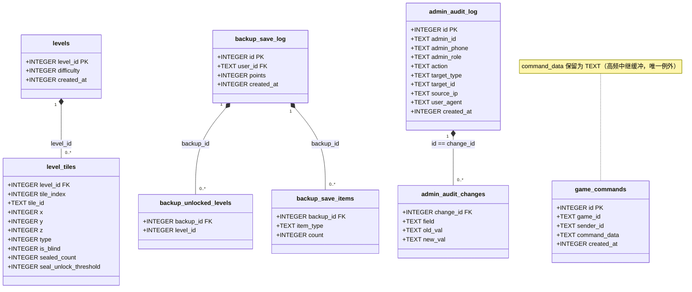
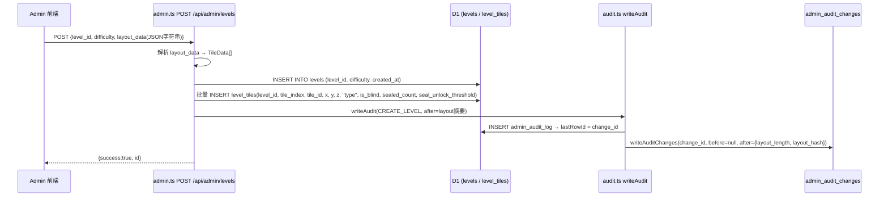
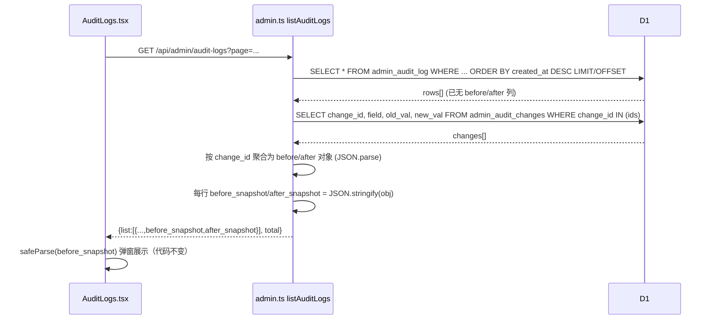
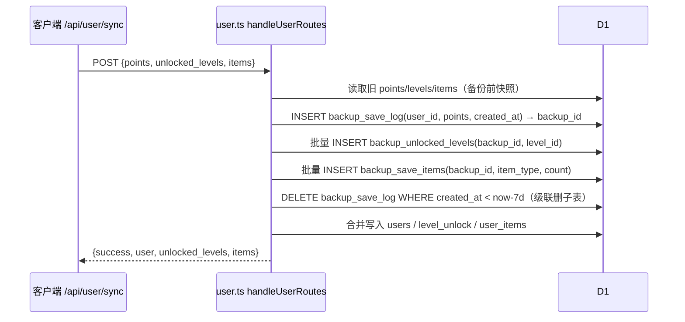

# sheeps · JSON 字符串列拆表 —— 系统架构设计 + 任务分解

> 作者：架构师 高见远（Gao） ｜ 团队：software-jsonsplit ｜ 日期：2025-07-09
> 背景：用户明确要求「数据库中不要存 json 字符串，json 字符串可以拆表，拆了后完善相关会影响的代码」。
> 本文给出**实现方案、新表结构、迁移方案、文件清单、类图、时序图、有序任务列表、依赖包、共享约定与待明确事项**。

---

## Part A · 系统设计

### 1. 实现方案 + 框架选型

**技术栈确认（沿用现有，不引入 ORM）**
- 后端：Hono + TypeScript，运行于 Cloudflare Worker + D1（SQLite 兼容）。
- 数据访问：全部手写参数化 SQL（`env.DB.prepare(...).bind(...).run()/.all()/.first()`），**不引入 ORM**。
- 迁移机制：复用现有 `migrateSchema(env)`（Worker 首次请求时触发，靠模块级 `schemaMigrated` 标记幂等）。本次递增式迁移（建新表 + ALTER 加列 + 回填 + 择机 DROP 旧列）。
- 前端：admin-console（React + TS + MUI），通过 REST 调用后台；本次**后端 API 契约保持不变**，前端原则上零改动（见第 9 节）。

**核心难点与选型**
| 难点 | 选型 / 策略 |
|---|---|
| 把 JSON 数组/对象变成关系表 | 按「父表 + 子表」拆分；数组 → 子表多行；对象 → KV 子表（`field, old_val, new_val`） |
| D1 无原生数组/JSON 类型 | 用 TEXT 存标量，子表承载集合；回填用 SQLite JSON1 的 `json_each` |
| 迁移不能丢数据 | 采用「建新表 → 从旧 JSON 列回填 → 保留旧列（标记 deprecated，停止写入） → 验证后择机 DROP」的稳妥路径 |
| 审计快照键不固定 | KV 子表 `admin_audit_changes(change_id, field, old_val, new_val)` 最合适 |
| 前端 AuditLogs 弹窗要能展示快照 | 读取时由子表**重组为与原结构一致的 JSON 字符串**回填 `before_snapshot/after_snapshot`，前端契约不变 |
| game_commands 高频 + 嵌套 payload | **推荐保留 `command_data` 为 TEXT（唯一例外）**，理由见下 |

**关于 game_commands 的明确推荐（需主理人拍板）**
- `game_commands.command_data` 是**联机对战的实时中继缓冲**：唯一读路径是 `SELECT id, command_data ... WHERE game_id=? AND id>?` 后 `socket.send(row.command_data)` 原样下发，无任何结构化查询/过滤。
- 若严格拆成「主表 + `game_command_payloads` KV 子表」，则**每一条 WS 消息都要多写 N 条 KV 行，且轮询循环（250ms）每条消息都要从 KV 重组回 JSON 再下发**——写放大 + 读重组命中高频热路径，收益为零（它本就不是领域实体，只是传输缓冲）。
- **推荐：保留 `command_data` 为 TEXT，不拆表**。这是全库唯一例外。若主理人坚持「全库零 JSON 字符串」，则改用备选方案（主表 `game_commands(id, game_id, sender_id, seq_id, command_ts, command_type)` + KV 子表 `game_command_payloads(command_id, payload_key, payload_val)`），代价见待明确事项 §1。

**迁移策略（D1 安全路径）**
1. 新建子表（`CREATE TABLE IF NOT EXISTS`，幂等 try/catch）。
2. 必要 ALTER：`ALTER TABLE backup_save_log ADD COLUMN points INTEGER`（幂等）。
3. 回填：用 `json_each` 从旧 JSON 列解析写入新表；审计回填用 TS 函数复用写入逻辑（保证编码一致，见 §3/§4）。
4. 旧列处理：回填后**先保留旧列、停止写入**（标记 deprecated）；验证无误后由 DBA 择机 `ALTER TABLE ... DROP COLUMN`（D1 较新版本支持，失败则保留旧列不读，不影响正确性）。

---

### 2. 文件列表（全部相对仓库根 `E:/file/sheeps`）

**新增文件**
| 路径 | 作用 |
|---|---|
| `server/src/lib/audit.ts` | 审计变更写入/重组 helper：`writeAuditChanges()`、`reassembleAuditSnapshots()` |
| `server/src/lib/level-tiles.ts` | 关卡 tile 读写 helper：`writeLevelTiles()`、`readLevelTilesByLevels()`、`assembleLayoutData()` |
| `server/src/lib/migrate.ts` | 各域回填函数：`backfillLevels()`、`backfillBackups()`、`backfillAudit()`，由 `index.ts` 调用 |

**修改文件**
| 路径 | 改动点 |
|---|---|
| `server/schema.sql` | 删除 `levels.layout_data` / `backup_save_log.save_data` / `admin_audit_log.before_snapshot,after_snapshot` 列定义；新增 `points` 列；新增 4 张子表 DDL；`DROP TABLE IF EXISTS` 列表补子表 |
| `server/src/index.ts` | `migrateSchema()`：建新表、ALTER 加 `points`、调用 `migrate.backfill*()`、择机 DROP 旧列 |
| `server/src/types.ts` | 新增 `LevelTileRow` / `BackupUnlockedLevelRow` / `BackupItemRow` / `AuditChangeRow` 接口 |
| `server/src/handlers/admin.ts` | ① `writeAudit` 改调 `audit.ts` 写 `admin_audit_changes`；② `listAuditLogs` 用子查询重组 `before/after`；③ 关卡 GET/POST/PUT/DELETE 改用 `level_tiles`；④ `deleteUser` 级联删备份子表 |
| `server/src/handlers/user.ts` | `/api/user/sync` 备份改为写 `backup_save_log` + 子表；7 天清理连带子表 |
| `server/src/handlers/auth.ts` | 游客合并删除 `tablesToDelete` 增加备份子表（用 IN 子查询，因其无 `user_id` 列） |

> **前端文件（admin-console）本次无需改动**：后端读取时重组为原 JSON 字符串契约（`layout_data` 字符串、`before_snapshot/after_snapshot` 字符串），`Levels.tsx` 与 `AuditLogs.tsx` 行为不变。结构化 tile 编辑器为可选增强（见 §9）。

---

### 3. 数据模型与接口（类图）



**新表字段说明**
| 表 | 字段 | 类型 | 说明 |
|---|---|---|---|
| `level_tiles` | `level_id` | INTEGER | 外键 → `levels.level_id` |
| | `tile_index` | INTEGER | 数组下标，从 0 起，用于稳定排序/重组 |
| | `tile_id` | TEXT | 原 `TileData.id` |
| | `x/y/z` | INTEGER | 原 `TileData.x/y/z` |
| | `type` | INTEGER | 原 `TileData.type`（SQL 关键字加双引号兼容） |
| | `is_blind` | INTEGER | 原 `isBlind`（0/1） |
| | `sealed_count` | INTEGER | 原 `sealedCount` |
| | `seal_unlock_threshold` | INTEGER | 原 `sealUnlockThreshold`（可空） |
| `backup_unlocked_levels` | `backup_id` | INTEGER | 外键 → `backup_save_log.id` |
| | `level_id` | INTEGER | 原 `unlocked_levels[]` 元素 |
| `backup_save_items` | `backup_id` | INTEGER | 外键 → `backup_save_log.id` |
| | `item_type` | TEXT | 原 `items[].item_type` |
| | `count` | INTEGER | 原 `items[].count` |
| `admin_audit_changes` | `change_id` | INTEGER | 外键 → `admin_audit_log.id` |
| | `field` | TEXT | 被变更字段名 |
| | `old_val` | TEXT | 变更前值，`JSON.stringify` 后的文本（可 NULL） |
| | `new_val` | TEXT | 变更后值，`JSON.stringify` 后的文本（可 NULL） |

**索引建议（按需创建）**
- `CREATE INDEX IF NOT EXISTS idx_level_tiles_level ON level_tiles(level_id);`
- `CREATE INDEX IF NOT EXISTS idx_backup_items_backup ON backup_save_items(backup_id);`
- `CREATE INDEX IF NOT EXISTS idx_backup_unlock_backup ON backup_unlocked_levels(backup_id);`
- `CREATE INDEX IF NOT EXISTS idx_audit_changes_change ON admin_audit_changes(change_id);`

---

### 4. 程序调用流程（时序图）

**4.1 创建关卡并写审计（写新表）**


**4.2 审计列表读取重组（前端契约不变）**


**4.3 用户同步写备份（save_data 拆表）**


---

### 5. 待明确事项（假设 + 需拍板点）

1. **game_commands 是否强拆**：我推荐保留 `command_data` 为 TEXT（唯一例外）。若主理人要求「全库零 JSON 字符串」，则改用主表 + `game_command_payloads` KV 子表（写放大 + 轮询重组代价，见 §1）。**需确认**。
2. **旧列删留时机**：我建议「回填 + 保留旧列(deprecated) → 验证后 DROP」。是否要求迁移中直接 DROP（`ALTER TABLE ... DROP COLUMN`，依赖 D1 版本）？
3. **审计值编码**：`old_val/new_val` 统一用 `JSON.stringify(value)` 存储、读取 `JSON.parse` 重组 → 完整保留类型（数字/布尔/字符串/嵌套对象）。是否接受？
4. **备份 points 落点**：`points` 作为 `backup_save_log` 标量列（非 KV）。是否同意？
5. **关卡前端编辑器**：保持 textarea（后端重组 `layout_data` 字符串，零改动）即可；结构化 tile 编辑器为可选增强，是否纳入本次？
6. **回填充幂等**：默认「子表为空才回填」。是否需要额外开关/日志？
7. **FK 级联**：子表声明 FK（文档/完整性用），但清理用显式 DELETE（与现有 `deleteUser` 风格一致，不依赖 D1 `PRAGMA foreign_keys`）。是否同意？
8. **确认 `/api/level` 不读 `levels.layout_data`**：调研结论称游戏侧实时生成、不读该列。请工程师实现前再 grep `game.ts`/`level.ts` 确认。

---

## Part B · 任务分解

### 6. 依赖包列表

**无需引入新依赖。**
- SQL 层回填：`json_each`（D1 已启用 JSON1 扩展）做数组拆分。
- 应用层：`JSON.parse` / `JSON.stringify`（内置）做快照序列化；可选复用既有 `zod`（已随 `@hono/zod-openapi` 存在）对 `TileData[]` 做解析校验，非必须。
- 前端：保持 MUI + React，无新增依赖。

```
- @hono/zod-openapi（已存在，可选 zod 校验 TileData）
- 无新增第三方包
```

### 7. 任务列表（按依赖与实现顺序排列，≤5 个）

> 说明：项目已存在，故「基础设施」任务 = 数据库 schema + 迁移骨架 + 共享类型（全体任务的前置依赖）。

**T01 · 数据库 schema + 迁移骨架 + 共享类型（基建，P0）**
- 源文件：`server/schema.sql`、`server/src/index.ts`、`server/src/types.ts`
- 改动点：
  - `schema.sql`：新增 4 张子表 DDL + `backup_save_log.points` 列；删除主表旧 JSON 列定义；`DROP TABLE IF EXISTS` 列表补子表。
  - `index.ts`：`migrateSchema()` 增加 CREATE 新表（幂等）、`ALTER TABLE backup_save_log ADD COLUMN points INTEGER`、调用 `migrate.backfillLevels/Backups/Audit()`、择机 DROP 旧列。
  - `types.ts`：新增 `LevelTileRow`、`BackupUnlockedLevelRow`、`BackupItemRow`、`AuditChangeRow` 接口。
- 依赖：无 ｜ 优先级：**P0**

**T02 · 审计快照拆分（admin_audit_log → admin_audit_changes，P0）**
- 源文件：`server/src/lib/audit.ts`（新增）、`server/src/handlers/admin.ts`、`server/src/lib/migrate.ts`（新增）
- 改动点：
  - `lib/audit.ts`：`writeAuditChanges(change_id, before, after)`（按字段 `JSON.stringify` 写入 KV，`env.DB.batch` 原子）、`reassembleAuditSnapshots(changeIds)`（读取并聚合为 before/after 对象）。
  - `admin.ts`：`writeAudit` 写完 `admin_audit_log` 取 `lastRowId` 后调 `writeAuditChanges`；`listAuditLogs` 用子查询重组 `before_snapshot/after_snapshot` 字符串（前端不变）。
  - `migrate.ts`：`backfillAudit()`：`SELECT id, before_snapshot, after_snapshot` → 复用 `writeAuditChanges` 回填（保证编码一致）。
- 依赖：**T01** ｜ 优先级：**P0**

**T03 · 关卡 layout_data 拆表（levels → level_tiles，P0）**
- 源文件：`server/src/lib/level-tiles.ts`（新增）、`server/src/handlers/admin.ts`、`server/src/lib/migrate.ts`
- 改动点：
  - `lib/level-tiles.ts`：`writeLevelTiles(level_id, tiles)`（先删后插/REPLACE）、`readLevelTilesByLevels(ids)`、`assembleLayoutData(tiles)`（重组为 `TileData[]` → `JSON.stringify` 供前端）。
  - `admin.ts`：关卡 GET 改为自定义（分页后批量取 tiles 并重组 `layout_data` 字符串）；POST 剥离 `layout_data` 写主表 + `writeLevelTiles`；PUT 替换 tiles；DELETE 先删 `level_tiles` 再删主表；审计摘要 sha256 仍基于重组后的 layout。
  - `migrate.ts`：`backfillLevels()`：`INSERT ... SELECT ... FROM levels, json_each(layout_data)` 回填（tile_index=CAST(j.key), 字段用 `json_extract`，`isBlind`→0/1）。
- 依赖：**T01** ｜ 优先级：**P0**

**T04 · 备份 save_data 拆表 + 级联删除（P0）**
- 源文件：`server/src/handlers/user.ts`、`server/src/handlers/auth.ts`、`server/src/handlers/admin.ts`、`server/src/lib/migrate.ts`
- 改动点：
  - `user.ts`：`/api/user/sync` 备份改为 `INSERT backup_save_log(user_id, points, created_at)` + 批量 `backup_unlocked_levels` + 批量 `backup_save_items`；7 天清理连带删子表。
  - `auth.ts`：游客合并删除 `tablesToDelete` 增加 `backup_unlocked_levels`/`backup_save_items`（用 `WHERE backup_id IN (SELECT id FROM backup_save_log WHERE user_id=?)`，因其无 `user_id` 列）。
  - `admin.ts`：`deleteUser` 级联增加上述两子表删除（先于删 `backup_save_log`）。
  - `migrate.ts`：`backfillBackups()`：`json_each` 拆 `items`/`unlocked_levels` + `UPDATE points=json_extract(save_data,'$.points')`。
- 依赖：**T01** ｜ 优先级：**P0**

> game_commands：按 §1 推荐**不拆**，无任务；若主理人要求强拆，新增 T05（主表 + `game_command_payloads`，写放大 + 轮询重组）。

### 8. 共享知识（跨文件约定）

- **命名约定**：子表 = `<父表>_<实体>`（`level_tiles` / `backup_unlocked_levels` / `backup_save_items` / `admin_audit_changes`）。变更 KV 列固定为 `(change_id, field, old_val, new_val)`。
- **写函数封装位置**：按域放 `server/src/lib/`（`audit.ts`、`level-tiles.ts`）；回填统一放 `server/src/lib/migrate.ts` 由 `index.ts` 调用。
- **重组（payload/快照还原）工具**：同一 lib 文件内提供 `*reassemble*` / `assemble*` 函数；**读取端一律重组为原 JSON 字符串契约**，保证前端零改动。
- **值编码**：审计 KV 值统一 `JSON.stringify(value)` 存、`JSON.parse` 取，保类型。
- **原子性**：多行写入一律 `env.DB.batch([...])`。
- **迁移幂等**：建表 `IF NOT EXISTS`；回填前判断「目标子表该父键无记录才插」；`DROP 旧列` 包 try/catch 兜底。
- **级联清理**：显式 DELETE 子表（不依赖 D1 `PRAGMA foreign_keys`），顺序先子后父。
- **game_commands**：`command_data` 保留 TEXT，不在此约定范围（特例，见 §1）。

### 9. 任务依赖图

```mermaid
graph TD
    T01["T01 schema+迁移+类型(P0)"] --> T02["T02 审计快照拆分(P0)"]
    T01 --> T03["T03 关卡 tiles 拆表(P0)"]
    T01 --> T04["T04 备份 save_data 拆表(P0)"]
    T02 -.共享 migrate.ts.-> T03
    T02 -.共享 migrate.ts.-> T04
    T03 -.共享 admin.ts.-> T04
```

### 10. 落地检查清单（给工程师）

- [ ] `schema.sql` 与 `migrateSchema` 双路一致（全新库 / 存量库都能跑通）。
- [ ] 回填脚本在本地产线 DB 跑一遍，核对行数（level_tiles 总数 == Σ数组长度；backup 子表条数 == 原 items/unlocked 长度之和；audit 变更条数 == 原快照键数之和）。
- [ ] 旧列 DROP 前，确认无任何 handler 仍 SELECT/INSERT 旧列（grep `layout_data|save_data|before_snapshot|after_snapshot`）。
- [ ] 前端 `Levels.tsx` / `AuditLogs.tsx` 回归：列表、编辑、审计弹窗展示正常（应零改动通过）。
- [ ] `game_commands` 路径（WS 联机）压测确认未受本次改动影响。

---

## 附录 · 关键回填 SQL 示意（供工程师实现参考，非最终代码）

```sql
-- 关卡 tiles 回填（D1 json_each 可用）
INSERT INTO level_tiles (level_id, tile_index, tile_id, x, y, z, "type", is_blind, sealed_count, seal_unlock_threshold)
SELECT l.level_id,
       CAST(j.key AS INTEGER),
       json_extract(j.value, '$.id'),
       json_extract(j.value, '$.x'),
       json_extract(j.value, '$.y'),
       json_extract(j.value, '$.z'),
       json_extract(j.value, '$.type'),
       CASE WHEN json_extract(j.value, '$.isBlind') THEN 1 ELSE 0 END,
       json_extract(j.value, '$.sealedCount'),
       json_extract(j.value, '$.sealUnlockThreshold')
FROM levels l, json_each(l.layout_data) j
WHERE NOT EXISTS (SELECT 1 FROM level_tiles lt WHERE lt.level_id = l.level_id);

-- 备份 items 回填
INSERT INTO backup_save_items (backup_id, item_type, count)
SELECT b.id, json_extract(j.value, '$.item_type'), json_extract(j.value, '$.count')
FROM backup_save_log b, json_each(json_extract(b.save_data, '$.items')) j
WHERE NOT EXISTS (SELECT 1 FROM backup_save_items bi WHERE bi.backup_id = b.id);

-- 备份 unlocked_levels 回填
INSERT INTO backup_unlocked_levels (backup_id, level_id)
SELECT b.id, CAST(json_extract(j.value, '$') AS INTEGER)
FROM backup_save_log b, json_each(json_extract(b.save_data, '$.unlocked_levels')) j
WHERE NOT EXISTS (SELECT 1 FROM backup_unlocked_levels bul WHERE bul.backup_id = b.id);

-- 备份 points 回填
UPDATE backup_save_log SET points = CAST(json_extract(save_data, '$.points') AS INTEGER)
WHERE points IS NULL;
```

> 审计 `admin_audit_changes` 回填**不走纯 SQL**（需与 `writeAuditChanges` 编码一致），用 `lib/migrate.ts: backfillAudit()` 在 TS 层 `JSON.parse` 旧快照后复用 `writeAuditChanges` 写入。
